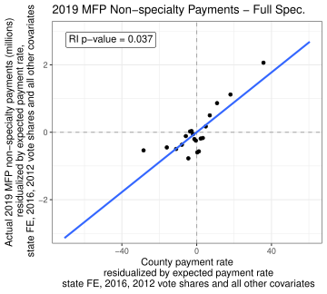
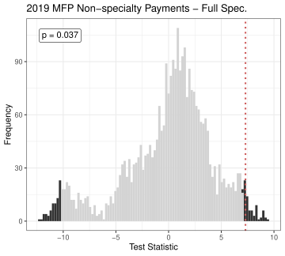
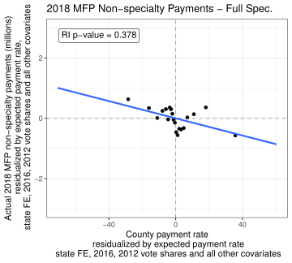
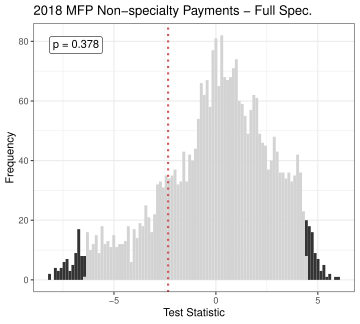
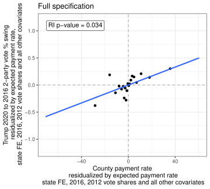
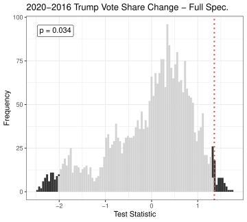

$$
  \require{cancel}
$$

```{r}
#| echo: false
#| warning: false
#| message: false
library(tidyverse)
library(haven)
library(estimatr)
library(inferference)
options(digits=3)
```

## Today

::: {.incremental}

- What happens when SUTVA breaks!?
  - Units' potential outcomes depend on **other units'** assigned treatments
- When do we see this?
  - Experiments on **social networks**
  - Experiments involving **differential** exposure to common shocks
- **Key idea**: Exposure mapping
  - How do different sorts of treatment assignments translate into particular **exposures** at the unit level?
  - Estimation/inference possible under **known** exposure mapping.
  - But be careful! Random experiment $\leadsto$ non-random exposures - need to adjust!
- What if I don't know the exposure mapping?
  - Analyzing as a regular experiment gives an "expected" ATE (marginalizing over the spillovers) **(Sävje, Aronow, Hudgens, 2017)**
  - But standard errors are **definitely** wrong!

:::

## Setup and notation

::: {.incremental}

- $N$ units indexed by $i = 1, \ldots, N$. Denote the set of units as $U$. 
- Observed outcome $Y_i$
- We have a **randomized experiment** that assigns a vector of treatment
  - The full assignment vector $\mathbf{z} = (z_1, \ldots, z_N)'$ is random with support $\Omega$ 
  - $\Pr(\mathbf{z} = z) = p_z$ is known
- **Potential outcomes** $y_i(\mathbf{z})$ - what would we **observe** for unit $i$ under the **complete** set of assignments across all units $\mathbf{z}$
  - We can write the potential outcomes as: $y_i(z_i; z_{-i})$
  - $z_i$ is the treatment assigned to unit $i$, $z_{-i}$ are the treatments assigned to all other units.
- **SUTVA** assumes that $y_i(\mathbf{z}) = y_{i}(z_i)$. Only $i$'s status matters for $i$'s potential outcomes.
- But under arbitrary interference $y_i(z_i; z_{-i}) \neq y_i(z_i; z_{-i}')$
  - $2^N$ potential outcomes for each unit - without some structure we're hopeless.

:::

## Exposure mappings

:::{.incremental}

- **Aronow and Samii (2017)** consider a setting where we know an **exposure mapping** $f: \Omega \times \Theta \to \Delta$
  - We collapse the vector of assignments $\mathbf{Z}$ and unit $i$'s characteristics $\theta_i$ to its **exposure** $D_i$

    $$D_i = f(\mathbf{Z}, \theta_i)$$

- Examples:
  - We randomize a treatment on a social network. **Exposure** can be defined as whether a "close friend" received treatment (Jones et. al., 2017)
  - We randomize a level of **vaccination** in a region. **Exposure** can be defined as the **share** of residents who are exposed in a unit's region (Hudgens and Halloran, 2008)
  
:::

## Exposure mappings

:::{.incremental}

- Our new "consistency" assumption under a known exposure mapping

  $$Y_i = \sum_{k=1}^K I(D_i = d_k) y_i(d_k)$$

- Essentially, once we know the value of the exposure, all assignments that generate that exposure are equivalent
  - If we think the **number** of friends treated is the exposure mapping, **which** friends doesn't matter.

:::

## Causal estimands

:::{.incremental}

- We define causal estimands as **differences** across different types of exposure mappings

  $$\mu(d_k) = \frac{1}{N}\sum_{i=1}^N y_i(d_k), \qquad \tau(d_k, d_l) = \mu(d_k) - \mu(d_l)$$
  
- Examples
  - What is the average effect of having 5 of your friends exposed to treatment versus zero **fixing** your own treatment status?
  - What is the average effect of exposing you to treatment **holding fixed** how many of your friends are treated?
  
- Problem:
  - Even if $\mathbf{z}$ is completely randomized, exposures are **non-random**
  - This is because **unit-level** characteristics $\theta_i$ enter into the exposure mapping.
  - People who **have a lot of friends** are more likely to have **more friends treated**

:::

## IPW estimation

:::{.incremental}

- **Aronow and Samii (2017)** suggest that we can **adjust** for the probability of observing a given exposure via IPW
- We need to know the **propensity of exposure**

  $$\pi_i(d_k) = \Pr(D_i = d_k)$$
  
- If the design is known, this can be calculated directly 
  - e.g. given $8$ close friends and $.5$ probability of treatment, probability that $4$ are treated is $\approx .6367$

:::

## IPW estimation

:::{.incremental}

- Can apply our usual IPW estimators using these known exposure probabilities
- Our **Horvitz-Thompson** estimator is just

  $$\widehat{y^T_{HT}}(d_k) = \sum_{i=1}^N I(D_i = d_k)\, \dfrac{Y_i}{\pi_i(d_k)}$$
  
- Can also use **Hajek** estimator (normalize the weights to $1$)
- Need a **positivity** assumption on the exposures
  - It must be possible for all units to receive exposure $d_k$: $\pi_i(d_k) > 0 \forall i$

:::

## Variance Estimation

- **Aronow and Samii (2017)** propose a conservative variance estimator (conservative for similar reasons to the Neyman estimator)

  $$\begin{align*}\widehat{\text{Var}}\big[\widehat{y^T_{HT}}(d_k)\big] =& \sum_{i \in U} I(D_i = d_k)\, \big[1 - \pi_i(d_k)\big]\, \bigg[\frac{Y_i}{\pi_i(d_k)}\bigg]^2\; \\ &+\; \sum_{i \in U}\sum_{j \in U \setminus i} I(D_i = d_k)\, I(D_j = d_k)\, \frac{\pi_{ij}(d_k) - \pi_i(d_k)\pi_j(d_k)}{\pi_{ij}(d_k)}\, \frac{Y_i\, Y_j}{\pi_i(d_k)\pi_j(d_k)}\end{align*}$$
  
- Note the "off-diagonal" term - we need to account for the fact that the **joint** propensity of receiving exposure $d_k$ might not be the same as the product ofthe **marginals**
  - Also, note that when $\pi_{ij}(d_k) = 0$ for some pairs, we get bias (though Aronow and Samii show how to correct this)

## Example: Nickerson (2008)

::: {.incremental}

- Door-to-door GOTV experiment in Denver and Minneapolis (2002 primary).
- $N = 7722$ individuals living in $H = 3861$ two-person households.
- Households randomly assigned (within turfs) to one of three conditions:
  - **GOTV** message (~1/3)
  - **Recycling** message (placebo contact) (~1/3)
  - **Control** — no contact (~1/3)
- For treated households, canvassers visit.
  - **Whoever opens the door** receives the message $R_i = 1$. The household-mate is not contacted directly.
  - Who answers the door is **not random** — it correlates with age, gender, voting history, etc.

:::

## Estimands

::: {.incremental}

- Two estimands of interest:
  - **Direct effect**: receiving the GOTV pitch vs. *receiving the placebo pitch* — among the people who actually answer the door.
  - **Indirect effect:** living with a GOTV-treated partner vs. a placebo-treated partner — among the *un*reached.
- Note these are distinct from **mediation** direct/indirect effects.

:::

## Exposure mapping

- We restrict to **canvassed households** ($Z_h \in \{1, 2\}$ — GOTV or placebo). 
- Treatment within this subset: $Z_h \in \{1, 2\}$. 
  - Plus a within-household reach indicator $R_i \in \{0, 1\}$.
- Unit traits: $\theta_i = (h(i), j(i))$ — household membership and partner identity.
- Exposure mapping produces **four** conditions of interest:

::: {.incremental}

  - $d_{1R}$: $Z_h = 1$ (GOTV), $R_i = 1$ — GOTV reached
  - $d_{1S}$: $Z_h = 1$, $R_{j(i)} = 1$, $R_i = 0$ — GOTV spillover (unreached partner)
  - $d_{2R}$: $Z_h = 2$ (placebo), $R_i = 1$ — placebo reached
  - $d_{2S}$: $Z_h = 2$, $R_{j(i)} = 1$, $R_i = 0$ — placebo spillover

:::

## Generalized probability of exposure

- Two ingredients to $\pi_i(d_k) = \Pr(D_i = d_k)$:
  1. Conditional household assignment probability $\tilde p_z = \Pr(Z_h = z)$ — **known** from the design.
  2. Individual reach probability $e_i = \Pr(R_i = 1 \mid \theta_i)$ — **not** known, must be estimated.

::: {.fragment}

- Combining them, for individual $i$ in household $h$ with partner $j$:

  $$\pi_i(d_{1R}) = \tilde p_1\, e_i,\qquad \pi_i(d_{1S}) = \tilde p_1\, e_j$$
  $$\pi_i(d_{2R}) = \tilde p_2\, e_i,\qquad \pi_i(d_{2S}) = \tilde p_2\, e_j$$

:::

## Estimating the propensities

::: {.incremental}

- Randomization was **stratified by turf** - use turf-specific conditional household assignment probabilities
- For $\hat e_i$: covariates are age, gender, party, prior turnout history (1998, 1999, 2000 general/primary, 2001), both for the unit *and* its household-mate (either could open the door).
- Gender and party are **only observed in Denver**, so we **stratify the propensity model by city** (separate logits in Denver and Minneapolis).
- Fit on canvassed households (where $R_i$ is observed) and predict $\hat e_i$ for all units in our analysis sample.

:::

## Loading and preparing the data

```{r data-prep, message=F, warning=F}
#| code-fold: show
data(voters)
dat <- as_tibble(voters)

# A handful of treated households have BOTH members reached
# (data anomaly given design). Drop them.
trt_dat <- dat %>% filter(treatment %in% 1:2)
bad_fam <- trt_dat %>% group_by(family) %>%
  summarize(n_reach = sum(reached)) %>% filter(n_reach > 1) %>% pull(family)
dat <- dat %>% filter(!(family %in% bad_fam))

# Restrict to canvassed households (drop pure controls).
dat <- dat %>% filter(treatment %in% 1:2) %>%
  mutate(Z = factor(treatment, levels = c(1,2), labels = c("gotv","placebo")))

# Turf-level conditional household assignment probabilities (within canvassed)
hh <- dat %>% distinct(family, turf, treatment)
turf_probs <- hh %>% group_by(turf) %>%
  summarize(p1 = mean(treatment == 1),   # GOTV  | canvassed
            p2 = mean(treatment == 2))   # placebo | canvassed
dat <- dat %>% left_join(turf_probs, by = "turf")
```

## Adding partner covariates

```{r partner-covs, message=F, warning=F}
#| code-fold: show
# Each household has exactly two members; reverse the within-family order
# to attach each unit's partner's characteristics.
dat <- dat %>% group_by(family) %>%
  mutate(across(c(age, voted98, voted99, voted00, voted00p, voted01),
                ~ rev(.x), .names = "{.col}_partner"),
         partner_reached = rev(reached)) %>%
  ungroup()

# Gender / party are missing for all of Minneapolis, so we keep them
# only when they exist (used in the city-stratified propensity model).
dat <- dat %>% group_by(family) %>%
  mutate(gender_partner = if (first(city) == "DENVER") rev(gender) else NA_character_,
         party_partner  = if (first(city) == "DENVER") rev(party)  else NA_character_) %>%
  ungroup()
```

## Estimating the reach propensity

```{r prop-score, message=F, warning=F}
#| code-fold: show
# City-stratified logistic propensity model
denver_dat <- dat %>% filter(city == "DENVER")
minn_dat   <- dat %>% filter(city == "MINNEAPOLIS")

ps_denver <- glm(reached ~ age + I(age^2) + gender + party +
                   voted98 + voted99 + voted00 + voted00p + voted01 +
                   age_partner + gender_partner + party_partner +
                   voted98_partner + voted99_partner + voted00_partner +
                   voted00p_partner + voted01_partner,
                 data = denver_dat, family = binomial())

ps_minn <- glm(reached ~ age + I(age^2) +
                 voted98 + voted99 + voted00 + voted00p + voted01 +
                 age_partner +
                 voted98_partner + voted99_partner + voted00_partner +
                 voted00p_partner + voted01_partner,
               data = minn_dat, family = binomial())
```

## Predicted reach probabilities

```{r predict-eps}
#| code-fold: show
denver_idx <- which(dat$city == "DENVER")
minn_idx   <- which(dat$city == "MINNEAPOLIS")

dat$e_i <- NA_real_
dat$e_i[denver_idx] <- predict(ps_denver, newdata = dat[denver_idx, ], type = "response")
dat$e_i[minn_idx]   <- predict(ps_minn,   newdata = dat[minn_idx,   ], type = "response")

# Trim pathological values to keep IPW weights stable
eps <- 0.005
dat$e_i <- pmin(pmax(dat$e_i, eps), 1 - eps)
dat <- dat %>% group_by(family) %>%
  mutate(e_partner = rev(e_i)) %>% ungroup()
```

## Constructing exposure conditions

```{r exposure-setup}
#| code-fold: show
dat <- dat %>% mutate(
  exposure = case_when(
    Z == "gotv"    & reached == 1                        ~ "d1R",
    Z == "gotv"    & reached == 0 & partner_reached == 1 ~ "d1S",
    Z == "placebo" & reached == 1                        ~ "d2R",
    Z == "placebo" & reached == 0 & partner_reached == 1 ~ "d2S"
    # remaining units (nobody reached in their household) drop out
  ),
  pi_d1R = p1 * e_i,
  pi_d1S = p1 * e_partner,
  pi_d2R = p2 * e_i,
  pi_d2S = p2 * e_partner
)
```

## Implementing the IPW estimators

```{r ht-hajek-fns}
#| code-fold: show
N <- nrow(dat)
exposures <- c("d1R","d1S","d2R","d2S")

mu_HT <- function(d) {
  pi_d <- dat[[paste0("pi_", d)]]
  ind  <- as.integer(dat$exposure == d & !is.na(dat$exposure))
  sum(ind * dat$voted02p / pi_d) / N
}
mu_H <- function(d) {
  pi_d <- dat[[paste0("pi_", d)]]
  ind  <- as.integer(dat$exposure == d & !is.na(dat$exposure))
  sum(ind * dat$voted02p / pi_d) / sum(ind / pi_d)
}

mu_HT_v <- sapply(exposures, mu_HT)
mu_H_v  <- sapply(exposures, mu_H)
```

## Variance implementation

```{r var-fns}
#| code-fold: show
# AS17 eq. 7 variance of the HT total y^T_HT(d_k).
# Off-diagonal term vanishes since each household contributes at most one unit
# to any of {d1R, d1S, d2R, d2S}.
var_yT_HT <- function(d) {
  pi_d <- dat[[paste0("pi_", d)]]
  ind  <- as.integer(dat$exposure == d & !is.na(dat$exposure))
  Y    <- dat$voted02p
  sum(ind * (1 - pi_d) * (Y / pi_d)^2)
}

# Hájek "linearized" variance: same form with residualized outcome.
var_mu_H <- function(d) {
  pi_d <- dat[[paste0("pi_", d)]]
  ind  <- as.integer(dat$exposure == d & !is.na(dat$exposure))
  S_d  <- sum(ind / pi_d) / N
  e    <- (dat$voted02p - mu_H_v[d]) / S_d
  sum(ind * (1 - pi_d) * (e / pi_d)^2) / N^2
}

# Variance of the contrast = sum of variances (Cov ≈ 0; disjoint units).
var_tau_HT <- function(d_k, d_l) (var_yT_HT(d_k) + var_yT_HT(d_l)) / N^2
var_tau_H  <- function(d_k, d_l) var_mu_H(d_k) + var_mu_H(d_l)
```

## Combining the results

```{r contrast-table}
#| code-fold: show
contrasts <- list(
  "Direct: GOTV vs placebo, reached"   = c("d1R", "d2R"),
  "Indirect: GOTV vs placebo, unreached" = c("d1S", "d2S")
)

results <- map_dfr(names(contrasts), function(nm) {
  d1 <- contrasts[[nm]][1]; d2 <- contrasts[[nm]][2]
  tibble(contrast = nm,
         HT_est = mu_HT_v[d1] - mu_HT_v[d2],
         HT_se  = sqrt(var_tau_HT(d1, d2)),
         H_est  = mu_H_v[d1]  - mu_H_v[d2],
         H_se   = sqrt(var_tau_H(d1, d2)))
})
```

## Results

```{r mu-table, echo=F}
tibble(exposure = exposures,
       mu_HT = mu_HT_v,
       mu_H  = mu_H_v) %>%
  knitr::kable(digits = 3)
```

```{r results-table, echo=F}
results %>%
  mutate(across(where(is.numeric), ~ sprintf("%.3f", .x))) %>%
  knitr::kable(col.names = c("Contrast",
                             "HT estimate", "HT SE",
                             "Hájek estimate", "Hájek SE"),
               align = "lrrrr")
```

- We find that turnout among those who were **directly** exposed to the canvasser who did GOTV was about 40%
  - Compared to the direct contact among those exposed to the recycling canvasser (30%) we get a sizeable direct effect
- But **indirectly exposed** household-mates still turn out at 35%

## Shift-share designs

::: {.incremental}

- In economics, a very popular style of design is the **shift-share** design
  - Origins in **Bartik (1991)** but popularized by the "China shock" design of **Autor et. al. (2013)**
  
- Consider the linear model

  $$Y_i = \beta z_i + \epsilon_i$$

- We're interested in the average effect of $z_i$ ($\beta$)
  - $z_i$ is typically used as an **instrument** but we'll focus on the "reduced form" effect here.

- Example **(Autor et. al. (2013))**
  - $Y_i$: manufacturing employment in location $i$
  - $z_i$: an **instrument** for import growth from China post-WTO entry

:::

## Shift-share designs

::: {.incremental}

- In a **shift-share** design, $z_i$ has a particular known structure

  $$z_i = \sum_{k=1}^K s_{ik} \times g_k$$

- $g = \{g_1, g_2, \dotsc, g_K\}$ are the **shifts**
- $s_i = \{s_{i1}, s_{i2}, \dotsc, s_{iK}\}$ are the unit-specific **shares**

- Example **(Autor et. al. (2013))**
  - $g_k$: Industry $k$'s overall growth in imports from China
  - $s_{ik}$ The share of industry $k$'s employment in location $i$

:::

## Identification strategies

::: {.incremental}

- There are **two** approaches to identification in the shift-share setting

- **Random shares** (Goldsmith-Pinkham et. al., 2020)
  - In this case, the shares themselves act as **many** exogenous instruments. 
  - Each is observed at the level of $i$, so just do regular IV w/ the shares
- **Random shocks** (Borusyak, Hull, Jaravel, 2022)
  - Analogous to an **experiment** with **interference**
  - Randomness in the **shocks** propagates in a non-random way via the **shares**
  - The shift-share structure is a **known exposure mapping**
  - With shares that sum to $1$, can estimate using a **shock-level** regression.

:::

## Example: Effects of the 2019 MFP

::: {.incremental}

- **Gulotty and Strezhnev (2026)** look at the effects of Trump I agriculture bailout on 2020 presidential vote share
  - Implement the **Borusyak and Hull (2023)** approach to identification with **general** formula instruments.
  
- The paper wants to know whether **money** paid to farming counties increased **support** for Trump in 2020
  - But payments are non-random! Some places were "hurt" more by the trade war. Some places have more farmers, etc...
  - In the 2019 Market Facilitation Program (MFP), counties were assigned a single per-acre payment rate (our instrument for overall county payments)
  - The instrument had a **formula** structure that looked a lot like a shift-share!
  
    $$(\text{Rate})_i^{\text{\$/acre}} = \frac{\sum_{c=1}^C (\text{Acreage})_{i,c}^{\text{acre}} \times (\text{Yield})_{i,c}^{\text{unit/acre}} \times \text{(Rate)}_{c}^{\text{\$/unit}}}{\sum_{c=1}^C \text{(Acreage)}_{i,c}^{\text{acre}}}$$
    
:::

## Example: Effects of the 2019 MFP

::: {.incremental}

- The payment rate is a function of...
  - **non-random** county-level shares of each commodity
  - **random** shocks in the compensation rate assigned to each commodity
  
- We adjust for this non-randomness by computing the **expected** county payment rate and subtracting this from the **observed** county payment rate.
  - We compute the expectation by assuming shocks are **exchangeable** at some level.
  
- **Essentially**
  - We assume there was an **experiment** run at the level of the commodities...
  - ...that **propagated** to farmers/voters through a county-level exposure (the per-acre rate)

:::

## Example: Effects of the 2019 MFP

::: {.incremental}

- **Outcome**: Difference between 2020 and 2016 Trump county vote share (percentage points)
- **Treatment**: 2019 MFP Payments
- **Instrument**: Re-centered payment-rate instrument

- **Design-based randomization inference**
  - Asymptotics unlikely to be valid with only 12 shocks!
  - Construct a randomization distribution under the null of no effect using **permutations** of the crop-level shocks.

- Our **test statistic** - the sample covariance of $Y$ and the de-meaned instrument **(Borusyak and Hull, 2023)**

:::

## Example: Effects of the 2019 MFP

::: {layout-ncol=2}

{fig-align="center" width="100%"}

{fig-align="center" width="100%"}

:::

## Example: Effects of the 2019 MFP

::: {layout-ncol=2}

{fig-align="center" width="100%"}

{fig-align="center" width="100%"}

:::

## Example: Effects of the 2019 MFP

::: {layout-ncol=2}

{fig-align="center" width="100%"}

{fig-align="center" width="100%"}

:::

  
## Conclusion

::: {.incremental}

- A lot of interesting problems in causal inference deal with **interference** in exposures
  - Experiments conducted at **one level** filter down into **another level** of observation.
- The **trick** is to figure out the **exposure mapping**
  - What's the function that converts the vector of randomized treatments into the **thing that matters**?
  - SUTVA is a kind of **super-restrictive** exposure mapping
- **Exposure mappings** depend on non-random unit-level characteristics
  - Adjust using standard covariate-adjustment methods!
- A general principle for causal inference in observational designs:
  - **Find the hidden experiment**
  
:::