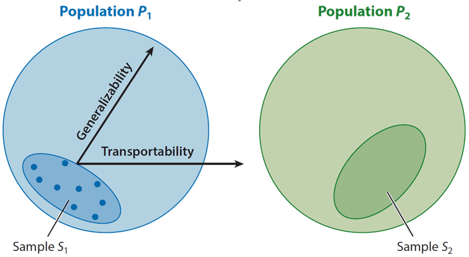

```{r}
#| echo: false
#| message: false
#| warning: false
library(tidyverse)
library(estimatr)
knitr::opts_chunk$set(digits = 3)
options(digits=3)
```

## Last week

  - Why randomized experiments work
    - Guarantee treatment $D_i$ is independent of potential outcomes $\{Y_i(1), Y_i(0)\}$

. . .

  - Inference for treatment effects
    - **Fisher**: Can get exact p-values under the sharp null just knowing the
    distribution of treatment assignments.
    - **Neyman**: A conservative variance estimator for the difference-in-means + large-sample asymptotics

    $$\widehat{Var(\hat{\tau})} = \frac{s^2_t}{N_t} + \frac{s_c^2}{N_c}$$

## This week

- One post-experiment use of covariates
  - Balance checking

. . .

- When should we *not* condition on covariates?
  - When they're **post-treatment**!
  - Attrition/Non-compliance
  - Bounds when we *have* to condition
  
. . .
  
- How do we **generalize** from a single experiment?
  - What are the dimensions of **external validity**?
  - What do we have to believe to **transport** a treatment effect?

## Balance checking {.title-slide}

$$
  \require{cancel}
$$

## Balance tests

  - One reason to use covariates even in completely randomized designs is to check
whether the experiment **actually** did what it was supposed to do.

. . .

- Under any randomization scheme that satisfies **ignorability**:

$$X_i {\perp \! \! \! \perp} D_i$$


$$E[X_i | D_i = 1] = E[X_i | D_i = 0]$$

. . .

- If we correctly randomized treatment, then the expectation (and the distribution)
of covariates should be **the same** in treatment and control.

. . .

- But in any given sample, we'll observe a difference just by chance -- how do we
know if this **is a problem**?

## Against balance tests

- One view in some experimentally-focused fields is that you should **never** waste time
checking balance

. . .

- **Senn (1994)** *Statistics in Medicine*
  1. Randomization ensures balance over all randomizations.
  2. Observing any particular imbalance in our sample doesn't disprove 1

. . .

- What if we did screw up? What if the randomization software had a bug? What if there was
some implementation issue?
  - Maybe a balance test helps here?

. . .

- But how would we interpret a "failed" balance test?
  - A reason to go back and check the randomization process - if we think that it *did* actually work
  as intended, we may just have gotten unlucky.
  - Might want a stricter threshold than $p < .05$ if we **really** believe treatment was randomized.


## Against balance tests

- Another more nuanced argument is that you shouldn't use balance tests to decide
whether to **include or not include** covariates in the analysis.

. . .

- **Mutz, Pemantle and Pham (2019)**
  - Sometimes, researchers run a lot of univariate balance tests in an experiment.
  - If a test for some covariate fails, they include that covariate in adjustment.
  - This process risks raising false-positive rates through researcher "degrees-of-freedom"

. . .

- This is a correct argument, but is less an argument against *balance testing* per-se and
more against ad-hoc or data-dependent covariate choices.

. . .

- When we talk about covariates in experiments next week, we'll emphasize the importance of **ex-ante** choices.
  - Don't decide on **what** to include in your analysis based on tests conducted **after the experiment is run** and using **information from the experiment outcomes**
  
## Example: Broockman and Kalla (2023)

- **Broockman and Kalla (2023)** "Consuming cross-cutting media causes learning and moderates attitudes: A field experiment with Fox News viewers"
  - Sample of **763** individuals in **695** households who regularly watch FOX News
  - **Treatment**: Incentivized to watch CNN instead of Fox News for one month (**304** individuals)
  - **Control**: No incentive (continue normal viewing habits) (**459** individuals)

. . .

- Randomization was done at the household level, stratified by baseline characteristics
- Let's check balance on pre-treatment covariates!

## Broockman and Kalla: Loading the data

```{r bk-load}
#| echo: true
#| message: false
#| warning: false
library(haven)
library(cobalt)

# Load the Broockman and Kalla data
bk <- read_dta("assets/data/primary_dataset_unstd.dta")

# Treatment variable: treat (1 = CNN incentive, 0 = control)
table(bk$treat)
```

```{r bk-covariates}
#| echo: true
# Key pre-treatment covariates from baseline survey (t1_) and voter file (vf_)
baseline_covs <- c(
  # Demographics from voter file
  "vf_age",                    # Age
  # Baseline survey measures (t1_ = time 1, pre-treatment)
  "t1_pid7",                   # 7-point party ID (1 = Strong Dem to 7 = Strong Rep)
  "t1_ideo_self",              # Self-reported ideology
  "t1_therm_trump",            # Feeling thermometer: Trump
  "t1_therm_biden",            # Feeling thermometer: Biden
  "t1_therm_fox",              # Feeling thermometer: Fox News
  "t1_therm_cnn",              # Feeling thermometer: CNN
  "t1_trust_fox",              # Trust in Fox News
  "t1_trust_cnn",              # Trust in CNN
  # Pre-treatment TV viewership (from set-top box data)
  "pre_treat_fox_minutes",     # Minutes watching Fox pre-treatment
  "pre_treat_cnn_minutes"      # Minutes watching CNN pre-treatment
)
```

## Broockman and Kalla: Aggregate to household level

```{r bk-aggregate}
#| echo: true
# Randomization was at the household level, so aggregate covariates
bk_hh <- bk %>%
  group_by(hh_id) %>%
  summarize(
    treat = first(treat),
    # Take the mean of covariates within household
    across(all_of(baseline_covs), ~mean(.x, na.rm = TRUE))
  ) %>%
  ungroup()

# Check: 695 households
nrow(bk_hh)

# Check treatment assignments
table(bk_hh$treat)
```

## Broockman and Kalla: Balance table

```{r bk-balance}
#| echo: true
#| output-location: slide
# Use cobalt to create a balance table (at household level)
bal_tab <- bal.tab(
  x = bk_hh %>% select(all_of(baseline_covs)),   # Covariate data
  treat = bk_hh$treat,           # Treatment indicator
  binary = "std",                # Standardize binary variables
  continuous = "std",            # Standardize continuous variables
  s.d.denom = "pooled"           # Use pooled SD for standardization
)
print(bal_tab)
```

## Broockman and Kalla: Love plot

```{r bk-love, message = F}
#| echo: false
#| fig-width: 10
#| fig-height: 6
#| fig-align: center
# Create a Love plot to visualize balance (at household level)
love.plot(
  x = bk_hh %>% select(all_of(baseline_covs)),
  treat = bk_hh$treat,
  binary = "std",
  s.d.denom = "pooled",
  thresholds = c(m = 0.1),      # Show threshold at 0.1 SMD
  var.order = "unadjusted",
  abs = TRUE,                    # Show absolute values
  title = "Covariate Balance: Broockman & Kalla (2023)"
)
```

## Multiple testing

- We could put a simple difference-in-means hypothesis test on each of these covariates.
  - But with enough covariates, we'd find a $p < .05$ just by chance!

```{r, echo=T}
lm_robust(t1_therm_trump ~ treat, data=bk_hh)
```

. . . 

- Is there a quick way to deal with multiple testing in balance checks?
  - Could correct for multiple comparisons...
  - ...or construct a **single** test.
  - How? With randomization inference!
  
## Permutation/Randomization Testing for Balance

- **Step 1:** Run a regression predicting treatment using all the covariates. Store the F-statistic (or any statistic summarizing "goodness of fit")

```{r, echo=T}
treat_reg <- lm_robust(treat ~ vf_age + t1_pid7 + t1_ideo_self + t1_therm_trump + t1_therm_biden +
                         t1_therm_fox + t1_therm_cnn + t1_trust_fox + t1_trust_cnn + pre_treat_fox_minutes +
                         pre_treat_cnn_minutes, data=bk_hh)
tstat_obs <- treat_reg$fstatistic[1]
```

## Permutation/Randomization Testing for Balance

- **Step 2:** Permute the treatment assignment based on the known assignment scheme
- **Step 3:** Calculate the test statistic under alternative assignments

```{r, echo=T}
set.seed(53706)
iterations <- 10000
tstat_null <- rep(NA, iterations)
for (i in 1:iterations){
  bk_hh$treat_perm <- sample(bk_hh$treat)
  treat_reg_null <- lm_robust(treat_perm ~ vf_age + t1_pid7 + t1_ideo_self + t1_therm_trump + t1_therm_biden +
                         t1_therm_fox + t1_therm_cnn + t1_trust_fox + t1_trust_cnn + pre_treat_fox_minutes +
                         pre_treat_cnn_minutes, data=bk_hh)
  tstat_null[i] <- treat_reg_null$fstatistic[1]
}
```

## Permutation/Randomization Testing for Balance

- **Step 4:** Compare the observed statistic to the permuted null distribution

```{r, echo=T}
mean(tstat_null > tstat_obs)
```

## Guidelines for balance testing

- Testing for balance to assess whether randomization occurred as intended: [Good]{.green}
  - Careful with multiple testing/false positives
  - $p < .05$ is probably too low of a threshold, but you should probably be concerned if $p < 1 \times 10^{-6}$
  - What do do if a balance check fails? Check your experiment!

. . .

- Testing for balance to pick which covariates to adjust for: [Bad]{.red}
  - "Garden of forking paths"
  - You should choose covariates ex-ante (even if not blocking)
  - Pick covariates that predict $Y$ - balance checks are the wrong criteria.

## Post-treatment bias {.title-slide}

## Post-treatment covariates

- When talking about covariates, we've emphasized that $X_i$ must be **pre-treatment**
- What happens when we condition on some post-treatment variable (call it $M_i$).
- **Intuition**: $M_i$ is post-treatment. It has potential outcomes: $\{M_i(1), M_i(0)\}$
  - But we can't condition on the *latent* potential outcomes, we only condition on the observed $M_i$
  - This induces a form of enodgenous "selection bias"

. . .

- Many cases in political science
  - Experiments with **non-compliance**
  - **Attention checks** in survey experiments.
  - **Administrative data** (police interactions are only recorded if a stop occurs)
  - **Attrition** induced by treatment (e.g. court proceedings that settle)


## Post-treatment bias

- Let $M_i$ denote the post-treatment covariate. Since it's post-treatment, it has potential outcomes $\{M_i(1), M_i(0)\}$ as
though it were any other outcome.

. . .

- By randomization

$$\{M_i(1), M_i(0)\} {\perp \! \! \! \perp} D_i$$

. . .

- What happens if we take the difference-in-means conditional on $M_i = 1$

$$E[Y_i | D_i = 1, M_i = 1] - E[Y_i | D_i = 0, M_i = 1]$$

. . .

- By consistency:

$$E[Y_i(1) | D_i = 1, M_i(1) = 1] - E[Y_i(0) | D_i = 0, M_i(0) = 1]$$


## Post-treatment bias

- Ignorability gets us

$$E[Y_i(1) |  M_i(1) = 1] - E[Y_i(0) |  M_i(0) = 1]$$

. . .

- Is this the ATE?
  - No! $M_i(1) = 1$ and $M_i(0) = 1$ define *two different subsets of the sample*
- Under what assumptions would we get the ATE?

. . .

- Either:
  1. No individual effect of treatment on $M_i$: $M_i(1) = M_i(0) \text{   } \forall i$
  2. $\{M_i(1), M_i(0)\} {\perp \! \! \! \perp} \{Y_i(1), Y_i(0\}$

. . .

- Neither of these assumptions is guaranteed by an experiment since we don't randomize $M_i$
- Therefore, conditioning on a post-treatment quantity **breaks** the experiment -- now it's an observational study.

## Principal strata

- We can think of the combination of $D_i$ and $M_i$ as defining a "sub-group" of units - these are referred to as "principal strata"
  - They have different names in the literature - one common convention comes from the **compliance** literature
  
Stratum              | $M_i(1)$          |  $M_i(0)$ |
:-------------------:|:-----------------:|:---------:|
"Always-takers"      |  $1$              |  $1$      |
"Never-takers"       |  $0$              |  $0$      |
"Compliers"          |  $1$              |  $0$      |
"Defiers"            |  $0$              |  $1$      |

. . .

- Units with $M_i = 1$ could be any three of these strata. Even observing $D_i$ narrows it down to only two - we can't observe the strata directly.
- Strata aren't necessarily independent of potential outcomes $Y_i(d)$!
  - (e.g.) Units that would **never** respond to a door-to-door canvasser likely have **lower** propensity to vote.

## Example: Administrative data

- **Knox, Lowe and Mummolo (2020)** consider the problem of estimating the effect of civilian race on police use of force.
  - Typically, past studies would use administrative data from police departments on stops
  - Compare police use of force among Black civilians who are stopped and white civilians who are stopped.
  - **Problem**: Stops are post-treatment!

. . .

- Define $D_i$ as the treatment (race of civilian), $M_i$ is an indicator for whether a stop occurs, $Y_i$ is severe use of force
- The difference-in-means does not identify the treatment effect unless...
  - $D_i$ has no effect on $M_i$ (race of civilian doesn't affect whether an officer makes a stop)
  - $M_i(1), M_i(0)$ is independent of $Y_i(1), Y_i(0)$ (civilian propensity to be stopped (net of race) is uncorrelated with propensity to use force)

. . .

- Given substantive knowledge of this setting, both assumptions seem **implausible**.

## The Survivor Average Causal Effect

- In the attrition setting, we focus on the **Survivor Average Causal Effect (SACE)**
  - The ATE among those who would be observed irrespective of treatment status
  - In the **Knox, Lowe and Mummolo (2020)** setting: the ATE of civilian race on use of force among civilians who would be stopped irrespective of their race.

  $$\tau_{\text{SACE}} = E[Y_i(1) - Y_i(0) | M_i(1) = 1, M_i(0) = 1]$$

. . .

- Recall that the difference-in-means only gets us 

$$E[Y_i(1) |  M_i(1) = 1] - E[Y_i(0) | M_i(0) = 1]$$

. . . 

- $M_i(1) = 1$ is not the same subset of units as $M_i(0) = 1$
  - $M_i(1) = 1$ includes both **survivors** and the "compliers" (or "helped by treatment")
  - $M_i(0) = 1$ includes both **survivors** and the "defiers" (or "hurt by treatment")

## Monotonicity

- One approach to bounding from **Lee (2009)** relies on an additional **monotonicity** assumption

$$M_i(1) \ge M_i(0) \text{  } \forall i \quad \text{or} \quad M_i(1) \le M_i(0) \text{  } \forall i$$

. . .

- Treatment affects selection in **only one direction**
  - Either treatment can only *increase* the probability of being observed (no "defiers")
  - Or treatment can only *decrease* the probability of being observed (no "compliers")
  
. . .

- In the **Knox, Lowe and Mummolo (2020)** setting
  - **Monotonicity**: non-minorities who are stopped **would also have been stopped** had they been a minority.


## Intuition for Lee bounds

- Suppose treatment *increases* observation probability: $M_i(1) \ge M_i(0)$
  - More units observed in the treated group than control group
- Monotonicity lets us pin down more of the **principal strata**.

. . .

- Among observed **treated units**:
  - Some are "survivors" (would be observed even under control)
  - Some are "compliers" (observed *only because* they got treatment)

. . .

- Among observed control units:
  - **All** are "survivors" (they're observed despite being in control)

. . .

## Intuition for Lee bounds

- If we could figure out who the compliers are and remove them - we could get point identification.
  - We **can't** - but we can get the **share** of compliers.
  - And we can **worst-case** which units those happen to be.
  
. . .

- Additionally, the share of survivors is **balanced** between treated and control

  $$Pr(M_i(1) = M_i(0) = 1 | D_i = 0) = Pr(M_i(1) = M_i(0) = 1 | D_i = 1)$$
  
. . .

- All observed units in the control group are survivors

  $$Pr(M_i = 1 | D_i = 0) = Pr(M_i(1) = M_i(0) = 1 | D_i = 0)$$
  
- And observed units in the treated group are survivors + compliers 

  $$Pr(M_i = 1 | D_i = 1) = Pr(M_i(1) = M_i(0) = 1 | D_i = 1) +  Pr(M_i(1) = 1, M_i(0) = 0 | D_i = 1)$$W

## The trimming procedure

- Let $p_1 = Pr(M_i = 1 | D_i = 1)$ and $p_0 = Pr(M_i = 1 | D_i = 0)$
  - Under monotonicity with $M_i(1) \ge M_i(0)$: $p_1 \ge p_0$

. . .

- We can use the proportion of survivors identified in the control group to identify the share of "compliers" in the treated group by **differencing**
  - Treated group is **survivors + compliers** - we subtract the **survivors** using what we observe in control

- So the fraction of treated-and-observed who are "compliers" is:

$$q = \frac{p_1 - p_0}{p_1}$$

. . .

- The premise of **bounds** and **partial identification** is that we want to characterize the **set** of treatment effects consistent with the observed data.
  - When we have point identification, only *one* ATE is consistent with the observed data.
  - But sometimes **a range** of effects is consistent with what we see because the data only partially pins down the potential outcomes.

## The trimming procedure

- Under the monotonicity assumption, we can apply a **trimming procedure** to obtain a "worst case" and a "best case" for the ATE
  - The identification problem comes from the fact that the treated group has some share of compliers - we identify that quantity $q$
  - Trimming the **top** $q$ observations (in terms of the outcome) gives a **lower bound** on $\tau_{\text{SACE}}$
  - Trimming the **bottom** $q$ observations (in terms of the outcome) gives an **upper bound** on $\tau_{\text{SACE}}$

. . .

- **Lower bound**: Trim the top $q$ proportion of treated outcomes

$$\tau^{LB} = \mathbb{E}[Y_i | D_i = 1, M_i = 1, Y_i \le y^{1-q}_1] - \mathbb{E}[Y_i | D_i = 0, M_i = 1]$$

- **Upper bound**: Trim the bottom $q$ proportion of treated outcomes

$$\tau^{UB} = E[Y_i | D_i = 1, M_i = 1, Y_i \ge y^{q}_1] - E[Y_i | D_i = 0, M_i = 1]$$

- Where $y^{q}_1$ is the $q$-th quantile of the treated outcome distribution


## Visualizing the Lee Bounds

- Let's run a quick simulation to show how the bounds work.
- Consider a case with $0$ **treatment effect**, standard normal outcome, but selection associated with both **treatment** and **outcome**
  - $Y > 0$ - $70\%$ chance of being a survivor, $30\%$ chance of being a "complier"/"helped by treatment"
  - $Y < 0$ - $30\%$ chance of being a survivor, $70\%$ chance of being a "complier"/"helped by treatment"
- Marginally, half of all observations are **compliers** and half are **survivors**.
  
- Generate $5000$ observations, and look at their outcome distributions?

```{r, echo=T}
set.seed(53706)
N <- 5000
lee_df <- data.frame(Y = rnorm(n = N), D = rbinom(N, 1, .5))
lee_df <- lee_df %>% mutate(treatment = case_when(D == 1 ~ "Treated",
                                                  D == 0 ~ "Control"))
lee_df <- lee_df %>% mutate(survivor_prob = case_when(Y > 0 ~ .7,
                                                      Y < 0 ~ .3))
lee_df <- lee_df %>% mutate(survivor = rbinom(N, 1, survivor_prob))
lee_df <- lee_df %>% mutate(M = as.numeric(D == 0)*survivor + as.numeric(D == 1))
```

## Visualizing the Lee Bounds

- What do the **observed** outcome distributions look like?

```{r}
lee_df %>% filter(M == 1) %>% ggplot(aes(x=Y, fill = treatment)) + geom_density(alpha = .5) +
  theme_bw() + scale_fill_manual(values = c("indianred", "dodgerblue")) +
  labs(fill = "Treatment Group") + geom_vline(xintercept = mean(lee_df %>% filter(M == 1&D == 0) %>% pull(Y)), lwd = 2, lty = 2, colour = "indianred") +
 geom_vline(xintercept = mean(lee_df %>% filter(M == 1&D == 1) %>% pull(Y)), lwd = 2, lty = 2, colour = "dodgerblue") +
  ggtitle("Naive Comparison among M = 1")
```

- It looks like there's a **negative** effect?
  - There isn't - this is selection! 
  - We're systematically filtering out the treated high $Y$ outcomes at a higher rate to control.

## Visualizing the Lee Bounds

- What's our estimated share of compliers in the treatment group?

```{r, echo = T}
q_complier <- (mean(lee_df$M[lee_df$D == 1]) - mean(lee_df$M[lee_df$D == 0]))/
  (mean(lee_df$M[lee_df$D == 1]))
q_complier
```

- Consistent with our simulation, about half of the units in the treated group are **compliers**
- Our bounds are going to be constructed by dropping either...
  - ...the **top** half of the distribution (lower bound)...
  - ...or the **bottom** half of the distribution (upper bound)
  
- What quantiles are we cutting at?

```{r}
cutpoints <- quantile(lee_df$Y[lee_df$M == 1&lee_df$D == 1], c(q_complier, 1-q_complier))
cutpoints
```
  
## Visualizing the Lee Bounds

- What happens when we trim the bottom

```{r}
lee_df %>% filter(M == 1) %>% filter(D == 0|D==1&Y > cutpoints[2]) %>% ggplot(aes(x=Y, fill = treatment)) + geom_density(alpha = .5) +
  theme_bw() + scale_fill_manual(values = c("indianred", "dodgerblue")) +
  labs(fill = "Treatment Group") + geom_vline(xintercept = mean(lee_df %>% filter(M == 1&D == 0) %>% pull(Y)), lwd = 2, lty = 2, colour = "indianred") +
 geom_vline(xintercept = mean(lee_df %>% filter(M == 1&D == 1&Y > cutpoints[2]) %>% pull(Y)), lwd = 2, lty = 2, colour = "dodgerblue") +
  ggtitle("Lee Bounds - Upper Bound - Trim *bottom* half of treated")
```

- Upper bound is **positive**

## Visualizing the Lee Bounds

- What happens when we trim the top

```{r}
lee_df %>% filter(M == 1) %>% filter(D == 0|D==1&Y < cutpoints[1]) %>% ggplot(aes(x=Y, fill = treatment)) + geom_density(alpha = .5) +
  theme_bw() + scale_fill_manual(values = c("indianred", "dodgerblue")) +
  labs(fill = "Treatment Group") + geom_vline(xintercept = mean(lee_df %>% filter(M == 1&D == 0) %>% pull(Y)), lwd = 2, lty = 2, colour = "indianred") +
 geom_vline(xintercept = mean(lee_df %>% filter(M == 1&D == 1&Y < cutpoints[1]) %>% pull(Y)), lwd = 2, lty = 2, colour = "dodgerblue") +
  ggtitle("Lee Bounds - Lower Bound - Trim *top* half of treated")
```

- Lower bound is **negative** - The bounds contain the true effect of **zero**


## Properties of Lee bounds

- **Sharp bounds**: Cannot be tightened without additional assumptions
  - Any value within the bounds is consistent with the data and assumptions

. . .

- Bounds **collapse to a point** when:
  - Treatment has no effect on selection ($p_1 = p_0$, so $q = 0$)
  - In this case, SACE = ATE (no selection problem!)
  - But the **monotonicity** assumption is key here!

. . .

- Can construct confidence intervals for bounds using bootstrap or analytical standard errors
  - Note that the **bounds** reflect fundamental uncertainty in mapping from **observed outcomes** to **potential outcomes**
  - Further uncertainty is driven by the usual sources (random sampling/treatment assignment)


## Effect Heterogeneity and External Validity {.title-slide}

## Heterogeneous treatment effects (HTE)

- When targeting the **average treatment effect**, we (try to be) entirely agnostic about the variation in $\tau_i$ between units in the sample

  $$\tau_{\text{ATE}} = \mathbb{E}[Y_i(1) - Y_i(0)]$$
  
. . .

- But often we have **predictions** about average effects for different **sub-groups** in the sample.
  - Effects of treatment are **rarely homogeneous**: **Republicans** respond to cues from Trump differently than **Democrats**!
  - Can we target a different quantity of interest?
  
. . .

- The **Conditional Average Treatment Effect (CATE)**

  $$\tau(x) =  \underbrace{E[Y_i(1) | X_i = x]}_{\text{Mean P.O. under treatment among units with } X_i = x} -  \underbrace{E[Y_i(0) | X_i = x]}_{\text{Mean P.O. under control among units with } X_i = x}$$
  
## Estimating the CATE

- In a **completely randomized experiment**, it's straightforward to estimate the CATE
  - Just subset down to units with $X_i = x$ and take the difference-in-means
  - Conventional inference using the Neyman variance (though be careful assuming asymptotic normality when sub-groups are small!)

. . .

$$\hat{\tau}(x) = \frac{1}{N_{t,x}}\sum_{i: X_i = x}^N Y_i D_i - \frac{1}{N_{c,x}}\sum_{i: X_i = x}^N Y_i (1 - D_i)$$

where $N_{t, x}$ is the number of units with $D_i = 1, X_i = x$ and $N_{c, x}$ is the number of units with $D_i = 0, X_i = x$

. . . 

- Be **careful** in interpretation - CATEs assign no **causal** interpretation to $X_i$
  - (e.g.) A difference in treatment effects between **Democrats** and **Republicans** tells us nothing about the question "what if person $i$ were a Democrat rather than a Republican.
  - Many $X_i$ are **non-manipulable**
  
## Illustration: Gerber, Green and Larimer (2008)

- Let's return to the **Gerber, Green and Larimer (2008)** example
  - Does **social pressure** get people to vote more?
 
```{r, echo=T, message=F, warning=F, cache=T}
# Load the data
data <- read_dta('assets/data/ggr_2008_individual.dta')

# Aggregate to the household level
data_hh <- data %>% group_by(hh_id) %>% summarize(treatment = treatment[1], voted = mean(voted),
                                                   voted_p2004 = mean(p2004))
```

## Illustration: Gerber, Green and Larimer (2008)
 
- We might ask whether **social pressure** works more on the **less habitual voters**
  - Were voters who turned out in the 2004 primary affected differently by the Neighbors treatment?

```{r, echo=T, message=F, warning=F}
# Estimated ATE of Neighbors (3) vs. Control (0)
# At least one member of the household voted in Primary 2004
ate_voters <- mean(data_hh$voted[data_hh$treatment == 3&data_hh$voted_p2004 > 0]) -
  mean(data_hh$voted[data_hh$treatment == 0&data_hh$voted_p2004 > 0])
ate_voters

# No member of the household voted in Primary 2004
ate_nonvoters <- mean(data_hh$voted[data_hh$treatment == 3&data_hh$voted_p2004 == 0]) -
  mean(data_hh$voted[data_hh$treatment == 0&data_hh$voted_p2004 == 0])
ate_nonvoters
```

## Illustration: Gerber, Green and Larimer (2008)
 
- Let's compute the Neyman variance

```{r, echo=T, message=F, warning=F}
# Estimate the sampling variance
# At least one member of the household voted in Primary 2004
var_ate_voters = var(data_hh$voted[data_hh$treatment == 3&data_hh$voted_p2004 > 0])/sum(data_hh$treatment == 3&data_hh$voted_p2004 > 0) +
  var(data_hh$voted[data_hh$treatment == 0&data_hh$voted_p2004 > 0])/sum(data_hh$treatment == 0&data_hh$voted_p2004 > 0)

# No member of the household voted in Primary 2004
var_ate_nonvoters = var(data_hh$voted[data_hh$treatment == 3&data_hh$voted_p2004 == 0])/sum(data_hh$treatment == 3&data_hh$voted_p2004 == 0) +
  var(data_hh$voted[data_hh$treatment == 0&data_hh$voted_p2004 == 0])/sum(data_hh$treatment == 0&data_hh$voted_p2004 == 0)

```


## Illustration: Gerber, Green and Larimer (2008)

- 95% asymptotic confidence intervals

```{r, echo=T, message=F, warning=F}
# Confidence intervals (assuming asymptotic normality)
ate_95CI_voters = c(ate_voters - qnorm(.975)*sqrt(var_ate_voters),
  ate_voters + qnorm(.975)*sqrt(var_ate_voters))
# At least one member of the household voted in Primary 2004
ate_95CI_voters

ate_95CI_nonvoters = c(ate_nonvoters - qnorm(.975)*sqrt(var_ate_nonvoters),
  ate_nonvoters + qnorm(.975)*sqrt(var_ate_nonvoters))
# No member of the household voted in Primary 2004
ate_95CI_nonvoters
```

## Illustration: Gerber, Green and Larimer (2008)

- It looks like more regular voters were actually **more** affected by treatment than the less regular voters.
  - But is this just due to chance?
  
. . .

- Suppose we're interested in the difference in the population CATEs
  - We need to construct a hypothesis test **explicitly** for this difference!
  - The difference between **significant** and **not significant** is not necessarily **significant**!
  
. . .

- Remember, the **variance** of the difference in our CATE estimators is **larger** than the variance of any one CATE
  - Estimates of the CATEs themselves are less noisy than the **difference** in the estimates.

. . . 

- For inference on the population difference in CATEs, remember that the variances are **additive** 

  $$\widehat{Var}(\hat{\tau}_{\text{voter}} - \hat{\tau}_{\text{non-voter}}) = \frac{s_{t, \text{voter}}^2}{N_{t, \text{voter}}} + \frac{s_{c, \text{voter}}^2}{N_{c, \text{voter}}} +  \frac{s_{t, \text{non-voter}}^2}{N_{t, \text{non-voter}}} + \frac{s_{c, \text{non-voter}}^2}{N_{c, \text{non-voter}}}$$

## Illustration: Gerber, Green and Larimer (2008)

```{r, echo=T}
# Confidence intervals for the **difference** in CATEs
ate_95CI_voters = c(ate_voters - ate_nonvoters - qnorm(.975)*sqrt(var_ate_voters + var_ate_nonvoters),
  ate_voters - ate_nonvoters + qnorm(.975)*sqrt(var_ate_voters + var_ate_nonvoters))

ate_voters - ate_nonvoters

ate_95CI_voters
```

## Illustration: Gerber, Green and Larimer (2008)

- Again, with a binary treatment/binary covariate, you can do this with **OLS** and an **interaction term**

```{r, echo =T, message=F, warning=F}
lm_robust(voted ~ I(treatment==3)*I(voted_p2004 > 0), data=data_hh %>% filter(treatment == 3|treatment == 0))
```

## Illustration: Gerber, Green and Larimer (2008)

- Voters who voted in the 2004 primary were **more** affected by the social pressure mailer (we'll reveal your voting history to your neighbors) than voters who did not.

. . .

- Is this because...
  - ...these voters are the **types** of people to be more susceptible to social pressure (they already do pro-social things like voting)?
  - ...these voters received a different treatment **content** (the treatment told them they were *voters*)?
  - ...other explanations?

. . .

- Does this tell us anything about the **effect** of voting in the 2004 primary?

. . .

- If we re-ran this experiment in a place that exhibits generally lower turnout, do we expect effects...
  - ...to be larger?
  - ...to be smaller?
  - ...to be the same?
  
## External validity {.title-slide}

## External validity

- Two types of **validity** in experiments **(Shadish, Cook and Campbell, 2002)**
  - **Internal validity** - Does the study identify a **causal parameter**
  - **External validity** - Does the study identify the **causal parameter** that we **care about**?

. . .

- Experiments guarantee the first, but only **theory** can give us the latter.

. . .

- Often also characterized in terms of **generalization** and **transportability**

  - **Generalization**: Does the sample average treatment effect generalize to the ATE in the population from which the sample was drawn?
  - **Transportability**: Does an effect from one population "transport" to another, different, population?
  - Personally, I don't think this distinction is *that* important, but it's sometimes made.

## External validity

{width="100%"}


## Typology of External Validity

::: {.incremental}

- **Egami and Hartman (2022)** - My preferred take
  - **Starting point**: The experiment identifies the **Sample Average Treatment Effect** $\tau_{\text{SATE}}$
  - **Goal**: What do we need to assume to generalize to the **Target-Population Average Treatment Effect**: $\tau_{\text{T-PATE}}$
  - Combines *generalization* (sample to population) and *transportation* (source to target)
  
- What do we need to **assume** in order to generalize? **Four** sources of **variability** between SATE and T-PATE
  - **X-validity** - Differences in characteristics of **units**
  - **D-validity** - Differences in characteristics of **treatments**
  - **Y-validity** - Differences in characteristics of **outcomes**
  - **C-validity** - Differences in the **contexts**

:::

## X-validity

::: {.incremental}

- Often samples and target populations differ in the types of units they contain
  - Convenience samples, demographic variation between study site and target site, etc...
  
- What assumption do we need to make in order to address this threat to inference?
  - **Treatment effects** do not vary systematically in the **differences** in $X_i$ between sample and target.
  
- Two ways this could be satisfied
  1. Genuine random sampling assumptions (sample vs. population don't systematically differ)
  2. **Effect homogeneity** assumption - the covariates that drive sample vs. target differences are not correlated with **treatment effects**
  
- If we knew the relevant $X_i$, we could also **re-weight** the sample to match the target distribution.
  - We'll talk about IPW for causal inference later on - this is the same idea!

- Significant cross-discipline and cross-sub-discipline variation in **belief** in effect homogeneity
  - **Lab experimentalists** tend towards belief in homogeneity (e.g. political psychology)
  - **Field experimentalists** tend towards belief in **heterogeneity** (e.g. "Metaketa" project)
  
:::

## D-validity

::: {.incremental}

- Often the way we run our study and implement our treatment is **not** how it will be done in the "real world"
  - Realism vs. abstraction in our intervention
  - "Hawthorne effects"/observation 
  - "Real world" effects are sometimes bundles of interventions
  
- What assumption do we need to make in order to address this threat to inference?
  - **Effect homogeneity** across variations of treatment 
  - Note that "random sampling" doesn't really solve anything here since it's a characteristic of the **intervention** being studied!

- Examples: Brutger, R., Kertzer, J.D., Renshon, J., Tingley, D. and Weiss, C.M., 2023. **Abstraction and detail in experimental design**. *American Journal of Political Science*, 67(4), pp.979-995.
  - Debates in IR vignette experiments about how much abstraction to use (e.g. real event or hypothetical; China or "a country")
  - **Findings**: No variation effects across degrees of "hypotheticality" but some heterogeneity based on additional **contextual** detail and actor identity

:::

## Y-validity

::: {.incremental}
  
- Sometimes we can't actually measure the outcome we're interested in evaluating
  - e.g. In medicine - sometimes need to use a **surrogate** endpoint $Y^*$ when outcome of interest $Y$ is costly to obtain.
  - In surveys - We observe a **stated preference** but are actually interested in **revealed preferences** and **behavior**
  
- What assumption do we need to make in order to address this threat to inference?
  - It's **effect homogeneity** again! Type of outcome doesn't modify treatment effect
  
- Here we can sometimes use evidence about the **predictive power** of the outcome we measure $Y^*$ on the outcome of interest $Y$
  - "Surrogate endpoint" literature in medicine
  - But beware the **surrogacy paradox**! 
  - Positive effect of $D$ on $Y^*$ and a positive association between $Y^*$ and $Y$ does not guarantee a positive effect of $D$ on $Y$

:::


## C-validity

::: {.incremental}

- Treatment effects may depend on the **context** in which the study was conducted
  - Different cities
  - Different countries
  - Different times **(Munger, 2023)**

- What assumption do we need to make in order to address this threat to inference?
  - Once again, it's **effect homogeneity** by context!
  - C-validity is basically just X-validity with **no overlap**
  - So even if we knew the covariate distributions in both, we can't **reweight** the sample to match the target population.
  
- How do we figure out whether context matters?
  - Run **many studies** in **many settings** and compare the results!
  
:::

## Summary

::: {.incremental}

- Questions of **external validity** are questions of **effect heterogeneity**
  - Is the average effect of treatment the same for **these** units as it is for **those** units
  
- The degree of **effect heterogeneity** is a question of **scientific knowledge**
  - Highly discipline dependent! Some fields think we can generalize more than others.
  
- Think about the **dimensions** across which **sample** and **target population** can vary
  - Units
  - Outcomes
  - Treatments
  - Settings
  - **Mechanisms**

:::

## Next week

::: {.incremental}

- Using covariates to improve **precision** in experiments
  - Why blocking/stratification can't hurt you!
  - Covariate adjustment using **linear regression**
  
- **Agnostic** approach to linear regression
  - Linear regression as the **best linear predictor**
  - What assumptions do we **really** need to justify OLS as an estimator
  - Why (properly specified) OLS regression is fine in a randomized experiment **even if** you get the model wrong!
  
- Analysis of cluster-randomized experiments (time permitting!)

:::