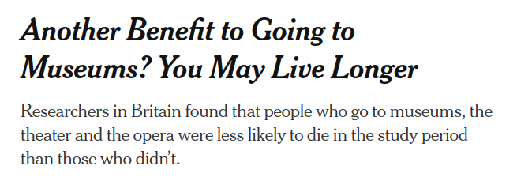
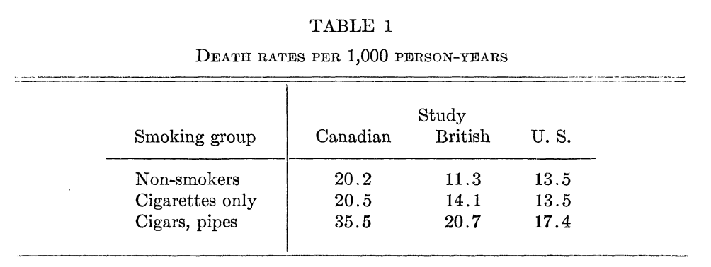
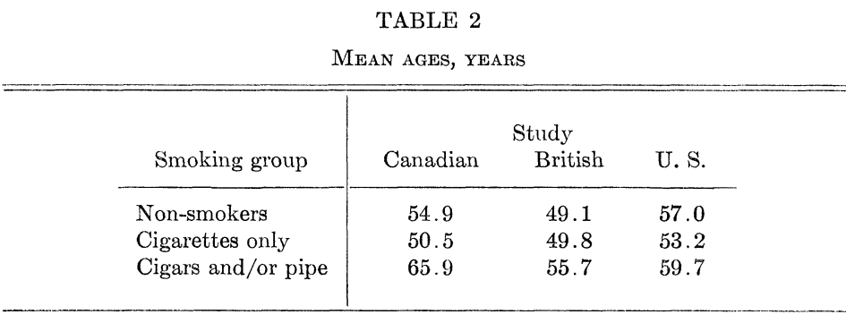
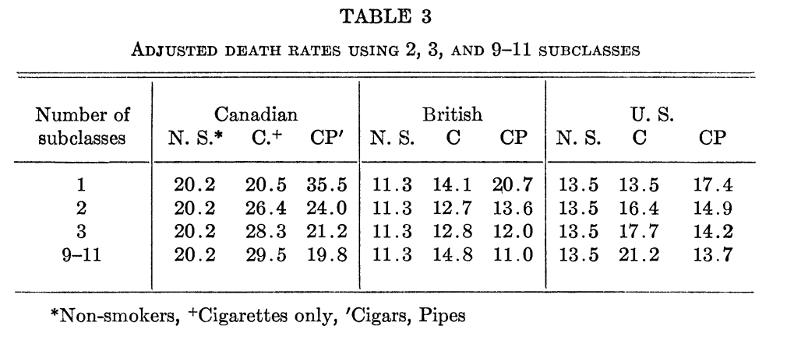
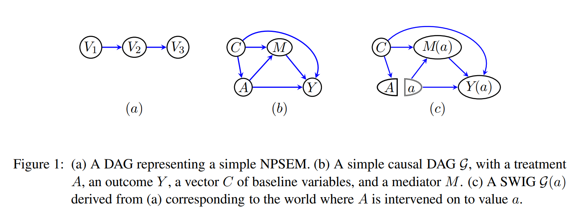

$$
  \require{cancel}
$$

```{r}
#| echo: false
#| warning: false
#| message: false
library(tidyverse)
library(haven)
library(estimatr)
options(digits=3)
```

## Last two weeks

::: {.incremental}

- How to use covariates in experiments
  - Improve precision for estimating the ATE
  - Subgroup effects
- "Agnostic regression"
  - **Estimand**: The "Best Linear Predictor" of $Y$ 
  - **Estimator**: Ordinary Least Squares (OLS)
  - Fairly minimal assumptions for consistency/asymptotic normality!
  
:::

## This week

::: {.incremental}

- What happens when **ignorability** does not hold?
  - Treatment is not randomly assigned - we have an *observational* design.
  - Treatment assignment may be driven by other factors that also predict the outcome
- Selection-on-observables assumptions
  - Treatment is ignorable **conditional** on observed covariates
- Estimation under selection-on-observables
  - Stratification
  - Inverse Propensity of Treatment Weighting
  - Regression adjustment
  - Matching

:::

## Selection-on-observables {.title-slide}

## Why experiments worked

::: {.incremental}

- A good causal observational study should try to mimic the features of an experiment
- So what were the nice properties of a **randomized experiment**?
  - **Positivity**: Assignment not deterministic $0 < P(D_i = 1) < 1$
  - **Ignorability/Unconfoundedness**: $P(D_i = 1 | Y_i(1), Y_i(0)) = P(D_i = 1)$
- We liked experiments because we could ensure treatment was independent of the potential outcomes.
  - $\{Y_i(1), Y_i(0)\} {\perp \! \! \! \perp} D_i$
- Even in a **conditionally** randomized experiment, we knew $P(D_i = 1 | \mathbf{X}_i)$

:::

## Observational designs

::: {.incremental}

- Complete **unconfoundedness** is only one kind of design assumption, but there are many settings where it won't hold.
- Suppose we didn't randomize an intervention but simply observe its occurrence
  - $P(D_i = 1)$ is not known.
  - Treatment and control groups might not be comparable. Why? -- confounders!
- Alternative design: **selection-on-observables**
  - Treatment assignment is ignorable **conditional** on a set of **observed** covariates $\mathbf{X}_i$
- Assumptions:
  - **Positivity**/**Overlap**: $0 < P(D_i = 1 | \mathbf{X}_i) < 1$
  - **Conditional ignorability**: $\{Y_i(1), Y_i(0)\} {\perp \! \! \! \perp} D_i | \mathbf{X}_i$
    - Other names: "No unmeasured confounders", "selection on observables", "no omitted variables",
    "conditional exogeneity", "condtiional exchangeability", etc...

:::

## Approximating experiments

::: {.incremental}

- A well-designed observational study will try to approximate some hypothetical "target" experiment **(Rubin, 2008; Hernán and Robins, 2016)**.
  - Well-defined intervention
  - Clear distinction between treatment and pre-treatment covariates
- You should try to answer the following questions:
  - What's the intervention of interest?
  - What is the assignment process for the intervention?
  - How well does our adjustment model this assignment process?
- What kind of experiment are we mimicking with a **selection-on-observables** identification strategy
  - *Conditional* randomization (given $\mathbf{X}_i$).
  - Treatment probability is not constant across levels of $\mathbf{X}_i$.
- **Problem**: In an experiment we're guaranteed balance on the unobservables (by randomization). In a selection-on-observables design we are
assuming these unobservables away!

:::

## Identification of the ATE

::: {.incremental}

- Recall that under conditional ignorability, $\{Y_i(1), Y_i(0)\} \cancel{{\perp \! \! \! \perp}} D_i$
- Therefore:

  $$\mathbb{E}[Y_i(1) | D_i = 1] \neq \mathbb{E}[Y_i(1)]$$

- So the difference in means alone will not identify the ATE -- we need to **condition** on the covariates $\mathbf{X}_i$

:::

## Identification of the ATE

::: {.incremental}

- Iterated expectations

  $$\mathbb{E}_X\bigg[\mathbb{E}[Y_i | D_i = 1, \mathbf{X}_i = x]\bigg] - \mathbb{E}_X\bigg[\mathbb{E}[Y_i | D_i = 0, \mathbf{X}_i = x]\bigg]$$

- Consistency:

  $$\mathbb{E}_X\bigg[\mathbb{E}[Y_i(1) | D_i = 1, \mathbf{X}_i = x]\bigg] - \mathbb{E}_X\bigg[\mathbb{E}[Y_i(0) | D_i = 0, \mathbf{X}_i = x]\bigg]$$

- Conditional ignorability:

  $$\mathbb{E}_X\bigg[\mathbb{E}[Y_i(1) | \mathbf{X}_i = x]\bigg] - \mathbb{E}_X\bigg[\mathbb{E}[Y_i(0) | \mathbf{X}_i = x]\bigg]$$

- Law of iterated expectations

  $$\mathbb{E}[Y_i(1)] - \mathbb{E}[Y_i(0)] = \tau$$

:::

## Identification vs Estimation

::: {.incremental}

- With infinite data, it would be possible to simply plug in sample analogues for $\mathbb{E}[Y_i | D_i = 1, X_i = x]$ for each unique value of $x$ (as long as positivity holds).

- But as the dimensionality of $\mathbf{X}_i$ grows large, within our sample this might be impossible (few to no observations for any given $\mathbf{X}_i$ )
  - We'll make **additional** assumptions to address this problem as part of *estimating* these conditional expectations and consider different estimation strategies with different assumptions
  - But it's important not to confuse these assumptions (e.g. **linearity** in a regression model) with the **identification** assumptions needed to even get a causal quantity from the observed data.

:::


## Identification vs Estimation

::: {.incremental}

- **Identification** assumptions
  - What do we need to assume is **true about the world** in order to get **any** causal quantity from the observed data?
  - In selection-on-observables designs: Treatment is independent of the potential outcomes **conditional** on observed covariates.

- **Estimation** assumptions
  - What do we need to assume in order to get a decent estimator of the treatment effect?
  - If these assumptions are wrong, might introduce additional bias **even if** ignorability holds
  - This is where fancy stats can help us!

:::

## Adjustment via stratification

::: {.incremental}

- If our $\mathbf{X}_i$ are sufficiently low-dimensional, we don't really need any strong modeling assumptions to estimate the ATE. 
  - We can use our usual **stratification** or **sub-classification** estimator:
  
  $$\hat{\tau(x)} = \widehat{\mathbb{E}}[Y_i | D_i = 1, X_i = x] - \widehat{\mathbb{E}}[Y_i | D_i = 0, X_i = x]$$

  $$\hat{\tau} = \sum_{x \in \mathcal{X}} \hat{\tau(x)} \widehat{P}(\mathbf{X}_i = x)$$


- What happens if $\mathbf{X}_i$ is high-dimensional? **Coarsen** into bins:
  - Fewer bins = more (potential) bias.

:::

## Example: Washington (2008)

- **Washington (2008; AER)** examines whether having daughters affects a legislator's voting behavior on feminist/pro-women issues (measured by AAUW voting scores)
  - Let's use the data to estimate the effect of having any daughters vs. having $0$ daughters

- What's the unadjusted difference-in-means?

```{r, echo=T}
washington <- read_dta("assets/data/washington.dta")
lm_robust(aauw ~ anygirls, data=washington)
```

- Doesn't seem to be any difference.
  - What's the confounder? What's the story?

## Example: Washington (2008)

```{r, echo=T}
# Number of girls by total number of children
table(washington$ngirls, washington$totchi)

# Association between total number of children and AAUW score
lm_robust(aauw ~ totchi, data=washington)

# Association between partisanship and total number of children
lm_robust(totchi ~ repub, data=washington)
```

## Example: Washington (2008)

::: {.incremental}

- Identification strategy: **selection-on-observables**
  - Conditional on the **total number of children**, the number of girls is assigned *as-if-random*
- For which strata can we not identify a treatment effect?
  - Legislators with $0$ children! 
  - Positivity/overlap violation. 
  - By definition a legislator w/ $0$ children can't have more than $0$ girls
- Other strata are just very sparse (4+ children).
  - Let's estimate the "any child" effect for legislators with 1 to 3 children, stratifying on the total amount.
  - Note that we've changed the target population here!

:::

## Example: Washington (2008)

```{r, echo=T}
# Subset down to cases with overlap
wash_subset <- washington %>% filter(totchi>0&totchi<4)

# Unadjusted
washington_unadjusted <- lm_robust(aauw ~ anygirls, data=wash_subset)
tidy(washington_unadjusted) %>% filter(term == "anygirls") %>%
  select(term, estimate, std.error, p.value)
```

## Example: Washington (2008)

```{r, echo=T}
# Get the difference-in-means in each stratum
stratum_ate <- wash_subset %>% group_by(totchi) %>%
  do(tidy(lm_robust(aauw ~ anygirls, data=.))) %>%
  select(totchi, term, estimate, std.error, df) %>%
  filter(term == "anygirls") %>% mutate(n=df+2) %>%
  ungroup()
stratum_ate
```

## Example: Washington (2008)

```{r, echo=T}
# Weighted average to get the point estimate
stratum_ate %>% summarize(ate = sum(estimate*n/sum(n)),
                          std.err = sqrt(sum(std.error^2*(n/sum(n))^2))) %>%
  mutate(p.val = 2*(pnorm(-abs(ate/std.err))))
```

## Example: Washington (2008)

- Remembber, the **Lin (2013)** estimator with de-meaned dummy variables for each stratum indicator interacted with treatment is also equivalent to the stratification estimator

```{r, echo=T}
wash_subset <- wash_subset %>% mutate(totchi1 = as.numeric(totchi==1),
                                      totchi2 = as.numeric(totchi==2),
                                      totchi3 = as.numeric(totchi==3))
# Adjusted
washington_strat <- lm_robust(aauw ~ anygirls*I(totchi2 - mean(totchi2)) +
                              anygirls*I(totchi3 - mean(totchi3)), wash_subset)
tidy(washington_strat) %>% filter(term == "anygirls") %>%
  select(term, estimate, std.error, p.value)
```

## Example: Washington (2008)

- We might still include **other covariates** to improve precision even if we don't think that they're part of the confounding story.
  - E.g. We might think that controlling for total number of children is enough to break the relationship between party and number of girls, but party is still really predictive of AAUW voting score.

```{r, echo=T}
# Adjusted + Party
washington_strat <- lm_lin(aauw ~ anygirls,
                           covariates = ~ as.factor(totchi)*as.factor(repub),
                           data=wash_subset)
tidy(washington_strat) %>% filter(term == "anygirls") %>%
  select(term, estimate, std.error, p.value)
```

## Confounding and the direction of the bias

{fig-align="center" height="200"}

{fig-align="center" height="200"}

## Omitted Variable Bias

- Suppose there exists an omitted (discrete) confounder $U_i$ and ignorability holds conditional on it. 
  - Suppose we **ignore it** and just use a simple difference-in-means estimator.
- What's **the bias** for the ATT? 
  - Recall our selection-into-treatment bias formula!

$$\underbrace{\mathbb{E}[Y_i | D_i = 1] - \mathbb{E}[Y_i | D_i = 0]}_{\text{Difference-in-means}} = \underbrace{\mathbb{E}[Y_i(1) - Y_i(0) | D_i = 1]}_{\text{ATT}} + \bigg(\underbrace{\mathbb{E}[Y_i(0) | D_i = 1] - \mathbb{E}[Y_i(0) | D_i = 0]}_{\text{Selection-into-treatment bias}}\bigg)$$

## Omitted Variable Bias

::: {.incremental}

- Let's write the selection-into-treatment bias conditioning on $U_i$

  $$\begin{align*}\text{Selection Bias} = &\sum_{u \in \mathcal{U}} \mathbb{E}[Y_i(0) | D_i = 1, U_i = u] Pr(U_i = u | D_i = 1) \\&- \sum_{u \in \mathcal{U}} \mathbb{E}[Y_i(0) | D_i = 0, U_i = u] Pr(U_i = u | D_i = 0)\end{align*}$$

- Ignorability conditional on $U_i$

  $$\text{Selection Bias} = \sum_{u \in \mathcal{U}} \mathbb{E}[Y_i(0) |  U_i = u] Pr(U_i = u | D_i = 1) - \sum_{u \in \mathcal{U}} \mathbb{E}[Y_i(0) | U_i = u] Pr(U_i = u | D_i = 0)$$

- Combining terms

  $$\text{Selection Bias} = \sum_{u \in \mathcal{U}} \mathbb{E}[Y_i(0) |  U_i = u] \times \bigg(Pr(U_i = u | D_i = 1) -  Pr(U_i = u | D_i = 0)\bigg)$$

:::

## Omitted Variable Bias

::: {.incremental}

- Two elements to selection bias. First, if treatment assignment is independent of the confounder, then the bias is 0

  $$\begin{align*}\text{Selection Bias} &= \sum_{u \in \mathcal{U}} \mathbb{E}[Y_i(0) |  U_i = u] \times \bigg(Pr(U_i = u) -  Pr(U_i = u)\bigg)\\
  &= \sum_{u \in \mathcal{U}} \mathbb{E}[Y_i(0) |  U_i = u] \times 0 = 0
  \end{align*}$$

- Second, if $Y_i(0)$ is independent of $U_i$, we have:

  $$\begin{align*}\text{Selection Bias} &= \sum_{u \in \mathcal{U}} \mathbb{E}[Y_i(0)] \times \bigg(Pr(U_i = u | D_i = 1) -  Pr(U_i = u | D_i = 0)\bigg)\\
 &= \mathbb{E}[Y_i(0)] \times \bigg(\sum_{u \in \mathcal{U}}Pr(U_i = u | D_i = 1) -  \sum_{u \in \mathcal{U}} Pr(U_i = u | D_i = 0)\bigg)\\
 &= \mathbb{E}[Y_i(0)] \times \bigg(1 -  1\bigg) = 0\end{align*}$$

:::

## Omitted Variable Bias

::: {.incremental}

- We get bias due to confounding when:
  1. $U_i$ is not independent of treatment
  2. $U_i$ is not independent of the potential outcomes

- **Heuristically** (e.g. assuming a lot of constant effects)
  - The **sign** of the bias is the product of the sign of...
  - ...**the effect of confounder on treatment**...
  - ...and **the effect of confounder on outcome** 

:::

## Example: Smoking and Cancer

- Back when the link between smoking and cancer was being debated, some researchers suggested that cigarettes might be a "healthy" alternative to pipe smoking
- **Cochran (1968)** uses this to illustrate adjustment by stratification

{fig-align="center" height="250"}

1. What's the omitted confounder?
2. What's the direction of the bias due to the omitted confounder?

## Example: Smoking and Cancer

{fig-align="center"}

## Example: Smoking and Cancer

{fig-align="center"}

## Directed Acyclic Graphs {.title-slide}

## What to condition on?

::: {.incremental}

- The main challenge in designing an observational study is figuring out what $\mathbf{X}$ is.
  - What do you need to control for in order to make $\{Y_i(1), Y_i(0)\} {\perp \! \! \! \perp} D_i | \mathbf{X}_i$ plausible?

- One useful tool: **graphical models**
  - Represent causal relations in terms of vertices/nodes ( $V$ ) and edges ( $E$ ) on a graph $G$.
  - **Vertices** represent variables
  - Directed **edges** denote non-zero causal effects.

- We will use DAGs to reason about (conditional) dependencies between variables
  - Slight conceptual/terminology differences from potential outcomes, but fundamentals of graphical approaches are the same
  - See: **Imbens (2020; JEL)** for comments on the differences. **Richardson and Robins (2013)** for a unification.

:::

## Directed Acyclic Graphs

```{tikz}
#| echo: false
#| fig-align: center
#| fig-dpi: 300
#| out-width: "32%"
#| fig-format: "svg"
\usetikzlibrary{arrows}
\begin{tikzpicture}[scale=2, every node/.style={font=\large}]
\node (d) at (0,0) {$D$};
\node (x) at (1, 1) {$X$};
\node (u) at (1, -1) {$U$};
\node (y) at (2,0) {$Y$};
\draw[->, >=stealth, thick] (d) -- (y);
\draw[->, >=stealth, thick] (x) -- (y);
\draw[->, >=stealth, thick] (x) -- (d);
\draw[->, >=stealth, dotted, thick] (u) -- (y);
\draw[->, >=stealth, dotted, thick] (u) -- (d);
\end{tikzpicture}
```

1. **Directed**: Edges have arrows
2. **Acyclic**: A node can't be its own descendant
3. **Graph**: Comprised of nodes and edges

- DAGs encode causal assumptions
  - Absence of an edge - assume **no** causal effect
  - Direction of the arrow - direction of effect

## Directed Acyclic Graphs

:::: {.columns}

::: {.column width="50%"}
```{tikz}
#| echo: false
#| fig-align: center
#| fig-dpi: 300
#| out-width: "50%"
#| fig-format: "svg"
\usetikzlibrary{arrows}
\begin{tikzpicture}[scale=2, every node/.style={font=\large}]
\node (d) at (0,0) {$D$};
\node (x) at (0.5, 1) {$X$};
\node (y) at (1,0) {$Y$};
\draw[->, >=stealth, thick] (d) -- (y);
\draw[->, >=stealth, thick] (x) -- (y);
\draw[->, >=stealth, thick] (x) -- (d);
\end{tikzpicture}
```
:::

::: {.column width="50%"}
- Chain: $X \rightarrow D \rightarrow Y$
- Fork: $D \leftarrow X \rightarrow Y$
- **Collider**: $X \rightarrow Y \leftarrow D$
:::

::::

- A **parent** node is a direct cause of a **child** node.
- An **ancestor** node is a direct or indirect cause of a **descendent** node.

- **Path**: A sequence of nodes connected by edges (either direction!)
  - Causal path: All arrows are pointed in the same direction
  - Non-causal path: Some arrows go in the opposite direction

## Directed Acyclic Graphs

:::: {.columns}

::: {.column width="50%"}
```{tikz}
#| echo: false
#| fig-align: center
#| fig-dpi: 300
#| out-width: "50%"
#| fig-format: "svg"
\usetikzlibrary{arrows}
\begin{tikzpicture}[scale=2, every node/.style={font=\large}]
\node (d) at (0,0) {$D$};
\node (x) at (0.5, 1) {$X$};
\node (y) at (1,0) {$Y$};
\draw[->, >=stealth, thick] (d) -- (y);
\draw[->, >=stealth, thick] (x) -- (y);
\draw[->, >=stealth, thick] (x) -- (d);
\end{tikzpicture}
```
:::

::: {.column width="50%"}

$$\begin{align*} Y &= f_Y(D, X, \epsilon_Y)\\
D &= f_D(X, \epsilon_D)\end{align*}$$
:::

::::

- DAGs are a way of representing a particular **nonparametric** structural equation model
- The DAG also represents a factorization of the joint distribution if it's compatible with the DAG.

$$P(X_1, X_2, \dotsc, X_K) = \prod_{k=1}^K P(X_K | \text{parents}(X_K))$$

- This lets us read (conditional) independence relationships directly from the DAG.

## D-separation

::: {.incremental}

- How do we know if two nodes $A$ and $B$ are conditionally dependent or independent conditional on a third set of nodes $C$?
- We can read this right off of the DAG using the "*d*-separation" criterion.
  - If $A$ and $B$ are *d*-separated given $C$, then $A {\perp \! \! \! \perp} B | C$
  - Otherwise they are *d*-connected

- When are two nodes $d$-separated?
  - When there are no **unblocked** paths between them given $C$.

- When are paths unblocked?
  - When there is a chain or fork that is *not* conditioned on in $C$.
  - When there is a collider (or descendent of a collider) that *is* conditioned on in $C$.

- Conditioning on causal chains or common causes (forks) blocks a path.
- Conditioning on common effects (colliders) unblocks a path.

:::

## D-separation

```{tikz}
#| echo: false
#| fig-align: center
#| fig-dpi: 300
#| out-width: "28%"
#| fig-format: "svg"
\usetikzlibrary{arrows}
\begin{tikzpicture}[scale=2, every node/.style={font=\large}]
\node (x1) at (0,0) {$X_1$};
\node (x2) at (1, 0) {$X_2$};
\node (d) at (0,1) {$D$};
\node (m) at (1,1) {$M$};
\node (y) at (2,0) {$Y$};
\draw[->, >=stealth, thick] (x1) -- (d);
\draw[->, >=stealth, thick] (x1) -- (x2);
\draw[->, >=stealth, thick] (x2) -- (y);
\draw[->, >=stealth, thick] (x2) -- (m);
\draw[->, >=stealth, thick] (d) -- (m);
\draw[->, >=stealth, thick] (m) -- (y);
\end{tikzpicture}
```

::: {.incremental}

- Are $X_2$ and $D$ $d$-separated?
- Paths:
  - $D \to M \to Y \leftarrow X_2$ (Blocked -- collider at $Y$)
  - $D \to M \leftarrow X_2$ (Blocked -- collider at $M$)
  - $D \leftarrow X_1 \to X_2$ (Unblocked)

:::

## D-separation

```{tikz}
#| echo: false
#| fig-align: center
#| fig-dpi: 300
#| out-width: "28%"
#| fig-format: "svg"
\usetikzlibrary{arrows}
\begin{tikzpicture}[scale=2, every node/.style={font=\large}]
\node[circle, draw] (x1) at (0,0) {$X_1$};
\node (x2) at (1, 0) {$X_2$};
\node (d) at (0,1) {$D$};
\node (m) at (1,1) {$M$};
\node (y) at (2,0) {$Y$};
\draw[->, >=stealth, thick] (x1) -- (d);
\draw[->, >=stealth, thick] (x1) -- (x2);
\draw[->, >=stealth, thick] (x2) -- (y);
\draw[->, >=stealth, thick] (x2) -- (m);
\draw[->, >=stealth, thick] (d) -- (m);
\draw[->, >=stealth, thick] (m) -- (y);
\end{tikzpicture}
```

::: {.incremental}

- Are $X_2$ and $D$ $d$-separated conditional on $X_1$?
- Paths:
  - $D \to M \to Y \leftarrow X_2$ (Blocked -- collider at $Y$)
  - $D \to M \leftarrow X_2$ (Blocked -- collider at $M$)
  - $D \leftarrow X_1 \to X_2$ (Blocked -- conditioning on $X_1$)

:::

## D-separation

```{tikz}
#| echo: false
#| fig-align: center
#| fig-dpi: 300
#| out-width: "28%"
#| fig-format: "svg"
\usetikzlibrary{arrows}
\begin{tikzpicture}[scale=2, every node/.style={font=\large}]
\node[circle, draw]  (x1) at (0,0) {$X_1$};
\node (x2) at (1, 0) {$X_2$};
\node (d) at (0,1) {$D$};
\node[circle, draw]  (m) at (1,1) {$M$};
\node (y) at (2,0) {$Y$};
\draw[->, >=stealth, thick] (x1) -- (d);
\draw[->, >=stealth, thick] (x1) -- (x2);
\draw[->, >=stealth, thick] (x2) -- (y);
\draw[->, >=stealth, thick] (x2) -- (m);
\draw[->, >=stealth, thick] (d) -- (m);
\draw[->, >=stealth, thick] (m) -- (y);
\end{tikzpicture}
```

::: {.incremental}

- Are $X_2$ and $D$ $d$-separated conditional on $X_1$ and $M$?
- Paths:
  - $D \to M \to Y \leftarrow X_2$ (Blocked -- collider at $Y$)
  - $D \to M \leftarrow X_2$ (Unblocked -- conditioned collider at $M$)
  - $D \leftarrow X_1 \to X_2$ (Blocked -- conditioning on $X_1$)

:::

## Defining causal effects

::: {.incremental}

- The graph lets us read conditional probabilities on the observed quantities $P(Y | D, X)$.
- However, we don't just want $P(Y |D)$, we want a **counterfactual**. 
  - Within Pearl's graph framework, an intervention is represented by the "do" operator applied to a node.
  - $\text{do}(X = x)$ denotes an intervention that sets $X$ to a particular level $x$
  - Represented in a **counterfactual graph** that removes all arrows into $D$.

- We want to learn about the post-intervention distribution $P(Y | \text{do}(X = x))$, but we only have the observed distribution/DAG.
  - We want to **identify** the counterfactual distribution (or a functional thereof) from the observed distribution.
  - How do we do this: Pearl's "do-calculus"

- Similar idea to our identification problem when defining effects in terms of potential outcomes.
  - We observe $Y | D, X$ and want to identify $Y(d)$
  - In fact, $Y_i(d)$ and $Y|do(D=d)$ are essentially representing the same counterfactual concept.

:::

## Adjustment criterion

::: {.incremental}

- If we condition on covariates $X$ can we non-parametrically identify the effect of $D$ on $Y$?
  - Yes, if we block all **non-causal paths** from $Y$ to $D$.

- **Adjustment criterion** **(Shpitser, Vanderweele and Robins, 2012)**
  - All non-causal paths from $D$ to $Y$ are blocked by the set $X$
  - No element in $X$ is a node or a descendant of a node on a causal path from $D$ to $Y$.

- Intuition:
  - Block non-causal paths from $Y$ to $D$
  - Don't **open up** non-causal paths from $Y$ to $D$
  - Don't control for variables along the causal path from $D$ to $Y$.

- If the adjustment criterion holds then, the observed distributions identify the counterfactual distribution
  - $P(Y | \text{do}(d)) = \sum_{z} P(Y | d, z) P(z)$
  - **Identification** under **conditional ignorability!**

:::

## Good controls

```{tikz}
#| echo: false
#| fig-align: center
#| fig-dpi: 300
#| out-width: "24%"
#| fig-format: "svg"
\usetikzlibrary{arrows}
\begin{tikzpicture}[scale=2, every node/.style={font=\large}]
\node (d) at (0,0) {$D$};
\node[circle, draw] (x) at (1, 1.5) {$X$};
\node (y) at (2,0) {$Y$};
\draw[->, >=stealth, thick] (d) -- (y);
\draw[->, >=stealth, thick] (x) -- (y);
\draw[->, >=stealth, thick] (x) -- (d);
\end{tikzpicture}
```

- One non-causal path from $D$ to $Y$: $D \leftarrow X \rightarrow Y$.
- Conditioning on $X$ blocks that path

## Bad controls

```{tikz}
#| echo: false
#| fig-align: center
#| fig-dpi: 300
#| out-width: "24%"
#| fig-format: "svg"
\usetikzlibrary{arrows}
\begin{tikzpicture}[scale=2, every node/.style={font=\large}]
\node (d) at (0,0) {$D$};
\node[circle, draw] (m) at (1, -1) {$M$};
\node (y) at (2,0) {$Y$};
\node (u) at (2,-1) {$U$};
\draw[->, >=stealth, thick] (d) -- (y);
\draw[->, >=stealth, thick] (d) -- (m);
\draw[->, >=stealth, dotted,  thick] (u) -- (m);
\draw[->, >=stealth, dotted, thick] (u) -- (y);
\end{tikzpicture}
```

- No non-causal paths between $D$ and $Y$ w/o conditioning
- But conditioning on $M$ opens up a non-causal path between $D$ and $Y$
  - $D \rightarrow Z \leftarrow U \rightarrow Y$

## Bad controls

```{tikz}
#| echo: false
#| fig-align: center
#| fig-dpi: 300
#| out-width: "32%"
#| fig-format: "svg"
\usetikzlibrary{arrows}
\begin{tikzpicture}[scale=2, every node/.style={font=\large}]
\node (d) at (0,0) {$D$};
\node[circle, draw] (x) at (1.5, 1) {$X$};
\node (y) at (3,0) {$Y$};
\node (u1) at (0,1.5) {$U_1$};
\node (u2) at (3,1.5) {$U_2$};
\draw[->, >=stealth, thick] (d) -- (y);
\draw[->, >=stealth, dotted, thick] (u2) -- (y);
\draw[->, >=stealth, dotted, thick] (u2) -- (x);
\draw[->, >=stealth, dotted, thick] (u1) -- (d);
\draw[->, >=stealth, dotted, thick] (u1) -- (x);
\end{tikzpicture}
```

- Even though $X$ is not causally related to $D$ or $Y$ ("irrelevant control"), conditioning on it still induces bias if there are common causes of $X$ and treatment and $X$ and outcome
- "M-bias"

## Neutral Controls

```{tikz}
#| echo: false
#| fig-align: center
#| fig-dpi: 300
#| out-width: "24%"
#| fig-format: "svg"
\usetikzlibrary{arrows}
\begin{tikzpicture}[scale=2, every node/.style={font=\large}]
\node (d) at (0,0) {$D$};
\node[circle, draw] (x) at (1,1.5) {$X$};
\node (y) at (2,0) {$Y$};
\draw[->, >=stealth, thick] (d) -- (y);
\draw[->, >=stealth, thick] (x) -- (y);
\end{tikzpicture}
```

- $X$ is not a confounder but is predictive of $Y$
- Might improve precision!

## Are graphs and P.O. incompatible?

> So, what is it about epidemiologists that drives them to seek the light of new tools, while economists (at least those in Imbens's camp) seek comfort in partial blindness, while missing out on the causal revolution? Can economists do in their heads what epidemiologists observe in their graphs? Can they, for instance, identify the testable implications of their own assumptions? Can they decide whether the IV assumptions (i.e., exogeneity and exclusion) are satisfied in their own models of reality? Of course they can't; such decisions are intractable to the graph-less mind. (I have challenged them repeatedly to these tasks, to the sound of a pin-drop silence)

[Pearl (2014)](http://causality.cs.ucla.edu/blog/index.php/2014/10/27/are-economists-smarter-than-epidemiologists-comments-on-imbenss-recent-paper/)

## SWIGs - a Unification

{fig-align="center" height="400"}

Shpitser, Richardson and Robins (2021)

## DAG Practice

```{tikz}
#| echo: false
#| fig-align: center
#| fig-dpi: 300
#| out-width: "32%"
#| fig-format: "svg"
\usetikzlibrary{arrows}
\begin{tikzpicture}[scale=2, every node/.style={font=\large}]
\node (D) at (0,0) {$D$};
\node (Y) at (0,2.5) {$Y$};
\node (X1) at (1,0) {$X_1$};
\node (X2) at (1.5,1) {$X_2$};
\node (X3) at (2,2) {$X_3$};
\draw[->, >=stealth, thick] (D) -- (Y);
\draw[->, >=stealth, thick] (X1) -- (Y);
\draw[->, >=stealth, thick] (X1) -- (D);
\draw[->, >=stealth, thick] (X2) -- (X1);
\draw[->, >=stealth, thick] (X2) -- (Y);
\draw[->, >=stealth, thick] (X3) -- (X2);
\draw[->, >=stealth, thick] (X3) -- (Y);
\end{tikzpicture}
```

- What is the **minimum** **sufficient** conditioning set needed to identify the effect of $D$ on $Y$?

## DAG Practice

```{tikz}
#| echo: false
#| fig-align: center
#| fig-dpi: 300
#| out-width: "36%"
#| fig-format: "svg"
\usetikzlibrary{arrows}
\begin{tikzpicture}[scale=2, every node/.style={font=\large}]
\node (U) at (0,2) {$U$};
\node (X) at (0.75,1.5) {$X$};
\node (D) at (1.5,1.5) {$D$};
\node (C) at (2.25,1.5) {$C$};
\node (Y) at (3,1.5) {$Y$};
\node (A) at (2.25,0.75) {$A$};
\node (B) at (1.5,0) {$B$};
\draw[->, >=stealth, thick] (D) -- (C);
\draw[->, >=stealth, thick] (C) -- (Y);
\draw[->, >=stealth, thick] (X) -- (D);
\draw[->, >=stealth, thick] (D) -- (A);
\draw[->, >=stealth, thick] (U) -- (X);
\draw[->, >=stealth, thick] (U) to [bend left] (Y);
\draw[->, >=stealth, thick] (B) -- (A);
\draw[->, >=stealth, thick] (B) to [bend right] (Y);
\end{tikzpicture}
```

## Summary

::: {.incremental}

- **Selection-on-observables**
  - We have **conditioned** on all confounders $X_i$
  - **Confounders**: Factors that affect **both** treatment **and** outcome
  - Imagine a stratified experiment w/ varying treatment assignment probabilities!
- **Directed Acyclic Graphs** as tools for finding *necessary* and *sufficient* sets of controls.
  - Block non-causal paths
  - Don't **open up** non-causal paths by conditioning on **colliders**
  
:::

# Next week

::: {.incremental}

- Techniques for **adjusting** for confounders when we can't just stratify!
  - Curse of dimensionality
- **Inverse propensity of treatment** weighting
  - Even if we have a lot of confounders $X_i$, can we adjust for a **single** quantity?
  - Yes! The **propensity score**
- **Regression adjustment**
  - Controlling for confounders by specifying an **outcome** model
- **Augmented** inverse propensity weighting
  - Combining both **weighting** and an **outcome** model
  - "Double-robustness"

:::
