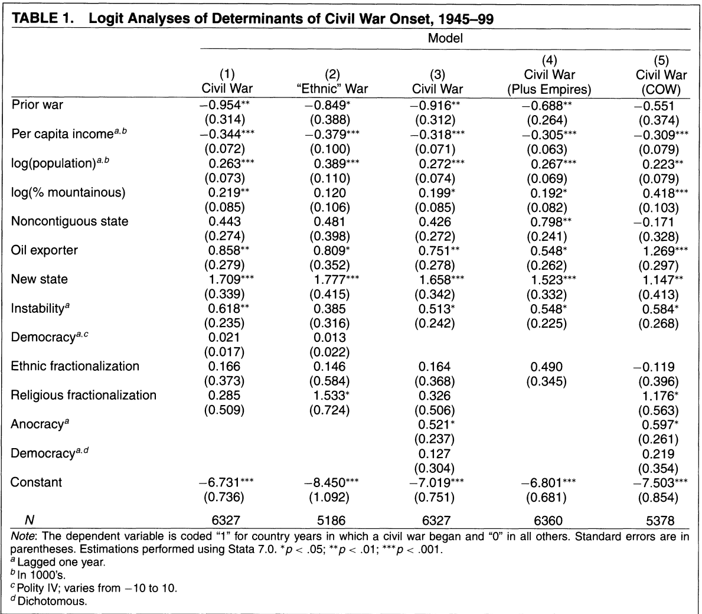

$$
  \require{cancel}
$$

```{r}
#| echo: false
#| warning: false
#| message: false
library(tidyverse)
library(haven)
library(estimatr)
options(digits=3)
```

## Last week

::: {.incremental}

- **Selection-on-observables**
  - Identification under **conditional ignorability**
  - We have to **adjust** for factors predicting **treatment** and predicting **outcome**
- **Directed acyclic graphs**
  - Represent **causal relationships** in terms of nodes and edges
  - Characterize **conditional independence** (d-separation)
  - **Adjustment criterion**
  
:::

## This week

::: {.incremental}

- How can we estimate effects under selection-on-observables assumptions?
  - What happens when we can't just stratify?
- **Regression modeling**
  - Estimate $\mathbb{E}[Y | X, D = 1]$ and $\mathbb{E}[Y | X, D = 0]$
  - What additional assumptions do we impose? Do some specifications impose **more** assumptions than others?
- **Inverse-propensity of treatment weighting**
  - Can we just adjust for a single quantity?
  - Yes, the **propensity score**: $P(D = 1 | X)$
  - **Weighting** by the inverse propensity of treatment.

:::

## Regression Adjustment {.title-slide}

## Running Example: Keele et. al. (2017)

- Do minority candidates drive minority voter turnout?
  - **Keele, Shah, White and Kay (2017, JOP)** "Black Candidates and Black Turnout: A Study of Viability in Louisiana Mayoral Elections"
  - Examine mayoral elections in Louisiana from 1988 to 2011 and compare differences in Black turnout among elections **with a Black candidate** and elections **without a Black candidate** (all-white candidate slate)

```{r, echo=T}
turn <- haven::read_dta("assets/data/match-all.dta")
lm_robust(black_turnout ~ black, data=turn)
```

```{r}
turn$twoYearCycle <- turn$year # Doing this to deal with FEs with few observations later on.
turn$twoYearCycle[turn$year %% 2 != 0] <- turn$year[turn$year %% 2 != 0] - 1
```

- **Identification challenge**: Black candidates are not randomly assigned to elections!
  - Strategic entry: Black candidates might be more likely to run in cities with larger Black population shares.
  - City demographics might just *generally* correlate with turnout.

## Running Example: Keele et. al. (2017)

- Let's take a look at the data to see if this is the case!
  - A very useful tool for visualizing CEFs is the **binned scatterplot**

```{r echo=F}
StatBinscatter <- ggplot2::ggproto(
  "StatBinscatter", 
  Stat,
  compute_group = function(data, scales, scalefactor = 1e-4, scalepoints = F, bins = 10) {
    bins     <- min(floor(nrow(data)/10), bins)
    x_bin    <- ggplot2::cut_number(data$x + 1e-12*runif(nrow(data)), bins)
    x_means  <- stats::ave(data$x, x_bin, FUN = mean)
    y_means  <- stats::ave(data$y, x_bin, FUN = mean)
    y_se     <- stats::ave(data$y, x_bin, FUN = sd)
    y_obs    <- stats::ave(data$y, x_bin, FUN = length)
    if (scalepoints == T){
      result   <- data.frame(x    = x_means, 
                             y    = y_means, 
                             ymax = y_means + 1.96*y_se/sqrt(y_obs),
                             ymin = y_means - 1.96*y_se/sqrt(y_obs),
                             size = scalefactor*y_obs)
    }else{
      result   <- data.frame(x    = x_means, 
                             y    = y_means, 
                             ymax = y_means + 1.96*y_se/sqrt(y_obs),
                             ymin = y_means - 1.96*y_se/sqrt(y_obs))
    }
    result   <- unique(result)
    return(result)
  },
  required_aes = c("x", "y")
)

#' Binscatter
#' 
#' Group variable on the horizontal axis into equal-sized bins and calculate group means
#' for each bin
#' @param bins Number of bins (defaults to 10)
#' @param geom Which geom to plot (defaults to "point", other options include "pointrange" or 
#' "line")
#' @examples 
#' 
#' ggplot(mpg, aes(x = displ, y = hwy)) + 
#' geom_point(alpha = .1) + 
#' stat_binscatter(color = "red")
#' 
#' ggplot(mpg, aes(x = displ, y = hwy)) + 
#' geom_point(alpha = .1) + 
#' stat_binscatter(color = "red", geom = "pointrange")
#' 
#' ggplot(diamonds, aes(x = carat, y = price, color = cut)) + 
#' stat_binscatter(bins = 20, geom = "pointrange") +
#' stat_binscatter(bins = 20, geom = "line")
#' 
stat_binscatter <- function(mapping = NULL, data = NULL, geom = "point",
                            position = "identity", na.rm = FALSE, show.legend = NA, 
                            inherit.aes = TRUE, ...) {
  ggplot2::layer(
    stat = StatBinscatter, data = data, mapping = mapping, geom = geom, 
    position = position, show.legend = show.legend, inherit.aes = inherit.aes,
    params = list(na.rm = na.rm, ...)
    )
}
```

```{r, echo=F, fig.align="center", fig.height=5}
turn %>% ggplot(aes(x=blackpop_pct1990, y=black_turnout, colour=as.factor(black))) + stat_binscatter(bins = 10, size = 3) + xlab("Black % of Population") + ylab("Black Turnout") + scale_colour_manual("Black Candidate", values=c("indianred", "dodgerblue")) + theme_minimal()
```


## Regression adjustment

::: {.incremental}

- Our goal is to estimate the **average treatment effect**

  $$\mathbb{E}[Y_i(1)] - \mathbb{E}[Y_i(0)]$$
  
- Recall that under selection-on-observables

  $$\mathbb{E}[Y_i(1)] = \mathbb{E}_{X}\bigg[E[Y_i(1)| X_i]\bigg] = \mathbb{E}_{X}\bigg[\mathbb{E}[Y_i| X_i, D_i = 1]\bigg]$$
  $$\mathbb{E}[Y_i(0)] = \mathbb{E}_{X}\bigg[\mathbb{E}[Y_i(0)| X_i]\bigg] = \mathbb{E}_{X}\bigg[\mathbb{E}[Y_i| X_i, D_i = 0]\bigg]$$

- So what we need to do to estimate the ATE is:
  - Fit a regression model in the treated group to estimate $\mathbb{E}[Y_i | X_i, D_i = 1]$
  - Fit a regression model in the control group to estimate $\mathbb{E}[Y_i(0) | X_i]$
  - Average the estimates from these models over the sample distribution of $X_i$

:::

## Classical regression

::: {.incremental}

- So far, we've shown that the OLS estimator is consistent and asymptotically normal for the **Best Linear Predictor**
  - But what about for estimating the **conditional expectation function**? $\mathbb{E}[Y_i|X_i]$
  - In non-experimental settings, we often **do** need to get this correct otherwise we'll still have some unadjusted-for bias remaining.
  
- To do inference on the **CEF** with OLS, we assume that it's equal to the **BLP**!
 
- **Assumption 1**: Linearity

  $$Y_i = X_i^\prime\beta + \epsilon_i$$

- **Assumption 2**: Strict exogeneity of the errors

  $$\mathbb{E}[\epsilon | \mathbf{X}] = 0$$
  
- When is linearity always **true**?
  - When we have a fully-saturated model - as many **parameters** as **unique covariate values** (e.g. (post)-stratification)

:::

## Fully saturated model

::: {.incremental}

- Consider a model with two binary covariates $X_{i1}$ and $X_{i2}$.
- Four possible unique values:
  - $\mathbb{E}[Y_i | X_{1i} = 0, X_{2i} = 0] = \alpha$
  - $\mathbb{E}[Y_i | X_{1i} = 1, X_{2i} = 0] = \alpha + \beta$
  - $\mathbb{E}[Y_i | X_{1i} = 0, X_{2i} = 1] = \alpha + \gamma$
  - $\mathbb{E}[Y_i | X_{1i} = 1, X_{2i} = 1] = \alpha + \beta + \gamma + \delta$

- With the way we've defined these parameters, the CEF can be written as:

  $$\mathbb{E}[Y_i | X_{i1}, X_{i2}] = \alpha + \beta X_{i1} + \gamma X_{2i} + \delta X_{1i} X_{2i}$$

- It's linear by construction! Each level of $\mathbb{E}[Y_i | X_{1i}, X_{2i}]$ is estimated separately by taking the mean.

:::

## Classical regression

::: {.incremental}

- **Assumption 3**: No perfect collinearity
  - $\mathbf{X}^{\prime}\mathbf{X}$ is invertible
  - $\mathbf{X}$ has full column rank

- When does this fail? How can we check?

:::

## Classical regression

- Under assumptions 1-3, our OLS estimator $\hat{\beta}$ is also **unbiased** for $\beta$
- Let's do a quick proof for unbiasedness

$$\begin{align*}\hat{\beta} &= (\mathbf{X}^{\prime}\mathbf{X})^{-1}(\mathbf{X}^{\prime}Y)\\
 &= (\mathbf{X}^{\prime}\mathbf{X})^{-1}(\mathbf{X}^{\prime}(\mathbf{X}\beta + \epsilon))\\
 &= (\mathbf{X}^{\prime}\mathbf{X})^{-1}(\mathbf{X}^{\prime}\mathbf{X})\beta + (\mathbf{X}^{\prime}\mathbf{X})^{-1}(\mathbf{X}^{\prime}\epsilon)\\
 &= \beta + (\mathbf{X}^{\prime}\mathbf{X})^{-1}(\mathbf{X}^{\prime}\epsilon)
 \end{align*}$$

- Then we can obtain the conditional expectation of $\mathbb{E}[\hat{\beta} | \mathbf{X}]$

$$\begin{align*} \mathbb{E}[\hat{\beta} | \mathbf{X}] &= \mathbb{E}\bigg[\beta + (\mathbf{X}^{\prime}\mathbf{X})^{-1}(\mathbf{X}^{\prime}\epsilon) \bigg| \mathbf{X} \bigg]\\
&= \mathbb{E}[\beta | \mathbf{X}] + \mathbb{E}[(\mathbf{X}^{\prime}\mathbf{X})^{-1}(\mathbf{X}^{\prime}\epsilon) | \mathbf{X}]\\
&= \beta + (\mathbf{X}^{\prime}\mathbf{X})^{-1}\mathbf{X}^{\prime} \mathbb{E}[\epsilon | \mathbf{X}]\\
&= \beta + (\mathbf{X}^{\prime}\mathbf{X})^{-1}\mathbf{X}^{\prime}0\\
&= \beta
 \end{align*}$$


## Classical regression

::: {.incremental}

- Lastly, by law of total expectation 

  $$\mathbb{E}[\hat{\beta}] = \mathbb{E}[\mathbb{E}[\hat{\beta}|\mathbf{X}]]$$

- Therefore 

  $$\mathbb{E}[\hat{\beta}] = \mathbb{E}[\beta] = \beta$$

- What have we still not assumed?
  - Anything about the distribution of the errors (aside from finite 1st/2nd moments)
  
:::

## Classical regression

::: {.incremental}

- **Assumption 4** - Spherical errors

  $$Var(\epsilon | \mathbf{X}) = \begin{bmatrix}
\sigma^2 & 0 & \cdots & 0\\
0 & \sigma^2 & \cdots & 0\\
\vdots & \vdots & \ddots & \vdots \\
0 & 0 & \cdots & \sigma^2
\end{bmatrix} =  \sigma^2 \mathbf{I}$$

- Benefits
  - Simple, unbiased estimator for $Var(\hat{\beta})$ - classical OLS standard errors (what you get in `lm()`)
  - Completes Gauss-Markov assumptions $\leadsto$ OLS is BLUE (Best Linear Unbiased Estimator)
  
- Drawbacks
  - Basically never is true (at least in social science settings!)
  
:::
  
## Classical regression

:::{.incremental}

- Under spherical errors, the variance formula simplifies 

  $$Var(\hat{\beta}) =  (\mathbf{X}^\prime\mathbf{X})^{-1} (\mathbf{X}^\prime \sigma^2\mathbf{X}) (\mathbf{X}^\prime\mathbf{X})^{-1}$$
  $$Var(\hat{\beta}) =  \sigma^2 (\mathbf{X}^\prime\mathbf{X})^{-1}$$

- An unbiased estimator for $\sigma^2$ is the sample variance of the residuals (mean squared error) adjusted by a degrees of freedom correction

  $$\hat{\sigma^2} = \frac{1}{N-K} \sum_{i=1}^N (Y_i - \hat{Y_i})^2$$

- $K$ is the number of parameters. We refer to $N-K$ as the "degrees of freedom"

:::

## OLS is BLUE

- The **Gauss-Markov Theorem**
  - Under Assumptions 1-4, we can show that there is no other estimator that for $\beta$ that is both **linear** and **unbiased** which has lower variance than $\hat{\beta}_{\text{OLS}}$

## OLS is BLUE

::: {.incremental}

- **Proof**: Suppose there's another linear estimator that diverges from the OLS projection of $Y$ by a non-zero $K \times N$ matrix $D$ 

  $$\tilde{\beta} = ((\mathbf{X}^\prime\mathbf{X})^{-1} \mathbf{X}^\prime + D)Y$$
    
- Let's take the expectation

  $$\mathbb{E}[\tilde{\beta}] = \mathbb{E}[\hat{\beta}_{\text{OLS}}] + \mathbb{E}[DY]$$
  
- We know OLS is unbiased. Next, we plug in the expression for $Y$ (linearity)
  
  $$\mathbb{E}[\tilde{\beta}] = \beta + \mathbb{E}[D\mathbf{X}\beta] + \mathbb{E}[D\epsilon]$$
  
:::

## OLS is BLUE

::: {.incremental}

- Pull out the constants and use $\mathbb{E}[\epsilon] = 0$
    
  $$\mathbb{E}[\tilde{\beta}] = \beta(\mathbf{I} + D\mathbf{X})$$
    
- If $\tilde{\beta}$ is unbiased, then

  $$\beta(\mathbf{I} + D\mathbf{X}) = 0$$
- This holds for all values of $\beta$ only if $D\mathbf{X} = 0$

:::

## OLS is BLUE

::: {.incremental}

- Under homoskedasticity, the variance is 

  $$Var(\tilde{\beta}) = \sigma^2\bigg((\mathbf{X}^\prime\mathbf{X})^{-1} \mathbf{X}^\prime + D\bigg)\bigg((\mathbf{X}^\prime\mathbf{X})^{-1} \mathbf{X}^\prime + D\bigg)^{\prime}$$

- Using properties of matrix transposes

  $$Var(\tilde{\beta}) = \sigma^2\bigg((\mathbf{X}^\prime\mathbf{X})^{-1} \mathbf{X}^\prime + D\bigg)\bigg(\mathbf{X}(\mathbf{X}^\prime\mathbf{X})^{-1} + D^\prime\bigg)$$

- Expanding

  $$Var(\tilde{\beta}) = \sigma^2\bigg((\mathbf{X}^\prime\mathbf{X})^{-1} \mathbf{X}^\prime\mathbf{X}(\mathbf{X}^\prime\mathbf{X})^{-1} + (\mathbf{X}^\prime\mathbf{X})^{-1}(D\mathbf{X})^\prime + D\mathbf{X}(\mathbf{X}^\prime\mathbf{X})^{-1} + DD^\prime\bigg)$$
:::

## OLS is BLUE

:::{.incremental}

- Using $D\mathbf{X} = 0$ from above along with the definition of the variance of $\hat{\beta}_{\text{OLS}}$

  $$Var(\tilde{\beta}) = Var(\hat{\beta}_{\text{OLS}}) + \sigma^2DD^\prime$$
  
- The variance of our alternative linear, unbiased estimator exceeds the variance of OLS by the positive semi-definite matrix $\sigma^2DD^\prime$ (since $DD^\prime$ is an outer product)
- Therefore OLS is the **lowest-variance** linear unbiased estimator

:::

## Classical regression

::: {.incremental}

- **Assumption 5** - Normality of the errors

  $$\epsilon | \mathbf{X} \sim \mathcal{N}(0, \sigma^2)$$

- Not necessary even for Gauss-Markov assumptions
- Not needed to do asymptotic inference on $\hat{\beta}$
  - Why? Central Limit Theorem!

- Benefits?
  - Finite-sample **inference** (no reliance on asymptotics for hypothesis tests)
  - Inference for **predictions** from the model.

- Drawbacks
  - Again, almost never true unless our outcome is a sum or mean of a large number of i.i.d. random variables
  
:::

## Regression review

::: {.incremental}

- What do we need for OLS to be consistent for the "best linear approximation" to the CEF?
  - Very little!

- What do we need for OLS to be consistent and unbiased for the conditional expectation function?
  - Truly linear CEF
  - Guaranteed if we have a **saturated** regression
  - But still no assumptions about the outcome distribution!
  
- What do we need to do inference:
  - We almost never assume homoskedasticity because "robust" SE estimators are ubiquitous
  - Even some forms of error correlation are permitted ("cluster" robust SEs)
  - Sample sizes are usually large enough where CLT approximations are good.
  - Otherwise, we'll generally use something like a Fisher randomization test.

:::


## Regression imputation in practice

- Let's visualize $\mathbb{E}[Y_i(1) | X_i]$ and $\mathbb{E}[Y_i(0) | X_i ]$ with a single covariate.

```{r, echo=F, fig.align="center", fig.height=5}
turn %>% ggplot(aes(x=blackpop_pct1990, y=black_turnout, colour=as.factor(black))) + stat_binscatter(bins = 10, size = 3) + geom_smooth(method=lm_robust, formula=y ~ x) + xlab("Black % of Population") + ylab("Black Turnout") + scale_colour_manual("Black Candidate", values=c("indianred", "dodgerblue")) + theme_minimal()
```

- Is the linear CEF approximation reasonable?

## Regression imputation in practice

- What happens if we use a cubic fit?

```{r, echo=F, fig.align="center", fig.height=6}
turn %>% ggplot(aes(x=blackpop_pct1990, y=black_turnout, colour=as.factor(black))) + stat_binscatter(bins = 10, size = 3) + geom_smooth(method=lm_robust, formula=y ~ x + I(x^2) + I(x^3)) + xlab("Black % of Population") + ylab("Black Turnout") + scale_colour_manual("Black Candidate", values=c("indianred", "dodgerblue")) + theme_minimal()
```

- Lots of *sensitivity* to model specification in the **extremes** of $X$.

## Regression imputation in practice

- If we have little overlap between treatment and control in the covariates, our counterfactual predictions will be based heavily on extrapolations - lots of **model dependence**

```{r, echo=F, fig.align="center", fig.height=5}
turn %>% ggplot(aes(x=blackpop_pct1990)) + geom_histogram(bins=20) + xlab("Black % of Population") + facet_wrap(~black, ) + theme_bw()
```

- Seems concerning here.

## Regression imputation

- Let's estimate the ATE via regression imputation

  $$\hat{\tau} = \frac{1}{N}\sum_{i=1}^N \widehat{Y_i(1)} - \widehat{Y_i(0)}$$

- Recall that the **Lin (2013)** estimator is equivalent to this!

```{r, echo=T}
reg_ate <- lm_lin(black_turnout ~ black, 
                  covariates = ~ pop90 + blackpop_pct1990 + 
                    unemp + college_pct + hs_pct + unemp + income + poverty + home + 
                    as.factor(year), 
                  data = turn)

tidy(reg_ate) %>% filter(term == "black") %>% dplyr::select(term, estimate, std.error, p.value)
```

## Regression imputation

- What happens if we use a different model specification and add a cubic polynomial instead?

```{r, echo=T}
reg_ate_cube <- lm_lin(black_turnout ~ black, 
                  covariates = ~ pop90 + blackpop_pct1990 + I(blackpop_pct1990^2) + I(blackpop_pct1990^3) +
                    unemp + college_pct + hs_pct + unemp + income + poverty + home +
                    as.factor(year), 
                  data = turn)

tidy(reg_ate_cube) %>% filter(term == "black") %>% dplyr::select(term, estimate, std.error, p.value)
```

- Our estimates are really sensitive to our choice of **functional form**! 

## Regression with constant effects

::: {.incremental}

- Often you will see researchers estimate a single regression model with the form:

  $$\mathbb{E}[Y_i | D_i, X_i] = \tau D_i + X_i^{\prime}\beta$$

- Does $\tau$ identify the ATE? Not necessarily!
  - We need to assume the model is correct (e.g. no treatment-covariate interactions)
  - **And** we need to assume constant treatment effects!

- Even if the model for the outcome is correct, under effect heterogeneity, the regression coefficient $\tau$ is not the ATE.
  - "Regression weighting problem" **(Samii and Aronow, 2016)**
  
:::
  
## Regression weighting

::: {.incremental}

- Suppose the potential outcomes can be written as

  $$Y_i(d) = Y_i(0) + \tau_i \times d$$

- The ATE is $\mathbb{E}[\tau_i] = \tau$

- Suppose we then fit the typical linear regression model that you see in **many** research papers

  $$Y_i = \alpha + \tau_{\text{R}} D_i + X_i^{\prime}\beta + \epsilon_i$$

- Will our OLS estimate of $\hat{\tau_{\text{R}}}$ be consistent for $\mathbb{E}[\tau_i]$?
  - No!
  
:::

## Frisch-Waugh-Lovell

::: {.incremental}

- An important regression theorem (that you will see **many times**) is that the coefficients in a multiple linear regression can be written by **partialling out** correlations with the other covariates.
  - The **Frisch-Waugh-Lovell** theorem!
- Consider estimating the following by OLS:

  $$Y_i = \beta_0 + \beta_1 X_{i1} + \epsilon_{i}$$

- The standard least-squares estimator for $\beta_1$ can be expressed as the ratio of the sample covariance of $X_{i1}$ and $Y_i$ and the variance of $X_{i1}$

  $$\hat{\beta_1} = \frac{\widehat{Cov}(Y_i, X_{i1})}{\widehat{Var}(X_{i1})} \to \frac{Cov(Y_i, X_{i1})}{Var(X_{i1})}$$

:::

## Frisch-Waugh-Lovell

::: {.incremental}

- Now what happens with a multiple linear regression - how do we write $\beta_1$ when the model is

  $$Y_i = \beta_0 + \beta_1 X_{i1} + \beta_2 X_{i2} + \epsilon_{i}$$

- It turns out that $\beta_1$ can also be written in terms of a bivariate regression involving residuals from **auxiliary** regressions

  $$\hat{\beta_1} = \frac{\widehat{Cov}(Y_i^{{\perp X_{i2}}}, X_{i1}^{{\perp X_{i2}}})}{\widehat{Var}(X_{i1}^{{\perp X_{i2}}})} \to \frac{Cov(Y_i^{{\perp X_{i2}}}, X_{i1}^{{\perp X_{i2}}})}{Var(X_{i1}^{{\perp X_{i2}}})}$$

- $Y_i^{{\perp X_{i2}}}$ is the residual from a regression of $Y_i$ on all of the other covariates (here, just $X_{i2}$)
- $X_{i1}^{{\perp X_{i2}}}$ is the residual from a regression of $X_{i1}$ on all of the other covariates ($X_{i2}$ here)

:::

## Regression weighting

::: {.incremental}

- Using the Frisch-Waugh-Lovell theorem. we can write an expression for the treatment coefficient as

  $$\tau_\text{R} = \frac{Cov(Y_i, D_i^{\perp X_i}}{Var(D_i^{\perp X_i})}$$

- $D_i^{\perp X_i}$ is the residual from a regression of $D_i$ on all of the other covariates $X_i$

- In this case, that's just:

  $$\tau_\text{R} = \frac{Cov(Y_i, D_i - \mathbb{E}[D_i|X_i])}{Var(D_i - \mathbb{E}[D_i|X_i])} $$

:::

## Regression weighting

::: {.incremental}

- We can re-arrange terms (see **Samii and Aronow, 2016** for the math) to get an expression for the weights placed on individual **treatment effects** $\tau_i$

  $$\tau_\text{R} = \frac{E[w_i \tau_i]}{E[w_i]}$$

  where $w_i = (D_i - E[D_i | X_i])^2$

- **Intuition**: **Effects** for units whose treatment status is *poorly predicted* by the covariates get more weight.
  - Why? Because OLS is a **minimum-variance** estimator - estimates are more precise for strata where there is more residual variation in $D_i$ 

- The typical multiple regression estimator does not recover the ATE under effect heterogeneity.
  - But in standard selection-on-observables settings, these weights are at least **non-negative**

:::

## Beware the Table 2 fallacy

{fig-align="center"}


## Beware the Table 2 fallacy

::: {.incremental}

- It is best to design a regression to estimate **one** effect.
- Don't read all the coefficients from a regression as causal!

- **Intuition**: We've selected $X_i$ that affect our treatment $D$.
  - So the coefficient on $X_i$ in our regression will - by construction - suffer from post-treatment bias since we're controlling for $D$ in that same regression!
  - We also justified our choices of $X_i$ based on what affects $D$, but the confounders for $D$ are not the same as the confounders for some other $X$
  - Effect heterogeneity also messes this up -- remember FWL!

- For more, see

  > Westreich, Daniel, and Sander Greenland. "The table 2 fallacy: presenting and interpreting confounder and modifier coefficients." American journal of epidemiology 177.4 (2013): 292-298.

  > Hünermund, Paul, and Beyers Louw. "On the Nuisance of Control Variables in Causal Regression Analysis." Organizational Research Methods (2023)

:::

## Beware the Table 2 fallacy

- Depending on the DAG, you might get multiple effects out of a single analysis, but it's a **very** specific set of assumptions:

```{tikz, example, echo=F, fig.align='center', fig.ext='svg'}
\usetikzlibrary{arrows}
\begin{tikzpicture}
\node (d1) at (0,-1) {$D_1$};
\node (d2) at (1, 0) {$D_2$};
\node (x1) at (1,1) {$X_1$};
\node (y) at (2,0) {$Y$};
\draw[->, >=stealth, thick] (x1) -- (y);
\draw[->, >=stealth, thick] (x1) -- (d2);
\draw[->, >=stealth, thick] (d1) -- (y);
\draw[->, >=stealth, thick] (d2) -- (y);
\end{tikzpicture}
```

## Propensity scores {.title-slide}

## Propensity scores

::: {.incremental}

- As an alternative to modelling the **outcome**, can we instead adjust for **treatment**?
  - Is there a **single** quantity scalar that we can adjust for regardless of how high-dimensional $\mathbf{X}$ is?
- Yes: The **propensity score**
  
  $$e(X_i) = P(D_i = 1 | X_i)$$

- **Rosenbaum and Rubin (1983)** show that conditional on the propensity score, the treatment is independent of the covariates.

  $$D_i {\perp \! \! \! \perp} X_i | e(X_i)$$
  
- Therefore, conditioning on the propensity score suffices to adjust for confounding due to $X$

  $$\{Y_i(1), Y_i(0)\} {\perp \! \! \! \perp} D_i | e(X_i)$$

- The propensity score is a type of **balancing score** in that conditioning on it breaks the relationship between the covariates and treatment.

:::

## Weighting estimators

::: {.incremental}

- One way of adjusting for the propensity score is to use it as a **weight** on each observation.
- We weight each unit by the **inverse** propensity of it receiving its particular treatment
  - Treated units receive a weight $\frac{1}{e(X_i)}$
  - Control units receive a weight $\frac{1}{1 - e(X_i)}$

- This yields the Horvitz-Thompson estimator for the ATE (with known weights)

  $$\hat{\tau} = \frac{1}{n}\sum_{i=1}^n\ \frac{D_i Y_i}{e(X_i)}  - \frac{(1-D_i)Y_i}{1 - e(X_i)}$$

- **Intuition**: Weighting constructs a "pseudo-population" where the link between treatment and the observed covariates is broken
  - Which treated units get more weight? Those whose treatment status is counter to what we would predict from the propensity score.
  - Downweight the "overrepresented" and upweight the "underrepresented" 

:::

## Why weighting works

::: {.incremental}

- By iterated expectations

  $$E\left[\frac{D_i Y_i}{e(X_i)}\right] = E\bigg[E\left[\frac{D_i Y_i}{e(X_i)} \bigg| X_i \right]\bigg]$$

- Consistency

  $$E\left[\frac{D_i Y_i}{e(X_i)}\right] = E\bigg[\frac{E[D_i Y_i(1) | X_i]}{e(X_i)} \bigg]$$

- Conditional ignorability

  $$E\left[\frac{D_i Y_i}{e(X_i)}\right] = E\bigg[\frac{E[D_i |X_i] E[Y_i(1) | X_i]}{e(X_i)} \bigg]$$

:::

## Why weighting works

::: {.incremental}

- Definition of the propensity score

  $$E\left[\frac{D_i Y_i}{e(X_i)}\right] = E\bigg[\frac{e(X_i) E[Y_i(1) | X_i]}{e(X_i)} \bigg]$$

- Iterated expectations

  $$E\left[\frac{D_i Y_i}{e(X_i)}\right] = E[Y_i(1)]$$

:::

## Normalizing the propensity score

::: {.incremental}

- Horvitz-Thompson behaves especially poorly when propensity scores are close to $0$ and $1$ 

  $$\hat{\tau}_{ht} = \frac{1}{n}\sum_{i=1}^n\ \frac{D_i Y_i}{\widehat{e(X_i)}}  - \frac{(1-D_i)Y_i}{1 - \widehat{e(X_i)}}$$

- Common practice is to normalize the weights within the treated and control groups to sum to $1$, which gives us the **Hajek estimator**

  $$\hat{\tau}_{\text{hajek}} = \frac{1}{\sum_{i=1}^n \frac{D_i}{\widehat{e(X_i)}}} \sum_{i=1}^n\ \frac{D_i Y_i}{\widehat{e(X_i)}} - \frac{1}{\sum_{i=1}^n \frac{1-D_i}{\widehat{1-e(X_i)}}} \sum_{i=1}^n\ \frac{(1-D_i) Y_i}{1-\widehat{e(X_i)}}$$

- Weighted least squares will do this if we regress outcome on a binary indicator for treatment and supply the inverse propensity weights.

:::

## Inference

::: {.incremental}

- We want to estimate the sampling variance $\text{Var}(\hat{\tau})$ in order to do inference
  - One option is to assume the weights are **known** and use a conventional "robust" SE estimator.
  - But this fails to account for the uncertainty in the estimation of the propensity scores themselves **(Reifeis and Hudgens, 2022)**.
- Closed form estimators *do* exist...but it's often easier to just use the **bootstrap**

:::


## Bootstrapping

::: {.incremental}

- Bootstrapping is a useful tool for learning about the sampling distribution of a parameter when we don't want to use theory to figure out $\widehat{\text{Var}(\hat{\tau})}$
  - Works well for estimators that are **smooth** functionals of the data (don't change drastically to minor perturbations of the input)

- **Intuition**: What drives uncertainty in $\hat{\tau}$ when we're doing population inference? 
  - If we took another sample, we would calculate a different value.
  - We can't go and re-draw a sample from the population again (that's just a hypothetical).
  - But our sample is a pretty good approximation for the population distribution...and we can resample from that. 
  
- **Bootstrap** procedures approximate the distribution of $\hat{\tau}$ under repeated draws from the population by taking repeated draws from the empirical distribution of the data **in the sample**.
  - Under i.i.d. observations, we'll often use the "nonparametric" bootstrap in which we resample complete observations **with** replacement

:::

## The bootstrap

- The bootstrap procedure for IPTW:
  1. Draw a sample of the data  by resampling observations (the rows of the data $\{Y_i, D_i, X_i\}$) **with replacement**
  2. Using the bootstrapped sample, estimate the propensity scores $\hat{e}(X_i)$.
  3. Using those propensity scores and the bootstrapped sample, compute an estimate of the average treatment effect $\hat{\tau}$. Store that estimate
  4. Repeat for many iterations.
  
- At the end, we have a bunch of draws that allow us to approximate the sampling distribution of $\hat{\tau}$.

## Estimating the propensity scores

::: {.incremental}

- With high-dimensional $X$, we'll often need a **parametric** model for the propensity score
  - We **actually** need to predict an outcome - but OLS might give us fitted values above 1 or below zero!
  
- We don't want to assume that the **CEF** is linear.

  $$\mathbb{E}[Y_i| X_i] = X_i^\prime\beta$$
  
- Instead, we might assume that a **function** of the CEF is linear

  $$g(\mathbb{E}[Y_i | X_i])  = X_i^\prime\beta$$
  
- This is where **generalized linear models** come in.

:::

## Generalized Linear Models

::: {.incremental}

- Generalized linear models (GLMs) have three components:
  1) A **parametric distribution** on $Y_i|X_i$ ("stochastic component")
  2) A **linear predictor**: $\eta_i = X_i^{\prime}\beta = \beta_0 + \beta_1X_{i1} + \beta_2X_{i2} + \dotsc \beta_kX_{ik}$ ("systematic component")
  3) A **link function** $g()$ applied to the CEF $E[Y_i|X_i]$ that yields the linear predictor

      $$g(E[Y_i | X_i]) = \eta_i$$

  - Alternatively, we can write the CEF in terms of the "inverse-link" $g^{-1}()$ applied to the linear predictor

      $$E[Y_i | X_i] = g^{-1}(\eta_i)$$
      
- Consistent estimation of the parameters via **maximum likelihood** methods (we'll cover this in PS 818).

:::

## Logistic regression

::: {.incremental}

- The "logit" or "logistic" GLM models the **log-odds** of a binary outcome as a function of the linear predictor $X_i^{\prime}\beta$

  $$E[Y_i | X_i] = Pr(Y_i = 1 | X_i) = \pi_i$$

  $$\log\bigg(\frac{\pi_i}{1-\pi_i}\bigg) = X_i^{\prime}\beta$$

- Alternatively, this is written in terms of the "inverse-link" function (the logistic function) that relates $\pi_i$ to $g^{-1}(X_i^{\prime}\beta)$

  $$\pi_i = \frac{\exp(X_i^{\prime}\beta)}{1 + \exp(X_i^{\prime}\beta)} = \frac{1}{1 + \exp(-X_i^{\prime}\beta)}$$

:::

## The logistic function

- The logistic function maps inputs on $\mathbb{R}$ to $(0, 1)$

```{r, echo=F, fig.width=5, fig.height = 3, fig.align="center"}
logistic <- function(x) 1/(1 + exp(-x))
logistic_curve <- ggplot() + xlim(-5, 5) + ylim(0,1) + geom_function(fun=logistic) + theme_bw() + ylab(expression(pi)) + xlab(expression(paste("X",beta))) + geom_vline(xintercept=0, lty=2) + ggtitle("Logistic function")
logistic_curve
```

## Illustration: Keele et. al. (2017)

- Let's go back to our earlier example on the effect of Black mayoral candidates on Black turnout
  - Let's work here with the subset of elections with Black population shares between $.1$ and $.4$ (otherwise we saw we had terrible overlap!)
  - Incidentally, we run into some modelling issues with year FEs (essentially only 1 obs in some off-cycles, so let's just fit a linear time trend).
  
- First, what's the regression-adjusted estimate

```{r, echo=T}
# Subset
turn_sub <- turn %>% filter(blackpop_pct1990 > .1&blackpop_pct1990<.4)

# Regression adjustment
regression <- lm_lin(black_turnout ~ black,
       covariates = ~  pop90 + blackpop_pct1990 +
                    college_pct + hs_pct + unemp + income + poverty + home + 
                    year, data = turn_sub)

tidy(regression) %>% filter(term == "black")
```

## Illustration: Keele et. al. (2017)

- Now let's fit the propensity score model

```{r, echo=T}
# Fit a propensity score model - we'll use a logit
pscore_model <- glm(black ~ pop90 + blackpop_pct1990 +
                    college_pct + hs_pct + unemp + income + poverty + home + 
                    year, data=turn_sub, family= binomial(link='logit'))

# Predict the propensity score
turn_sub$e <- predict(pscore_model, type="response")

# Generate the weights
turn_sub$iptw_weight <- 1/turn_sub$e
turn_sub$iptw_weight[turn_sub$black == 0] <- 1/(1-turn_sub$e[turn_sub$black == 0])
```


## Illustration: Keele et. al. (2017)

- Histogram of the weights.

```{r,  fig.align="center"}
turn_sub %>% ggplot(aes(x=iptw_weight)) + geom_histogram(bins=30) + facet_wrap(~black)
```

## Illustration: Keele et. al. (2017)

- Did we improve balance?

```{r, message=F}
cobalt::love.plot(
  x = turn_sub %>% select(pop90, blackpop_pct1990, college_pct, hs_pct, unemp, income, poverty, home, year),  # Covariate data
  treat = turn_sub$black,           # Treatment indicator
  weights = turn_sub$iptw_weight,
  abs=T,
  binary = "std",                # Standardize binary variables
  continuous = "std",            # Standardize continuous variables
  s.d.denom = "pooled"           # Use pooled SD for standardization
) + scale_color_discrete(labels = c("Unweighted", "IP-Weighted"))
```


## Illustration: Keele et. al. (2017)

- Calculate IPTW estimate of the ATE

```{r, echo=T}
# Weighted regression is equivalent to the Hajek estimator
iptw_model <- lm_robust(black_turnout ~ black, data=turn_sub, weights=iptw_weight)
coef(iptw_model)[2] # Ignore the SE

# Weighted regression gives the Hajek (normalized weights) estimator
iptw_est <- weighted.mean(turn_sub$black_turnout[turn_sub$black == 1], turn_sub$iptw_weight[turn_sub$black == 1]) -
  weighted.mean(turn_sub$black_turnout[turn_sub$black == 0], turn_sub$iptw_weight[turn_sub$black == 0])
iptw_est
```

## Illustration: Keele et. al. (2017)

- Bootstrap

```{r, echo=T}
set.seed(53706)
nIter <- 1000
boot_iptw <- rep(NA,nIter)
for (i in 1:nIter){
  turn_boot <- turn_sub[sample(1:nrow(turn_sub), size = nrow(turn_sub), replace=T),]
   # Fit a propensity score model
  pscore_model_boot <- glm(black ~ pop90 + blackpop_pct1990 + 
                      unemp + college_pct + hs_pct + unemp + income + poverty + home + 
                      year, data=turn_boot, family= binomial(link='logit'))
  
  # Predict the propensity score
  turn_boot$e <- predict(pscore_model_boot, type="response")
  
  # Generate the weights
  turn_boot$iptw_weight <- 1/turn_boot$e
  turn_boot$iptw_weight[turn_boot$black == 0] <- 1/(1-turn_boot$e[turn_boot$black == 0])
  
  # Fit a model
  iptw_model_boot <- lm(black_turnout ~ black, data=turn_boot, weights=iptw_weight)
  boot_iptw[i] <- coef(iptw_model_boot)[2]
}
```


## Illustration: 

- Bootstrap SE and percentile intervals

```{r, echo=T}
# Estimated standard error
boot_se <- sd(boot_iptw)
boot_se

# Asymptotic CI
c(iptw_est - qnorm(.975)*boot_se, iptw_est + qnorm(.975)*boot_se)

# Percentile interval
quantile(boot_iptw, c(.025, .975))

```

## Augmented IPTW

::: {.incremental}

- In both of these approaches, we need to get a **model** correct in order for our estimator to be **consistent** for the ATE
- In **outcome regression**, we need to get $m_d(X_i) = \mathbb{E}[Y_i | D_i = d, X_i]$ correct

  $$\hat{\tau}_{\text{reg}} = \frac{1}{n}\sum_{i=1}^n \bigg\{\hat{m}_1(X_i) - \hat{m}_0(X_i) \bigg\}$$
  
- In **inverse-propensity of treatment weighting**, we need to get $e(X_i) = P(D_i = 1 | X_i)$ correct

  $$\hat{\tau}_{\text{ht}} = \frac{1}{n}\sum_{i=1}^n\ \frac{D_i Y_i}{\hat{e}(X_i)}  - \frac{(1-D_i)Y_i}{1 - \hat{e}(X_i)}$$
  
- Could we construct an estimator that's still consistent even if we get one of these wrong?

:::

## Augmented IPTW


::: {.incremental}

- The **Augmented IPTW** estimator combines the regression estimator with an IPW estimator that replaces $Y_i$ with the **residuals** $Y_i - \hat{m}_d(X_i)$

  $$\hat{\tau}_{\text{aipw-ht}} =  \frac{1}{n}\sum_{i=1}^n\bigg\{\bigg(\hat{m}_1(X_i) - \hat{m}_0(X_i)\bigg) + \bigg(\frac{D_i (Y_i - \hat{m}_1(X_i))}{\hat{e}(X_i)}  - \frac{(1-D_i)(Y_i - \hat{m}_0(X_i))}{1 - \hat{e}(X_i)}\bigg)\bigg\}$$
  
- This is **doubly-robust** in the sense that it's consistent for the ATE if **either**
  - The outcome models $\hat{m}_1(X_i)$ and $\hat{m}_0(X_i)$ are consistent for the true outcome models
  - The propensity score model $\hat{e}(X_i)$ is consistent for the true propensity score

- As with IPW, we'll usually use the Hajek estimator for the IPW part with the weights normalized to 1 within each treatment condition to avoid instability with propensity scores near 0 or 1.

:::

## Augmented IPTW

::: {.incremental}

- Consider this form of the AIPW estimator. What happens if the outcome model is correct? 
  - **The IPW part is mean zero!**

  $$\hat{\tau}_{\text{aipw-ht}} =  \frac{1}{n}\sum_{i=1}^n\bigg\{\bigg(\hat{m}_1(X_i) - \hat{m}_0(X_i)\bigg) + \bigg(\frac{D_i (Y_i - \hat{m}_1(X_i))}{\hat{e}(X_i)}  - \frac{(1-D_i)(Y_i - \hat{m}_0(X_i))}{1 - \hat{e}(X_i)}\bigg)\bigg\}$$
    
- Alternatively, we can **rearrange** the terms to write the estimator in a different form.
  - What happens if the treatment model is correct? **The regression part is mean zero!**

  $$\hat{\tau}_{\text{aipw-ht}} =  \frac{1}{n}\sum_{i=1}^n\bigg\{\bigg(\frac{D_i Y_i}{\hat{e}(X_i)}  - \frac{(1-D_i)Y_i}{1 - \hat{e}(X_i)}\bigg)+ \bigg(\hat{m}_1(X_i)\bigg(1 - \frac{D_i}{\hat{e}(X_i)}\bigg)  - \hat{m}_0(X_i)\bigg(1 - \frac{1 -D_i}{1 -\hat{e}(X_i)}\bigg)\bigg\}$$

:::

## Augmented IPTW

- Let's implement this!

```{r, echo=T}
# Outcome models
turn_sub$mu_1 <- predict(regression, newdata = turn_sub %>% mutate(black = 1))
turn_sub$mu_0 <- predict(regression, newdata = turn_sub %>% mutate(black = 0))

# AIPW estimator
aipw <- mean(turn_sub$mu_1 - turn_sub$mu_0) + # Regression (we could just pull this from the Lin estimate)
  (weighted.mean(turn_sub$black_turnout[turn_sub$black == 1] - turn_sub$mu_1[turn_sub$black == 1], turn_sub$iptw_weight[turn_sub$black == 1]) - # Hajek IPW
  weighted.mean(turn_sub$black_turnout[turn_sub$black == 0] - turn_sub$mu_0[turn_sub$black == 0], turn_sub$iptw_weight[turn_sub$black == 0]))

aipw
```

## Augmented IPTW

- Bootstrap

```{r, echo=T}
set.seed(53706)
nIter <- 1000
boot_aipw <- rep(NA,nIter)
for (i in 1:nIter){
  turn_boot <- turn_sub[sample(1:nrow(turn_sub), size = nrow(turn_sub), replace=T),]
   # Fit a propensity score model
  pscore_model_boot <- glm(black ~ pop90 + blackpop_pct1990 + 
                      unemp + college_pct + hs_pct + income + poverty + home + 
                      year, data=turn_boot, family= binomial(link='logit'))
  
  # Predict the propensity score
  turn_boot$e <- predict(pscore_model_boot, type="response")
  
  # Generate the weights
  turn_boot$iptw_weight <- 1/turn_boot$e
  turn_boot$iptw_weight[turn_boot$black == 0] <- 1/(1-turn_boot$e[turn_boot$black == 0])
  
  # Fit a regression model
  regression_boot <- lm_lin(black_turnout ~ black,
       covariates = ~  pop90 + blackpop_pct1990 +
                    college_pct + hs_pct + unemp + income + poverty + home + 
                    year, data = turn_boot)
  
  turn_boot$mu_1 <- predict(regression_boot, newdata = turn_boot %>% mutate(black = 1))
  turn_boot$mu_0 <- predict(regression_boot, newdata = turn_boot %>% mutate(black = 0))

  # AIPW
  boot_aipw[i] <-  mean(turn_boot$mu_1 - turn_boot$mu_0) + # Regression (we could just pull this from the Lin estimate)
  (weighted.mean(turn_boot$black_turnout[turn_boot$black == 1] - turn_boot$mu_1[turn_boot$black == 1], turn_boot$iptw_weight[turn_boot$black == 1]) - # Hajek IPW
  weighted.mean(turn_boot$black_turnout[turn_boot$black == 0] - turn_boot$mu_0[turn_boot$black == 0], turn_boot$iptw_weight[turn_boot$black == 0]))
}
```


## Illustration: 

- Bootstrap SE and percentile intervals

```{r, echo=T}
# Estimated standard error
boot_se_aipw <- sd(boot_aipw)
boot_se_aipw

# Asymptotic CI
c(aipw - qnorm(.975)*boot_se_aipw, aipw + qnorm(.975)*boot_se_aipw)

# Percentile interval
quantile(boot_aipw, c(.025, .975))
```

## Summary

::: {.incremental}

- **Outcome regression** and **inverse propensity weighting** are two different strategies for adjusting for confounders $X_i$
  - One approach models the mean of $Y$ given $X_i$
  - The other models the **probability** of treatment given $X_i$
  
- Under correct model specification, both approaches are consistent for the ATE
  - Careful with the high variance/instability of IPW - especially with propensity scores close to $1$ or $0$.

- We can get an added **double-robustness** property by combining the two - Augmented Inverse Propensity Weighting (AIPW) estimator
  - Connected to the **residuals-on-residuals** regression
  - You'll see it in the context of **"double machine learning"**
  
:::

## Next week

::: {.incremental}

- One more method for adjusting for covariates - **matching**
  - For every treated unit, find the **closest** control 
  - "Pre-processing" or "Pruning" the data
  
- Can think of this as a **very basic** machine learning method!
  - No strong modelling assumptions
  
- But beware of finite sample biases! 
  - Matching on more than one covariate w/o additional regression adjustment creates problems!

:::
