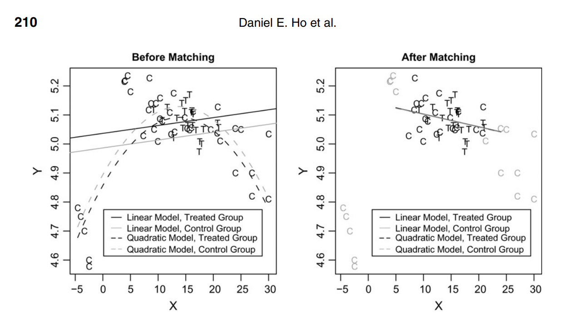

$$
  \require{cancel}
$$

```{r}
#| echo: false
#| warning: false
#| message: false
library(tidyverse)
library(haven)
library(estimatr)
options(digits=3)
```

## Last week

::: {.incremental}

- **Regression** adjustment for estimation of effects under **conditional ignorability**
  - Build a model for $\mathbb{E}[Y_i | X_i , D_i = d]$
  - Average over the predictions to get $\hat{\mathbb{E}}[Y_i(1)] = \frac{1}{N}\sum_{i=1}^N \hat{\mathbb{E}}[Y_i | X_i , D_i = 1]$
- **Weighting** adjustment using inverse-propensity weighting
  - Build a model for $e(X_i) = P(D_i = 1 | X_i)$
  - Re-weight to get $\hat{\mathbb{E}}[Y_i(1)] = \frac{1}{N} \sum_{i=1}^N \frac{Y_iD_i}{\hat{e}(X_i)}$
- **Combining** the two approaches - **Augmented Inverse Propensity Weighting** (AIPW)
  - "Double-robustness" - Need only **one** of the two models to be consistent for the true CEF/propensity score

:::

## This week

::: {.incremental}

- What if we don't want to make **any** model assumptions?
  - Even with **two** chances at the model with AIPW, we might be concerned about misspecification error
- One solution is to use **matching**
  - **Intuition**: What's our best guess for $Y_i(0)$ for a unit with $D_i = 1$ and $X_i = x$?
  - Ideally, we'd use $Y_i$ for a unit with $D_i = 0$ and $X_i = x$.
  - If we can't find one with $X_i = x$...find one with the **closest** $X_i$ to $x$.
- Challenges of **matching**
  - What's the right way to measure "close" vs. "far"?
  - How far is too far?
  - What do we do about the residual differences?

:::

## Review: Imputation estimators

::: {.incremental}

- We want to estimate the sample average treatment effect

  $$\tau = \frac{1}{N}\sum_{i=1}^N Y_i(1) - Y_i(0)$$

- Many estimators $\hat{\tau}$ can be written as differences in **imputed** potential outcomes

  $$\hat{\tau} = \frac{1}{N} \sum_{i=1}^N \widehat{Y}_i(1) - \widehat{Y}_i(0)$$
  
- Previously, we used **regression** to generate the imputations
  - Use a linear regression model $\hat{E}[Y_i | X_i, D_i = 1] = X_i^\prime\hat{\beta}^{(1)}$ to impute $\widehat{Y}_i(1)$
  - Use a linear regression model $\hat{E}[Y_i | X_i, D_i = 0] = X_i^\prime\hat{\beta}^{(0)}$ to impute $\widehat{Y}_i(0)$

:::

## Matching estimators

- An alternative approach is to use some notion of "closeness" to impute the potential outcomes.

  $$\hat{\tau} = \frac{1}{N} \sum_{i=1}^N \widehat{Y}_i(1) - \widehat{Y}_i(0)$$
  
- For unit $i$, if it's **treated** ($D_i = 1$)...
  - ...impute $Y_i$ for $\widehat{Y}_i(1)$
  - ...impute $Y_j$ for $\widehat{Y}_i(0)$...
  - ...where $j$ is another unit with $D_j = 0$ and $X_i \approx X_j$
  
- Vice-versa for the **control** units.

## Matching estimators

::: {.incremental}

- **Central question**: How do we decide what "close" means?

- We need to chhoose a **distance metric**
  - Let $Q_{ij}$ denote the distance between the covariates $X_i$ and $X_j$ between units $i$ and $j$

- Common metrics:
  - *Exact*: $Q_{ij} = 0$ if $X_i = X_j$ and $Q_{ij} = \infty$ if $X_i \neq X_j$
  - *Standardized Euclidean*:
    
    $$Q_{ij} = \sqrt{\sum_{k=1}^K \frac{(X_{ik} - X_{jk})^2}{s_k^2}}$$
  - **Most common:** *Mahalanobis*:
    
    $$Q_{ij} = \sqrt{(X_i - X_j)^{\prime}S^{-1}(X_i - X_j)}$$
    
    where $S$ is the sample variance-covariance matrix.
  
:::

## Matching estimators

::: {.incremental}

- Once we have a **distance metric**, we still need to choose..
  - ...how many units should we match (1-to-1, 1-to-3, 1-to-10, etc...)?
- Should the matching be done **with** replacement or **without** replacement?
  - **With replacement** - once matched, units can be **re-used** and matched with other units.
  - **Without replacement** - matched units fall out of the matching pool once used.
  
- We'll analyze the case for matching **with** replacement
  - Order of matching doesn't matter
  - We always pick the closest units (so matching discrepancy is minimized)
  - Higher variance - (e.g. if only one treated unit is close to many controls).
  
:::

## Nearest-neighbor matching

::: {.incremental}

- For a treated unit with $D_i = 1$, we impute the potential outcomes as:

  $$\widehat{Y}_i(1) = Y_i$$
  
  $$\widehat{Y}_i(0) = \frac{1}{M} \sum_{j \in \mathcal{J}_M(i)} Y_j$$

  where $\mathcal{J}_M(i)$ is the set of $M$ closest matches to $i$ among the control observations.
- Do the same for the controls (but impute $\widehat{Y}_i(1)$ using matched treated units)

- We can think of matching as a kind of weighting estimator that assigns a weight of $1 + \frac{K_M(i)}{M}$ to each unit.

  $$\hat{\tau^m_M} = \frac{1}{N}\sum_{i=1}^N (2D_i -1) \bigg(1 + \frac{K_M(i)}{M}\bigg) Y_i$$
  
:::

## ATE or ATT?

::: {.incremental}

- In many settings where we might want to use matching, we have a handful of treated units and many controls.
  - Easy to find a good match for each treated unit
  - *Hard* to find a good match for each control.

- So instead of trying to estimate the ATE, we could try to estimate the ATT instead - using the controls *only* to impute.

  $$\hat{\tau^m_{\text{ATT}}} = \frac{1}{N_t}\sum_{i: D_i = 1} Y_i - \widehat{Y_i(0)}$$
  
- In terms of the "matching weights", this is equivalent to

  $$\hat{\tau^m_{\text{ATT}}} = \frac{1}{N}\sum_{i=1}^N \bigg(D_i - (1 - D_i)\frac{K_M(i)}{M}\bigg) Y_i$$

- ATT in an observational study is often the more policy-relevant quantity
  - e.g.: How were the incomes of people who *actually* received a particular social service improved?
  
:::

## Properties of the simple matching estimator

::: {.incremental}

- Unless matching is exact, **Abadie and Imbens (2006)** show that matching exhibits a bias.

  $$B_M = \frac{1}{N}\sum_{i=1}^N (2D_i - 1) \bigg[\frac{1}{M} \sum_{m=1}^M \mu_{1-D_i}(X_i) - \mu_{1-D_i}(X_{\mathcal{J}_m(i)})\bigg]$$

  where $\mu_1(X_i) = E[Y_i(1) | X_i]$ and $\mu_0(X_i) = E[Y_i(0) | X_i]$ are the CEFs of the two potential outcomes.

- **Intuitively** - the bias term captures the differences in the conditional expectation function between observation $i$'s covariates and the covariates of the $M$ matches in $\mathcal{J}_m(i)$.
  - When matching is exact, $X_i$ and all of the $X_j$s of the matched units are identical
  - When matching is inexact, we have this **matching discrepancy**

- But does this bias go away in large samples?
  - With many continuous covariates, not fast enough - the rate of convergence of the bias term is slower than that of the sampling variance (the simple matching estimator is not $\sqrt{n}$-consistent).
  - This means our asymptotic approximations for the variance will be poor even in large samples.
  
:::


## Simulation to show the bias

::: {.incremental}

- Let's construct a simulation with confounding. Start with $K=8$ i.i.d. covariates $X_1, X_2, \dotsc X_K$ each distributed $\mathcal{N}(0,1)$.

- Treatment probability is modeled as a logit

  $$\text{log}\bigg(\frac{e(X_i)}{1-e(X_i)}\bigg) =  \beta_1X_1 + \beta_2X_2 + \beta_3X_3 + \dotsc + \beta_k X_k$$

- We'll assume the coefficients are $\beta_k = \frac{1}{k}$

- Outcome is linear w/ same coefficients $\beta_k$ and a constant treatment effect of $2$

  $$Y_i = 2D_i + \mathbf{X}\beta + \epsilon_i$$

:::

## Simulation

- First, our unadjusted simple difference-in-means estimator

```{r, echo=F, message=F, warning=F}
library(tidyverse)
library(estimatr)
library(MASS)
inv.logit = function(x) 1/(1 + exp(-x))
```

```{r, echo=F, message=F, warning=F, fig.align="center"}
set.seed(53706)
nIter <- 1000
ate_est <- rep(NA, nIter)
for (iter in 1:nIter){
  N = 100
  K = 8
  X = mvrnorm(N, rep(0, K), Sigma=diag(rep(1,K)))
  colnames(X) <- paste("X",1:K, sep="")
  coef = 1/c(1:K)
  prD = inv.logit(X%*%coef)
  D = rbinom(N, 1, prD)
  Y = 2*D + X%*%coef + rnorm(N)
  colnames(Y) <- "Y"
  dat <- data.frame(cbind(Y, D, X))
  ate_est[iter] <- coef(lm(Y ~ D, data=dat))[2]
}
hist(ate_est, main="Unadjusted", xlab="Estimate", xlim=c(1, 5))
abline(v=2, col="red", lty=2)
abline(v=mean(ate_est), col="blue", lty=2)

```

## Simulation

- Now, the 1-to-1 matching estimator

```{r, echo=F, message=F, warning=F}
library(Matching)
```

```{r, echo=F, message=F, warning=F, fig.align="center"}
set.seed(53706)
nIter <- 1000
ate_est <- rep(NA, nIter)
for (iter in 1:nIter){
  N = 100
  K = 8
  X = mvrnorm(N, rep(0, K), Sigma=diag(rep(1,K)))
  colnames(X) <- paste("X",1:K, sep="")
  coef = 1/c(1:K)
  prD = inv.logit(X%*%coef)
  D = rbinom(N, 1, prD)
  Y = 2*D + X%*%coef + rnorm(N)
  colnames(Y) <- "Y"
  dat <- data.frame(cbind(Y, D, X))
  ate_est[iter] <- Match(Y = Y, Tr = D, X = X, estimand="ATE", Weight = 2)$est
}
hist(ate_est, main="1-to-1 Matching", xlab="Estimate", xlim=c(1, 5))
abline(v=2, col="red", lty=2)
abline(v=mean(ate_est), col="blue", lty=2)
```

## Simulation

- How about 1-to-3 matching?

```{r, echo=F, message=F, warning=F, fig.align="center"}
set.seed(53706)
nIter <- 1000
ate_est <- rep(NA, nIter)
for (iter in 1:nIter){
  N = 100
  K = 8
  X = mvrnorm(N, rep(0, K), Sigma=diag(rep(1,K)))
  colnames(X) <- paste("X",1:K, sep="")
  coef = 1/c(1:K)
  prD = inv.logit(X%*%coef)
  D = rbinom(N, 1, prD)
  Y = 2*D + X%*%coef + rnorm(N)
  colnames(Y) <- "Y"
  dat <- data.frame(cbind(Y, D, X))
  ate_est[iter] <- Match(Y = Y, Tr = D, X = X, estimand="ATE", M = 3, Weight = 2)$est
}
hist(ate_est, main="1-to-3 Matching", xlab="Estimate", xlim=c(1, 5))
abline(v=2, col="red", lty=2)
abline(v=mean(ate_est), col="blue", lty=2)
```

## Simulation

- Now, what if we estimate the bias correction (using a regression estimator)

```{r, echo=F, message=F, warning=F, fig.align="center"}
set.seed(53706)
nIter <- 1000
ate_est <- rep(NA, nIter)
for (iter in 1:nIter){
  N = 100
  K = 8
  X = mvrnorm(N, rep(0, K), Sigma=diag(rep(1,K)))
  colnames(X) <- paste("X",1:K, sep="")
  coef = 1/c(1:K)
  prD = inv.logit(X%*%coef)
  D = rbinom(N, 1, prD)
  Y = 2*D + X%*%coef + rnorm(N)
  colnames(Y) <- "Y"
  dat <- data.frame(cbind(Y, D, X))
  ate_est[iter] <- Match(Y = Y, Tr = D, X = X, estimand="ATE", M = 3, BiasAdjust=T, Weight = 2)$est
}
hist(ate_est, main="1-to-3 Matching w/ bias correction", xlab="Estimate", xlim=c(1, 5))
abline(v=2, col="red", lty=2)
abline(v=mean(ate_est), col="blue", lty=2)
```

## Simulation to show the bias

- What if we just had 1 covariate?

```{r, echo=F, message=F, warning=F, fig.align="center"}
set.seed(53706)
nIter <- 1000
ate_est <- rep(NA, nIter)
for (iter in 1:nIter){
  N = 100
  K = 1
  X = mvrnorm(N, rep(0, K), Sigma=diag(rep(1,K)))
  colnames(X) <- paste("X",1:K, sep="")
  coef = 1/c(1:K)
  prD = inv.logit(X%*%coef)
  D = rbinom(N, 1, prD)
  Y = 2*D + X%*%coef + rnorm(N)
  colnames(Y) <- "Y"
  dat <- data.frame(cbind(Y, D, X))
  ate_est[iter] <- coef(lm(Y ~ D, data=dat))[2]
}
hist(ate_est, main="Unadjusted", xlab="Estimate", xlim=c(1, 5))
abline(v=2, col="red", lty=2)
abline(v=mean(ate_est), col="blue", lty=2)
```

## Simulation to show the bias

- Matching bias is a **dimensionality** problem!

```{r, echo=F, message=F, warning=F, fig.align="center"}
set.seed(53706)
nIter <- 1000
ate_est <- rep(NA, nIter)
for (iter in 1:nIter){
  N = 100
  K = 1
  X = mvrnorm(N, rep(0, K), Sigma=diag(rep(1,K)))
  colnames(X) <- paste("X",1:K, sep="")
  coef = 1/c(1:K)
  prD = inv.logit(X%*%coef)
  D = rbinom(N, 1, prD)
  Y = 2*D + X%*%coef + rnorm(N)
  colnames(Y) <- "Y"
  dat <- data.frame(cbind(Y, D, X))
  ate_est[iter] <- Match(Y = Y, Tr = D, X = X, estimand="ATE", Weight = 2)$est
}
hist(ate_est, main="1-to-1 Matching", xlab="Estimate", xlim=c(1, 5))
abline(v=2, col="red", lty=2)
abline(v=mean(ate_est), col="blue", lty=2)

```

## Bias-corrected matching

::: {.incremental}

- Instead of substituting in just the average in the matches, **Abadie and Imbens (2011)** propose a "bias-corrected" imputation

- For $D_i = 1$

  $$\widehat{Y}_i(1) = Y_i$$
  
  $$\widehat{Y}_i(0) = \frac{1}{M}\sum_{j \in \mathcal{J}_M(i)} (Y_j + \hat{\mu_0}(X_i) - \hat{\mu_0}(X_j))$$
  
- For $D_i = 0$

  $$\widehat{Y}_i(0) = Y_i$$
  
  $$\widehat{Y}_i(1) = \frac{1}{M}\sum_{j \in \mathcal{J}_M(i)} (Y_j + \hat{\mu_1}(X_i) - \hat{\mu_1}(X_j))$$

- **Intuition** -- We combine regression and matching! Regression models adjust for the residual imbalance that matching doesn't solve while matching helps limit the consequences of regression model misspecification.

:::

## Matching as pre-processing

{fig-align="center"}


## Variance estimation

::: {.incremental}

- **Abadie and Imbens (2008)** show that the standard pairs **bootstrap** doesn't work well for variance estimation.
  - **Intuition**: The matching weights are not a **smooth** function of the inputs (weights are discrete)
  - The regular bootstrap does not preserve the distribution of the match counts $K_M(i)$
  
- **Otsu and Rai (2017)** develop a **weighted** bootstrap using the residuals from the **linearized** version of the matching estimator
  - **Intuition**: Instead of resampling pairs $Y_i$ and $X_i$, we resample $\tilde{\tau}_i$ where...
  
  $$\hat{\tau} = \frac{1}{N}\sum_{i=1}^N (2D_i -1) \bigg(1 + \frac{K_M(i)}{M}\bigg) Y_i = \frac{1}{N}\sum_{i=1}^N \tilde{\tau}_i$$

- Alternatively, **Abadie and Imbens (2006)** derive the asymptotic variance and implement a matching estimator for the outcome variance terms.
  - `Matching` package implements this estimator.

- In the case of post-matching inference when matching **without replacement**, **Abadie and Spiess (2020)** show that matching induces dependence within matched sets
  - Solution: Clustered standard errors, clustered on matched set.
  
:::

## Other matching methods

::: {.incremental}

- A lot of other methods have been developed (primarily in the medicine/biostats literature) that are essentially extensions of matching **without replacement**

- *Optimal* matching
  - Minimize the **total distance** between treated and the set of chosen (matched) control units
  - Can improve over greedy "nearest-neighbor" matching when matching **without replacement**

- *Full* matching
  - Instead of matching 1-to-1 (or 1-to-many), create subclasses with at least 1 treated and control
  - Minimize the within-subclass distances (optimal matching)

:::

## Other matching methods

::: {.incremental}

- Other parts of the matching literature try tweaking the **distance** metric

- *Genetic* matching **(Diamond and Sekhon, 2013)**
  - Find the $S^{-1}$ matrix in the Mahalanobis distance that optimizes some criterion of balance between treated and control groups
  - Essentially trying to find optimal "weights" to put on covariates in the matching algorithm to achieve some global optimum of balance.
  - Use a "genetic" algorithm to search for this optimum (non-linear optimization problem)

:::

## Example: Keele et. al. (2017)

- Read in the data

```{r, echo=T}
turn <- haven::read_dta("assets/data/match-all.dta")
```

- Recall the simple difference-in-means

```{r, echo=T}
lm_robust(black_turnout ~ black, data=turn)
```

## Example: Keele et. al. (2017)

- Visualize the confounding!

```{r, fig.width=7, fig.height=5,  fig.align="center"}
turn %>% ggplot(aes(x=blackpop_pct1990, y=as.factor(black))) + geom_boxplot(orientation = "y") + scale_y_discrete(labels=c( "No Black candidates", "1+ Black candidates")) +
  labs(x = "Black population (%, 1990)", y="") + theme_minimal()
```

## Example: Keele et. al. (2017)

- Visualize the confounding!

```{r, fig.width=7, fig.height=5, warning=F, message=F,  fig.align="center"}
turn %>% ggplot(aes(y=black_turnout, x=blackpop_pct1990)) + geom_point() + geom_smooth() +
  labs(x = "Black population (%, 1990)", y="Black turnout") + theme_minimal()
```

## Example: Keele et. al. (2017)

::: {.incremental}

- **Design**: Selection-on-observables with lots of covariates to adjust for:
  - Population, pct. Black, pct. College degree, pct. High school, pct. Unemployed, median income, pct. below poverty line, home rule charter

- We'll focus on replicating their matching approach for **general** election turnout.
  - They also look at **runoff** elections where they believe selection-on-observables is more plausible.

- We'll use standard 1-to-1 nearest neighbor matching
  - The paper itself actually uses a variant of optimal matching
  
:::

## Example: Keele et. al. (2017)

- We'll implement the Mahalanobis distance 1-to-3 matching estimator

```{r, echo=T}
match_results <- Matching::Match(Y = turn$black_turnout, Tr = turn$black,
                         X = turn %>% dplyr::select(year, pop90, blackpop_pct1990,
                                                    college_pct, hs_pct,
                                                    unemp, income, poverty, home),
                         M=1 , Weight = 2, estimand = "ATT")
                        # Weight = 2 = Mahalanobis distance
```

## Example: Keele et. al. (2017)

- Results

```{r, echo=T}
summary(match_results)
```

## Example: Keele et. al. (2017)

```{r, message=F, fig.width=5, fig.height=3, warning=F, message=F, dpi=150, fig.align="center"}
library(cobalt)
cobalt::love.plot(match_results, treat = turn$black, covs = turn %>% dplyr::select(year, pop90, blackpop_pct1990, college_pct, hs_pct, unemp, income, poverty, home),
                                  abs=T, binary="std", thresholds= c(m=.1))
```


## Example: Keele et. al. (2017)

- What happens if we force **exact** matching on year?

```{r, echo=T}
match_results2 <- Matching::Match(Y = turn$black_turnout, Tr = turn$black,
                         X = turn %>% dplyr::select(year, pop90, blackpop_pct1990,
                                                    college_pct, hs_pct,
                                                    unemp, income, poverty, home),
                         exact = c(T, F, F, F, F, F, F, F, F),
                         M=1 , Weight = 2, estimand = "ATT")
                        # Weight = 2 = Mahalanobis distance
```

## Example: Keele et. al. (2017)

- Results

```{r, echo=T}
summary(match_results2)
```

## Example: Keele et. al. (2017)

```{r, message=F, fig.width=5, fig.height=3, warning=F, message=F, dpi=150, fig.align="center"}
cobalt::love.plot(match_results2, treat = turn$black, covs = turn %>% dplyr::select(year, pop90, blackpop_pct1990, college_pct, hs_pct, unemp, income, poverty, home),
                                  abs=T, binary="std", thresholds= c(m=.1))
```

## Example: Keele et. al. (2017)

- Now, what if we add in the bias-correction (the regression)

```{r, echo=T}
match_results_bc <- Matching::Match(Y = turn$black_turnout, Tr = turn$black,
                         X = turn %>% dplyr::select(year, pop90, blackpop_pct1990,
                                                    college_pct, hs_pct,
                                                    unemp, income, poverty, home),
                         M=1 , Weight = 2, estimand = "ATT", BiasAdjust = T)
                        # Weight = 2 = Mahalanobis distance
```


## Example: Keele et. al. (2017)

```{r, echo=T}
summary(match_results_bc)
```

## Summary

::: {.incremental}

- Matching is a useful tool for reducing covariate imbalance between treated and control groups in a selection-on-observables design
  - **Intuition**: Group together treated and control units with "similar" covariate values
  - Does not depend on any model for the treatment or the outcome
- However, matching is not a universal panacea even if we buy selection-on-observables
  - Still have residual imbalance due to imperfect matches.
  - Matching in high-dimensional space is tricky.
- **Combining** matching and regression
  - Matching is commonly framed as a "pre-processing" step prior to regression to avoid regression imputations that are far from the data.
- At it's core, matching is a tool for weighting the sample to improve **balance** between the treated and control groups.
  - But we could just target the **balance directly** rather than indirectly via distances...
  
:::

## Next week

::: {.incremental}

- How to deal with forms of **unobserved confounding**
- Our first approach - **Instrumental Variables**
  - What if **treatment** is not randomized...
  - ...but an **instrument** is!
- We can identify (a particular type of) average treatment effect if...
  - The **instrument** only affects the outcome **through** its effect on the treatment!
  
- Where have we seen this before?
  - **Experiments** with **non-compliance**
  - **Treatment** = "taking the treatment"
  - **Instrument** = "being assigned to take the treatment"
  
:::
