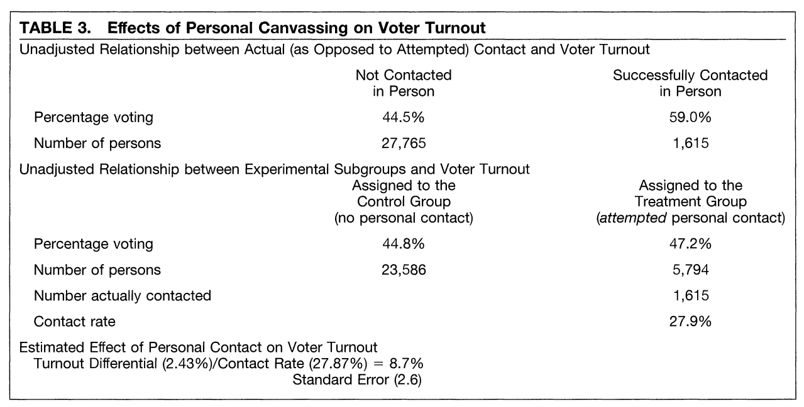
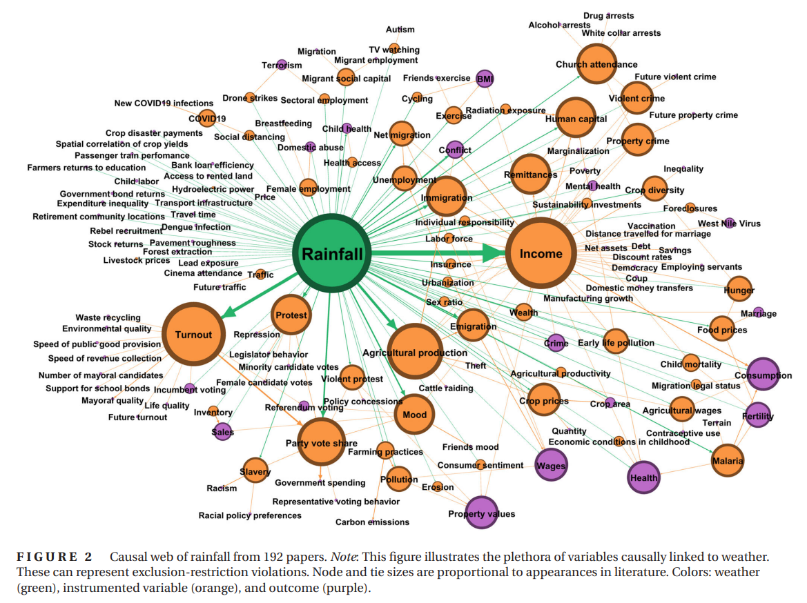

$$
  \require{cancel}
$$

```{r}
#| echo: false
#| warning: false
#| message: false
library(tidyverse)
library(haven)
library(estimatr)
library(ivmodel)
options(digits=3)
```

## Last three weeks

::: {.incremental}

- Identification under **conditional ignorability**
  - Treatment assignment is independent of the potential outcomes given observed confounders $\mathbf{X}$
  - "Selection-on-observables"
- "Selection-on-observables" isn't a testable assumption
  - Relies on theory to decide which $\mathbf{X}$ to include.
  - DAGs can help here.
- Lots of estimation strategies
  - Stratify with low-dimensional $\mathbf{X}$
  - IPTW to eliminate treatment-covariate relationship, regression to model the outcome-covariate relationship.
  - Matching to reduce model dependence.
    - Or consider more modern flexible modelling techniques for $\mathbb{E}[Y_i(d) | X_i]$

:::

## This week

::: {.incremental}

- Can we estimate a treatment effect when neither ignorability nor conditional ignorability hold for treatment?
  - Can we get rid of *unobserved* confounding?
- "Instrumental variables" designs are one way of dealing with this
- We can identify *some* average of treatment effects if...
  - There *does* exist an ignorable or conditionally ignorable **instrument** which...
  - ...has a monotonic effect on the treatment...
  - ...and has no effect on the outcome *except* through its effect on the treatment.
- What's the average? The "Local Average Treatment Effect"
  - Average effect among those who are *moved* to take treatment by the instrument

:::

## Instrumental Variables {.title-slide}

## Treatment non-compliance

::: {.incremental}

- Often experiments suffer from treatment **non-compliance**
  - Participants randomized to receive a phone call don't pick up.
  - Participants randomized to wear surgical masks choose not to.
- New notation!
  - Let $Z_i$ denote whether $i$ is assigned to receive a treatment.
  - Let $D_i$ denote the treatment actually *taken* by an individual.
- Can we just take the simple difference-in-means between $D_i = 1$ and $D_i = 0$?
  - No! Non-compliance affected by other factors which might also affect the outcome.
  - We're stuck with an observational design.

:::

##

- Unless...

## Intent-to-treat effect

::: {.incremental}

- We can first just change the question - instead of the effect of **treatment**, we can make our estimand the effect of being **assigned to treatment**.
- Our estimator for the ITT is just the difference in means between the $Z_i = 1$ and $Z_i = 0$ arms

  $$\hat{\tau}_{\text{ITT}} = \hat{E}[Y_i | Z_i = 1] - \hat{E}[Y_i | Z_i = 0]$$

- Identified under randomization of $Z_i$ even if $D_i$ is not randomized.
  - But combines two effects: the actual effect of $D_i$ and the effect of $Z_i$ on $D_i$.

:::

## Instrumental variables

```{tikz}
#| label: iv-dag-1
#| echo: false
#| fig-align: center
#| fig-ext: svg
#| out-width: 50%
\usetikzlibrary{shapes}
\usetikzlibrary{positioning}
\usetikzlibrary{arrows}
\usetikzlibrary{shapes.misc}
\usetikzlibrary{shapes.symbols}
\usetikzlibrary{shadows}
\usetikzlibrary{fit}
\begin{tikzpicture}[scale=2, every node/.style={font=\large}]
    \node (z1) at (-1,0) {$Z$};
    \node (a1) at (0,0) {$D$};
    \node (l1) at (0.5, 1)
    {$U$};
    \node (y) at
    (1,0) {$Y$};
    \draw[->, >=stealth, thick, dashed] (l1) -- (a1);
    \draw[->, >=stealth, thick, dashed] (l1) --  (y);
    \draw[->, >=stealth, thick] (a1) -- (y);
    \draw[->, >=stealth, thick] (z1) -- (a1);
\end{tikzpicture}
```

- Suppose though that we're interested in the *actual* effect of receiving treatment (the effect of $D_i$). What can we do?

## Instrumental variables

::: {.incremental}

- Start by writing down potential outcomes for $D_i$ along with **joint** potential outcomes of $Y_i$ in terms of $Z_i$ and $D_i$

  $$D_i(z) = D_i \text{ if } Z_i = z$$
  $$Y_i(d, z) = Y_i \text{ if } D_i = d, Z_i = z$$
- Observed treatment $D_i$ is a function of treatment assignment ($Z_i$) - it's a post-treatment quantity (and so has potential outcomes).

:::

## Assumptions

::: {.incremental}

1. Randomization of instrument
2. Exclusion restriction
3. Non-zero first-stage relationship
4. Monotonicity

:::

## Assumption 1: Randomization

::: {.incremental}

- $Z_i$ is independent of both sets of potential outcomes (potential outcomes for the treatment and potential outcomes for the outcome).

  $$\{D_i(1), D_i(0)\} {\perp \! \! \! \perp} Z_i$$

  $$\{Y_i(d, z) \forall d, z\} {\perp \! \! \! \perp} Z_i$$

- We can weaken this to conditional ignorability (where $Z_i$ is randomized conditional on $X_i$), which is common in observational settings.
- Sufficient to identify the **intent-to-treat (ITT)** effect

:::

## Assumption 1: Randomization

```{tikz}
#| label: iv-dag-2
#| echo: false
#| fig-align: center
#| fig-ext: svg
#| out-width: 50%
\usetikzlibrary{shapes}
\usetikzlibrary{positioning}
\usetikzlibrary{arrows}
\usetikzlibrary{shapes.misc}
\usetikzlibrary{shapes.symbols}
\usetikzlibrary{shadows}
\usetikzlibrary{fit}
\begin{tikzpicture}[scale=2, every node/.style={font=\large}]
    \node (z1) at (-1,0) {$Z$};
    \node (a1) at (0,0) {$D$};
    \node (l1) at (0.5, 1)
    {$U$};
    \node (y) at
    (1,0) {$Y$};
    \draw[->, >=stealth, thick, dashed] (l1) -- (a1);
    \draw[->, >=stealth, thick, dashed] (l1) --  (y);
    \draw[->, >=stealth, thick] (a1) -- (y);
    \draw[->, >=stealth, thick] (z1) -- (a1);
   \draw[->, >=stealth, red!60, thick, dashed] (l1) -- node[cross out,draw, solid]{} (z1);
\end{tikzpicture}
```

- The randomization assumption eliminates any arrows from $U$ to $Z$.

## Assumption 2: Exclusion restriction

::: {.incremental}

- $Z_i$ **only affects** $Y_i$ by way of its effect on $D_i$.
- In other words, if $D_i$ were set at some level $d$, the potential outcome for $Y_i(d, z)$ does not depend on $z$.

  $$Y_i(d, z) = Y_i(d, z^{\prime}) \text{ for any } z \neq z^{\prime}$$

- **Not a testable assumption!** - we have to justify this with substantive knowledge.
  - Easiest in the treatment non-compliance case
  - But consider what might happen in a non-blinded situation where respondents knew their treatment assignments?
- "Surprise" factor - If I told you $Z$ was associated with $Y$, would you think "that's odd"?

:::

## Assumption 2: Exclusion restriction

```{tikz}
#| label: iv-dag-3
#| echo: false
#| fig-align: center
#| fig-ext: svg
#| out-width: 50%
\usetikzlibrary{shapes}
\usetikzlibrary{positioning}
\usetikzlibrary{arrows}
\usetikzlibrary{shapes.misc}
\usetikzlibrary{shapes.symbols}
\usetikzlibrary{shadows}
\usetikzlibrary{fit}
\begin{tikzpicture}[scale=2, every node/.style={font=\large}]
    \node (z1) at (-1,0) {$Z$};
    \node (a1) at (0,0) {$D$};
    \node (l1) at (0.5, 1)
    {$U$};
    \node (y) at
    (1,0) {$Y$};
    \draw[->, >=stealth, thick, dashed] (l1) -- (a1);
    \draw[->, >=stealth, thick, dashed] (l1) --  (y);
    \draw[->, >=stealth, thick] (a1) -- (y);
    \draw[->, >=stealth, thick] (z1) -- (a1);
    \draw[->, >=stealth, red!60, thick] (z1)  to[bend right = 50] node[cross out, -, draw, red!60, thick, midway] {\vspace{3em}} node[red!60, midway, below] {}(y);
\end{tikzpicture}
```

- The exclusion restriction eliminates any causal paths from $Z$ to $Y$ **except** for $Z \to D \to Y$.

## Assumption 3: Non-zero first stage

::: {.incremental}

- $Z_i$ has an effect on $D_i$

  $$\mathbb{E}[D_i(1) - D_i(0)] \neq 0$$
- Seems trivial, but we need this to make the estimator work.
- Magnitude matters for estimator performance - a "weak" first-stage $\leadsto$ biased IV ratios in finite samples.
  - IV estimators are *consistent* but not *unbiased*.

:::

## Assumption 3: Non-zero first stage

```{tikz}
#| label: iv-dag-4
#| echo: false
#| fig-align: center
#| fig-ext: svg
#| out-width: 50%
\usetikzlibrary{shapes}
\usetikzlibrary{positioning}
\usetikzlibrary{arrows}
\usetikzlibrary{shapes.misc}
\usetikzlibrary{shapes.symbols}
\usetikzlibrary{shadows}
\usetikzlibrary{fit}
\begin{tikzpicture}[scale=2, every node/.style={font=\large}]
    \node (z1) at (-1,0) {$Z$};
    \node (a1) at (0,0) {$D$};
    \node (l1) at (0.5, 1)
    {$U$};
    \node (y) at
    (1,0) {$Y$};
    \draw[->, >=stealth, thick, dashed] (l1) -- (a1);
    \draw[->, >=stealth, thick, dashed] (l1) --  (y);
    \draw[->, >=stealth, thick] (a1) -- (y);
    \draw[->, >=stealth, thick, red!60, thick] (z1) -- (a1);
\end{tikzpicture}
```

- The non-zero first stage assumption requires a path from $Z$ to $D$.

## Assumption 4: Monotonicity

::: {.incremental}

- $Z_i$'s effect on $D_i$ only goes in one direction **at the individual level**

  $$D_i(1) - D_i(0) \ge 0$$

- If it goes the other way, we can always flip the direction of the treatment to make this hold
  - The key is that the instrument does not have a positive effect on $D_i$ for some units and a negative effect for others.
- **Not a testable assumption**

:::

## Assumption 4: Monotonicity

- In binary instrument/binary treatment world, this is sometimes called a "no defiers" assumption.

Stratum              | $D_i(1)$          |  $D_i(0)$ |
:-------------------:|:-----------------:|:---------:|
"Always-takers"      |  $1$              |  $1$      |
"Never-takers"       |  $0$              |  $0$      |
"Compliers"          |  $1$              |  $0$      |
"Defiers"            |  $0$              |  $1$      |

- Under no defiers, every unit with $D_i = 1$ and $Z_i = 0$ is an always-taker, every unit with $D_i = 0$ and $Z_i =1$ is a never-taker.

## Assumption 4: Monotonicity

```{tikz}
#| label: iv-dag-5
#| echo: false
#| fig-align: center
#| fig-ext: svg
#| out-width: 50%
\usetikzlibrary{shapes}
\usetikzlibrary{positioning}
\usetikzlibrary{arrows}
\usetikzlibrary{shapes.misc}
\usetikzlibrary{shapes.symbols}
\usetikzlibrary{shadows}
\usetikzlibrary{fit}
\begin{tikzpicture}[scale=2, every node/.style={font=\large}]
    \node (z1) at (-1,0) {$Z$};
    \node (a1) at (0,0) {$D$};
    \node (l1) at (0.5, 1)
    {$U$};
    \node (y) at
    (1,0) {$Y$};
    \draw[->, >=stealth, thick, dashed] (l1) -- (a1);
    \draw[->, >=stealth, thick, dashed] (l1) --  (y);
    \draw[->, >=stealth, thick] (a1) -- (y);
    \draw[->, >=stealth, thick, red!60, thick] (z1) -- (a1);
\end{tikzpicture}
```

- Can't represent the monotonicity assumption in a DAG - it's an assumption about the form of the relationship between $Z$ and $D$.

## Interpreting the IV estimand

::: {.incremental}

- The classic IV estimand with one instrument is a ratio of sample covariances.

  $$\tau_{\text{IV}} = \frac{Cov(Y, Z)}{Cov(D, Z)}$$

- With a binary instrument, this is sometimes called the "Wald" ratio - a ratio of differences in means

  $$\tau_{\text{IV}} = \frac{\mathbb{E}[Y_i | Z_i = 1] - \mathbb{E}[Y_i | Z_i = 0]}{\mathbb{E}[D_i | Z_i = 1] - \mathbb{E}[D_i | Z_i = 0]}$$
:::

## Interpreting the IV estimand

::: {.incremental}

- What does the Wald estimand correspond to in terms of causal effects?

  $$\tau_{\text{IV}} = \frac{\mathbb{E}[Y_i | Z_i = 1] - \mathbb{E}[Y_i | Z_i = 0]}{\mathbb{E}[D_i | Z_i = 1] - \mathbb{E}[D_i | Z_i = 0]}$$

- Under our identification assumptions:
  - The numerator is the ITT
  - The denominator is the first-stage effect

:::

## Interpreting the IV estimand

- Let's decompose the denominator first - under randomization:

  $$\begin{align*}
  \mathbb{E}[D_i | Z_i = 1] - \mathbb{E}[D_i | Z_i = 0] &= \mathbb{E}[D_i(1) | Z_i = 1] - \mathbb{E}[D_i(0) | Z_i = 0]\\
  &= \mathbb{E}[D_i(1)] - \mathbb{E}[D_i(0)]\\
  &= \mathbb{E}[D_i(1) - D_i(0)]
  \end{align*}$$

## Interpreting the IV estimand

::: {.incremental}

- With binary treatment/binary instrument, we can use law of total expectation to decompose by principal stratum

  $$\begin{align*}\mathbb{E}[D_i(1) - D_i(0)] = \underbrace{\mathbb{E}[D_i(1) - D_i(0) | D_i(1) = D_i(0)] \times P(D_i(1) = D_i(0))}_{\text{(always/never-takers)}} + \\
  \underbrace{\mathbb{E}[D_i(1) - D_i(0) | D_i(1) > D_i(0)] \times P(D_i(1) > D_i(0))}_{\text{(compliers)}} + \\
  \underbrace{\mathbb{E}[D_i(1) - D_i(0) | D_i(1) < D_i(0)] \times P(D_i(1) < D_i(0))}_{\text{(defiers)}}\end{align*}$$

- The first term is $0$
- And by no defiers, the last term is $0$ since $P(D_i(1) < D_i(0)) = 0$

  $$\mathbb{E}[D_i(1) - D_i(0)] = Pr(D_i(1) > D_i(0))$$
  
:::

## Interpreting the IV estimand

::: {.incremental}

- Next, the numerator (the ITT). Under the exclusion restriction and randomization:

  $$\mathbb{E}[Y_i | Z_i = 1] = \mathbb{E}\bigg[Y_i(0) + \bigg(Y_i(1) - Y_i(0)\bigg)D_i(1)\bigg]$$
  $$\mathbb{E}[Y_i | Z_i = 0] = \mathbb{E}\bigg[Y_i(0) + \bigg(Y_i(1) - Y_i(0)\bigg)D_i(0)\bigg]$$

- The difference (with some algebra) is

  $$\mathbb{E}[Y_i | Z_i = 1] - \mathbb{E}[Y_i | Z_i = 0]  = \mathbb{E}\bigg[\bigg(Y_i(1) - Y_i(0)\bigg) \times \bigg(D_i(1) - D_i(0)\bigg)\bigg]$$
  
:::

## Interpreting the IV estimand

::: {.incremental}

- Conditioning on the principal strata again:

  $$=\begin{align*}\underbrace{\mathbb{E}\bigg[(Y_i(1) - Y_i(0)) \times (0) | (D_i(1) = D_i(0))\bigg] \times P(D_i(1) = D_i(0))}_{\text{always/never-takers}} + \\
  \underbrace{\mathbb{E}\bigg[(Y_i(1) - Y_i(0)) \times (1) | (D_i(1) > D_i(0))\bigg] \times  P(D_i(1) > D_i(0))}_{\text{compliers}} + \\
  \underbrace{\mathbb{E}\bigg[(Y_i(1) - Y_i(0)) \times (-1) | (D_i(1) < D_i(0))\bigg] \times P(D_i(1) < D_i(0))}_{\text{defiers}}\end{align*}$$

- Again, first term is zero because $D_i(1) - D_i(0) = 0$, third is zero by "no defiers" and we have

  $$\mathbb{E}[Y_i | Z_i = 1] - \mathbb{E}[Y_i | Z_i = 0] =  \mathbb{E}\bigg[Y_i(1) - Y_i(0) | D_i(1) > D_i(0)\bigg] \times  P(D_i(1) > D_i(0))$$

- The ITT is the product of a conditional average treatment effect and the proportion of compliers.

:::

## The LATE Theorem

::: {.incremental}

- The IV estimand, under our identification assumptions, is a Local Average Treatment Effect (LATE):

  $$\frac{\mathbb{E}[Y_i | Z_i = 1] - \mathbb{E}[Y_i | Z_i = 0]}{\mathbb{E}[D_i | Z_i = 1] - \mathbb{E}[D_i | Z_i = 0]} = \mathbb{E}[Y_i(1) - Y_i(0) | D_i(1) > D_i(0)]$$

- The LATE is a conditional average treatment effect within the *subpopulation* of **compliers**
- If treatment effects are constant, we can generalize this to the whole sample.
  - But if effects are heterogeneous, we are not necessarily getting a "representative" treatment effect.

:::

## Better LATE than never?

::: {.incremental}

- How should we interpret the LATE?
  - It's not necessarily the quantity we care about - we care about the effect of the treatment in the entire sample.
  - On the other hand, in many policy applications the group *responsive* to treatment is also the group we want to learn about.
- **External validity** question
  - Compliers are those compelled to take treatment by our encouragement. Would estimates generalize to those who are less encourageable?
  - The LATE is design-specific. If we came up with a different instrument, that changes the population on which we're estimating an effect!
- What can we do?
  - We can actually get the distribution of **any** covariate for the compliers - can compare to the rest of the sample!

:::

## Example: The effect of media on voting

::: {.incremental}

- Gerber, Karlan and Bergan (2009, AEJ:AE) estimate the effect of reading the Washington Post (or Washington Times) on political attitudes and voting behavior.
  - $Z_i$: Random assignment to receive a free subscription to the Washington Post
  - $D_i$: Actually subscribing to the Washington Post (as measured by a post-encouragement survey)
  - $Y_i$: 2005 Turnout (measured in the survey)
- Assumptions:
  - Assignment to get the free subscription offer is ignorable/exogenous
  - Getting the free subscription offer affects actual subscriptions (non-zero first stage)
  - No one would subscribe to the Post if they *didn't* receive the offer but not subscribe if they *did*. (monotonicity/no defiers)
  - Assignment to get the free subscription offer doesn't affect voting *except through* actually subscribing to the Post (exclusion restriction)

:::

## Example: The effect of media on voting

- First, subset the data to WaPo or control observations that completed the follow-up survey

```{r, echo=T}
green <- read_dta("assets/data/publicdata.dta")
wapost <- green %>% filter(treatment != "TIMES"&!is.na(getpost)&!is.na(voted))
```

## Example: The effect of media on voting

- Is there a first-stage effect?

```{r, echo=T}
lm_robust(getpost ~ post, data=wapost)
```

- About 34 percent of the sample is a "complier" - quite substantial!

## Example: The effect of media on voting

- Is there an ITT?

```{r, echo=T}
lm_robust(voted ~ post, data=wapost)
```

- ITT is essentially zero.

## Example: The effect of media on voting

- Compare with the naive OLS estimate

```{r, echo=T}
lm_robust(voted ~ getpost, data=wapost)
```

- Post subscribers are 6pp more likely to vote in the 2005 VA gubernatorial election.
  - But is this causal? No!

## Example: The effect of media on voting

- Let's estimate the LATE using the Wald estimator

```{r, echo=T}
(mean(wapost$voted[wapost$post == 1]) - mean(wapost$voted[wapost$post == 0]))/(mean(wapost$getpost[wapost$post == 1]) - mean(wapost$getpost[wapost$post == 0]))
```

- Equivalent to a ratio of regression coefficients

```{r, echo=T}
coef(lm_robust(voted ~ post, data=wapost))[2]/coef(lm_robust(getpost ~ post, data=wapost))[2]
```

## Example: The effect of media on voting

- We'll talk about inference later on, but **important** to take note: the SE for the LATE can be much larger than the SE for the ITT

```{r, echo=T}
iv_robust(voted ~ getpost | post, data=wapost)
```

## Review: The IV Ratio

{fig-align="center"}

## IV in observational studies

::: {.incremental}

- Most applications of IV are **not** treatment non-compliance.
- But all follow the **same** underlying logic.
  - Treatment of interest is **not randomized**...but there exists a real or "natural" experiment that is.
  - And this **natural experiment** affects the outcome only through its effect on the treatment of interest.
- Examples:
  - **Angrist (1990)** - Vietnam draft lottery number as an instrument for the effect of military service on income.
  - **Angrist and Krueger (1991)** - Birth quarter as an instrument for education's effect on income.
  - **Acemoglu et. al. (2001)** - European settler mortality as an instrument for the effect of institutional quality on GDP per capita.

:::

## IV in observational studies

:::{.incremental}

- Challenges
  - **Exogeneity/ignorability** of the instrument isn't guaranteed - need to make the usual "selection-on-observables" arguments from **theory**
  - **IV double-bind**
    - If the instrument has a **huge** effect on your treatment...
    - ...it might also affect a lot of **other stuff**...
    - ...all of those are potential exclusion restriction violations!

:::

## Discussion: The rainfall instrument

::: {.incremental}

- **Miguel, Satyanth, and Sergenti (2004, JPE)** look at the effect of **economic growth** on **civil conflict** in 41 African countries.
  - Growth and conflict are confounded (e.g. by political institutions).
  - **Instrument** for GDP growth using the annual change in rainfall
    - For heavily agrarian countries, rainfall fluctuations determine **crop yields** which are a large component of GDP.
  - **Reduced form** - Negative rainfall shocks increase civil conflict.
    - **First stage** - Negative rainfall shocks reduce GDP growth
- Should we conclude that growth shocks increase conflict?
  - **Exogeneity?** Is rainfall as-good-as randomly assigned?
  - **Monotonicity?** Do positive rainfall shocks **strictly** boost GDP per capita?
  - **Exclusion restriction?** Is rainfall's effect transmitted only through the mechanism the authors define?

:::

## Discussion: The rainfall instrument

{fig-align="center" height="450px"}

> Mellon (2025) "Rain, Rain, Go Away: 194 Potential Exclusion-Restriction Violations for Studies Using Weather as an Instrumental Variable"

## Estimation and inference for IV {.title-slide}

## The IV ratio estimator

::: {.incremental}

- We've talked about what the **IV estimand** means...
  - ...now let's talk about **estimation**
  
- Remember, the IV ratio estimand (with a **single instrument** and a **single treatment**)

  $$\tau_{\text{IV}} = \frac{Cov(Y_i, Z_i)}{Cov(Y_i, X_i)}$$
  
- What is a **consistent** estimator of this? Let's use the **plug-in principle**

  $$\hat{\tau}_{\text{IV}} = \frac{\widehat{Cov}(Y_i, Z_i)}{\widehat{Cov}(Y_i, X_i)}$$
  
- **Numerator**: "Reduced form"/ITT
- **Denominator**: "First stage"

:::

## The IV ratio estimator

::: {.incremental}

- If the **sample** covariances are consistent for the **population** covariances (e.g. under i.i.d. sampling), then by continuous mapping theorem

  $$\hat{\tau}_{\text{IV}} \overset{p}{\to} \tau_{\text{IV}}$$
  
- And, by our usual assumptions from regression, we also have asymptotic normality

  $$\sqrt{n}(\hat{\tau}_{\text{IV}}  - \tau_{\text{IV}}) \overset{d}{\to} \mathcal{N}(0, V)$$
  
- What's the variance $V$?
  - This is easiest to explain by writing the IV estimator in **matrix** form.
  - We can use the same tools from our analysis of **linear regression**!

:::

## IV ratio in matrix form

::: {.incremental}

- Let $\mathbf{Z}$ be our matrix of **instruments** and **covariates**
- Let $\mathbf{X}$ be our matrix of **treatments** and **covariates**
  - **Covariates** here refers to stuff that's not a treatment or a - possibly things that are needed to satisfy ignorability for the instrument.

- For identification, we need **as many** instruments as we have treatments
  - Most typical case in political science: single-instrument, single-treatment case
  - More "structural equation"-oriented discplines also consider **multiple**-instrument/**multiple**-treatment cases
  - Sometimes we might have **more** instruments than treatments ("overidentification")
  
- We can write the just-identified (no. instruments = no. treatments) IV estimator as:

  $$\hat{\tau}_{\text{IV}} = (\mathbf{Z}^{\prime}\mathbf{X})^{-1}(\mathbf{Z}^{\prime} Y)$$
  
:::

## IV ratio in matrix form

- We can recover the **asymptotic** variance using the delta method!

  $$Var(\hat{\tau}_{\text{IV}}) = (\mathbf{Z}^{\prime}\mathbf{X})^{-1}(\mathbf{Z}^{\prime} \Sigma \mathbf{Z})(\mathbf{Z}^{\prime}\mathbf{X})^{-1}$$
  
- $\Sigma$ is the variance-covariance matrix of the errors
  - Under i.i.d. sampling, a **heteroskedasticity-robust** plug-in estimator for $\hat{\Sigma}$ is a diagonal matrix with the squared residuals.
  - Other "robust" SEs w/ different specifications for $\Sigma$ (e.g. clustering, spatial correlation, etc...) - we'll talk about these later!
  
## IV ratio inference

- To illustrate with our Washington Post example

```{r, echo=T}
iv_est <- iv_robust(voted ~ getpost | post, data=wapost, se_type = "HC0")
iv_est
```

- Let's calculate the point estimate by hand!

```{r, echo=T}
Z <- model.matrix(~post, data=wapost) # Add the intercept
D <- model.matrix(~getpost, data=wapost) # Add the intercept
Y <- wapost$voted
point <- solve(t(Z)%*%D)%*%(t(Z)%*%Y)
point
```

## IV ratio inference

- To illustrate with our Washington Post example

```{r, echo=T}
iv_robust(voted ~ getpost | post, data=wapost, se_type = "HC0")
```

- Let's do the variance!

```{r, echo=T}
u <- Y - iv_est$fitted.values
vcov <- solve(t(Z)%*%D)%*%(t(Z)%*%diag(u^2)%*%Z)%*%solve(t(Z)%*%D)
sqrt(diag(vcov))
```

## IV as "two-stage" least squares

::: {.incremental}

- Another way of interpreting $\hat{\tau}_{\text{IV}}$ is in terms **two** ordinary least squares regressions
  - Accommodates the "overidentified" case (more instruments than treatments)
  
- **Intuition** - We want to regress $Y$ on the part of the treatment that is explained **entirely** by the instrument (the "exogenous" variation)

- **First stage** - Project $\mathbf{X}$ into the space of the instrument $\mathbf{Z}$

  $$\widehat{\mathbf{X}} = \underbrace{\mathbf{Z}(\mathbf{Z}^\prime\mathbf{Z})^{-1}\mathbf{Z}^\prime}_{P_{\mathbf{Z}}}\mathbf{X}$$

- **Second stage** - Regress $Y$ on the "fitted values" $\widehat{\mathbf{X}}$

  $$\hat{\beta}_{\text{2SLS}} = (\widehat{\mathbf{X}}^{\prime}\mathbf{X})^{-1}(\widehat{\mathbf{X}}^{\prime}Y)$$
  
:::

## Two-stage least squares

- Putting it all together, the 2SLS estimator is:

  $$\hat{\tau}_{\text{2SLS}} =  (\mathbf{X}^{\prime}\mathbf{Z}(\mathbf{Z}^{\prime}\mathbf{Z})^{-1}\mathbf{Z}^\prime\mathbf{X})^{-1}(\mathbf{X}^{\prime}\mathbf{Z}(\mathbf{Z}^{\prime}\mathbf{Z})^{-1}\mathbf{Z}^\prime Y)$$

## Illustrating 2SLS

- Let's include covariates in our **Gerber, Karlan and Bergan (2009)** example
  - $Z_i$: Random assignment to receive a free subscription to the Washington Post
  - $D_i$: Actually subscribing to the Washington Post (as measured by a post-encouragement survey)
  - $Y_i$: 2005 Turnout (measured in the survey)
  - $X_i$: Gender, Age

- Load and subset out missing covariates

```{r, echo=T}
green <- read_dta("assets/data/publicdata.dta")
wapost <- green %>% filter(treatment != "TIMES"&!is.na(getpost)&!is.na(voted)&!is.na(Bfemale)&!is.na(reportedage))
```

## Illustrating 2SLS

- Our first stage regresses subscription on assignment + covariates

```{r, echo=T}
first_stage <- lm_robust(getpost ~ post + Bfemale + reportedage , data= wapost)
summary(first_stage)
```

## Illustrating 2SLS

- Let's actually run 2SLS - I like two routines: `iv_robust` in `estimatr` (does 2SLS with robust SEs) and `ivmodel` in `ivmodel` (does robust 2SLS *and* weak-instrument robust tests + other diagnostics)

```{r, echo=T}
wapo_2sls <- iv_robust(voted ~ getpost  + Bfemale + reportedage | post + Bfemale + reportedage, data= wapost)
summary(wapo_2sls)
```

## Illustrating 2SLS

```{r, echo=T}
wapo_2sls2 <- ivmodelFormula(voted ~ getpost  + Bfemale + reportedage | post + Bfemale + reportedage, data= wapost, heteroSE=T)
summary(wapo_2sls2)
```

## The weak instrument problem

:::{.incremental}

- Our ratio estimator is consistent

  $$\hat{\tau}_{\text{IV}} = \frac{\widehat{Cov(Y_i, Z_i)}}{\widehat{Cov(D_i, Z_i)}} \overset{p}{\to} \tau + \frac{Cov(U_i, Z_i)}{Cov(D_i, Z_i)}$$

- Under exogeneity $Cov(Z_i, U_i)$ is zero.

- However, when there are small violations of exogeneity, a weak instrument will amplify them.
- More generally, with a weak instrument, our t-ratio hypothesis tests assuming asymptotic normality will have **incorrect** type-1 error rates.
  - Why? Distributions of ratios are poorly behaved.
  
:::

## The weak instrument problem

::: {.incremental}

- Let's use a simulation to see how bad the bias can be in IV versus just a simple OLS regression of outcome on treatment under unobserved confounding.
- Let $U_i \sim \mathcal{N}(0, 1)$ be an unobserved confounder. $Z_i \sim \text{Bern}(.5)$ is an **exogenous** instrument.
- The probability of treatment is modeled via a logit

  $$\text{log}\bigg(\frac{P(D_i = 1 | Z_i, U_i)}{1-P(D_i = 1 | Z_i, U_i)}\bigg) =  \gamma Z_i + U_i$$

  $\gamma$ here captures the relationship between the exogenous instrument $Z_i$ and the treatment
- The outcome is a function of $U$ and a mean zero error term $\epsilon_i$ only, so the true treatment effect is $0$

$$Y_i = U_i + \epsilon_i$$

:::

## The weak instrument problem

- Let's see how the Wald estimator performs when we have a pretty large effect of $Z_i$ on $D_i$: $\gamma = 3$ and $N = 1000$

```{r, echo=F}
set.seed(53703)

nIter <- 1000
naive <- rep(NA,nIter)
IV <- rep(NA, nIter)
firststage <- rep(NA, nIter)
firststageF <- rep(NA,nIter)

for (i in 1:nIter){
  N <- 1000
  U <- rnorm(N)
  Z <- rbinom(N, 1, .5)
  FS <- 3
  prD <- 1/(1 + exp(-(FS*Z + U)))
  D <- rbinom(N, 1, prD)
  Y <- U + rnorm(N)
  naive[i] <- coef(lm(Y ~ D))[2]
  IV[i] <- coef(lm(Y ~ Z))[2]/coef(lm(D ~ Z))[2]
  firststage[i] <- coef(lm(D~Z))[2]
  firststageF[i] <- summary(lm(D~Z))$fstatistic[1]
}
```

```{r, echo=T}
## First stage effect
mean(firststage)

## F-statistic from the first stage
mean(firststageF)

## Bias of the naive OLS Y ~ X
mean(naive)

## Bias of IV
mean(IV)
```

## The weak instrument problem

- Sampling distribution of the naive OLS estimator

```{r, echo=F, fig.align="center"}
hist(naive, main="OLS")
abline(v=mean(naive), col="blue", lty=2)
abline(v=0, col="red", lty=2)
```

## The weak instrument problem

- Sampling distribution of the IV estimator

```{r, echo=F, fig.align="center"}
hist(IV, main="Instrumental Variables")
abline(v=mean(IV), col="blue", lty=2)
abline(v=0, col="red", lty=2)
```

## The weak instrument problem

- Now, what happens when our instrument is weak: $\gamma = .2$ and $N = 1000$

```{r, echo=F}
set.seed(53703)

nIter <- 1000
naive <- rep(NA,nIter)
IV <- rep(NA, nIter)
firststage <- rep(NA, nIter)
firststageF <- rep(NA,nIter)

for (i in 1:nIter){
  N <- 1000
  U <- rnorm(N)
  Z <- rbinom(N, 1, .5)
  FS <- .2
  prD <- 1/(1 + exp(-(FS*Z + U)))
  D <- rbinom(N, 1, prD)
  Y <- U + rnorm(N)
  naive[i] <- coef(lm(Y ~ D))[2]
  IV[i] <- coef(lm(Y ~ Z))[2]/coef(lm(D ~ Z))[2]
  firststage[i] <- coef(lm(D~Z))[2]
  firststageF[i] <- summary(lm(D~Z))$fstatistic[1]
}
```

```{r, echo=T}
## First stage effect
mean(firststage)

## F-statistic from the first stage
mean(firststageF)

## Bias of the naive OLS Y ~ X
mean(naive)

## Bias of IV
mean(IV)
```

## The weak instrument problem

- Sampling distribution of the naive OLS estimator

```{r, echo=F, fig.align="center"}
hist(naive, main="OLS")
abline(v=mean(naive), col="blue", lty=2)
abline(v=0, col="red", lty=2)
```

## The weak instrument problem

- Sampling distribution of the IV estimator

```{r, echo=F, fig.align="center"}
hist(IV, main="Instrumental Variables")
abline(v=mean(IV), col="blue", lty=2)
abline(v=0, col="red", lty=2)
```

## The weak instrument problem

::: {.incremental}

- When is an instrument too weak?
- **Classic result:** **Stock and Yogo (2005)** use first stage F-statistic thresholds
  - $\leadsto$ heuristic of first-stage $F > 10$
  - Problem! These are benchmarks under **homoskedasticity**
- **Montiel Olea and Pflueger (2013)**
  - **Robust** F-statistics
  - Comparable threshold to Stock and Yogo bias is $F > 23.1$
-  **Lee, Moreira, McCrary, Porter (2020)** 
  - These are thresholds that the bias is "small" (approximately 10%)
  - If we want to use the F-statistic as a screen for $p < .05$ to be valid, then we actually need $F > 104.7$
- **Angrist and Pischke (2009)** - with "just-identified" IV bias is usually overwhelmed by the large standard errors.

:::


## Permutation test

::: {.incremental}

- When the assignment process of $Z_i$ is known, we can construct hypothesis tests using permutation inference assuming a constant treatment effect $\tau$ **(Imbens and Rosenbaum, 2005)**.
  - With a single, de-meaned instrument $\tilde{Z_i} = Z_i - \bar{Z}$, we can construct a test statistic based on the sample covariance between $Z_i$ and $Y_i$ with the effect removed:

$$T(\tau) = \frac{1}{N} \sum_{i=1}^N \tilde{Z_i} \times (Y_i - \tau D_i)$$

- If the instrument is valid, under the null hypothesis that $\tau = \tau_0$, we can get the **randomization distribution** of the test statistic by simply re-randomizing treatment according to the known assignment process.
  - Construct confidence intervals by "inverting the test" - what values of $\tau_0$ does the test fail to reject?
- Alternative test statistics based on ranks of $Y_i - \tau D_i$ (possibly within strata) can also be used.

:::

## Anderson-Rubin Test

::: {.incremental}

- Even when the assignment process is not known, the IV assumptions allow us to construct a test statistic that does not depend on the first stage.
  - This is the **Anderson-Rubin (1949)** approach - **Andrews, Stock and Sun (2019)** provide a good explanation especially for the "just-identified" case
- Let $\hat{\delta}_{\text{ITT}}$ be the **reduced form** or intent-to-treat estimate.
- Under the IV assumptions, the reduced form is the product of first stage $\pi$ and the treatment effect $\tau$

  $$\delta_{\text{ITT}} = \gamma \times \tau$$

- Assuming a particular null $H_0: \tau = \tau_0$ implies that

  $$\delta_{\text{ITT}} - \gamma \times \tau_0 = 0$$

:::

## Anderson-Rubin Test

::: {.incremental}

- We can construct a test statistic based on the difference between the estimated ITT and the estimated first stage adjusted by the null which we know is normal in large samples.

  $$g(\tau_0) = \hat{\delta}_{\text{ITT}} - \hat{\gamma} \tau_0 \sim \mathcal{N}(0, \Omega(\tau_0))$$

- The Anderson-Rubin (1949) test statistic is:

  $$AR(\tau) = g(\tau)^\prime \Omega(\tau_0)^{-1}g(\tau)$$

  Under the null $H_0: \tau = \tau_0$, this has a chi-squared distribution which does not depend on the value of the first stage.

- **Intuitively**: Statistical properties of **differences** in two normal random variables are well-known and easy. Statistical properties of **ratios** are much more complicated!
  - Again, invert the test to get a confidence interval
  - Can get **infinite** confidence bounds with a weak instrument - the test **never rejects** for any value of $\tau_0$

:::

## Example: Strong instrument

```{r, echo=T}
wapo_iv <- ivmodelFormula(voted ~ getpost  | post , data= wapost, heteroSE=T)
print(AR.test(wapo_iv))
```

## Example: Weak instrument

```{r, echo=T}
weak_iv_data <- data.frame(Y = Y, D= D, Z=Z)
weak_iv <- ivmodelFormula(Y ~ D | Z , data= weak_iv_data, heteroSE=T)
print(AR.test(weak_iv))
```

## Conclusion

::: {.incremental}

- Instrumental variables lets us leverage *alternative* sources of randomness to learn about an otherwise confounded causal relationship.
- An instrument:
  - Affects treatment
  - Doesn't affect the outcome except through treatment
  - Is ignorable w.r.t the outcome.
- LATE theorem: The IV estimand is the ATE among those who would take treatment due to the instrument.
  - With continuous treatment/instrument - a weighted average of LATEs **(Angrist and Imbens, 1995)**
  - With covariates - a weighted average of covariate-specific LATEs
  - But be careful with this interpretation when the model is not fully saturated **(Słoczyński, 2022)**
- Statistical inference is tricky
  - Beware weak instruments - typical large-sample asymptotics do poorly when instruments are irrelevant.
  - Consider weak-instrument robust tests (Anderson-Rubin)

:::

## Next week

::: {.incremental}

- Another method of dealing with **unobserved** confounding - **differences-in-differences**
- What if we can observe a period when **both** treated and control are unexposed
  - Then any **differences** are attributable to **bias**
- Assume the bias is **time-invariant**
  - Then we can just subtract it out!
  
- **"Parallel trends"** - Observed trends in the control group are equal to **counterfactual** trends in the treated group!


:::

