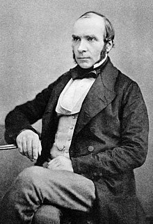
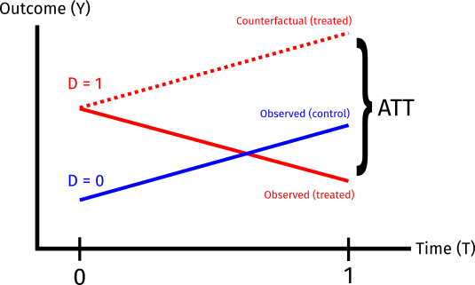
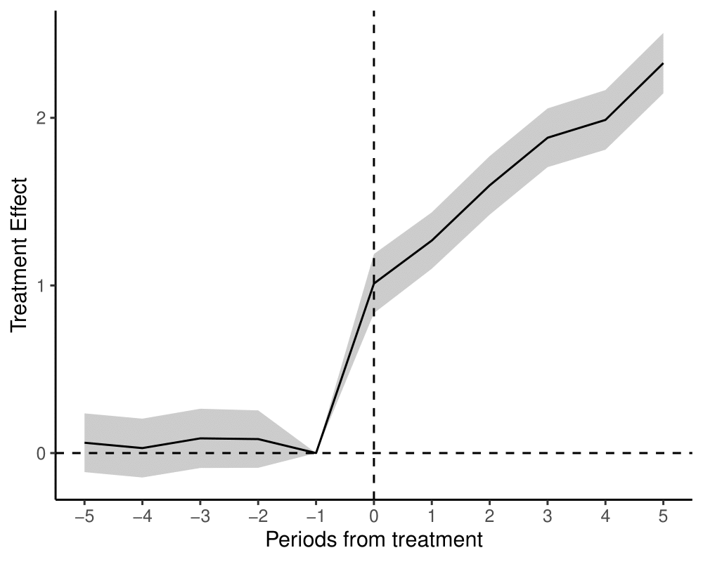
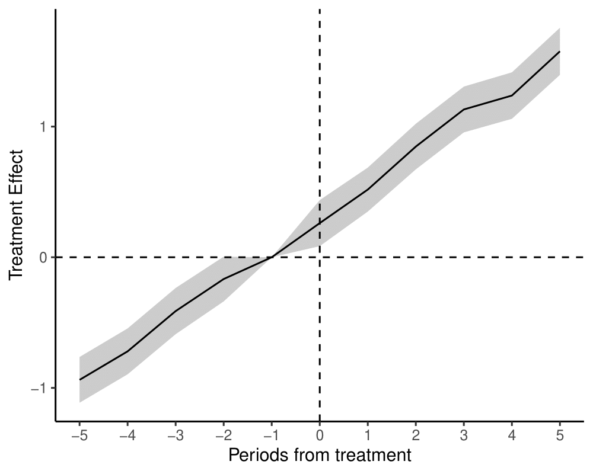
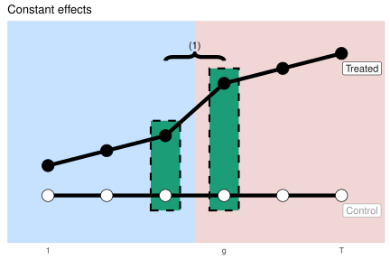
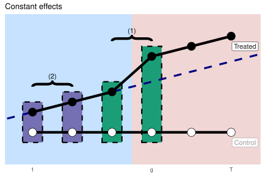

$$
  \require{cancel}
$$

```{r}
#| echo: false
#| warning: false
#| message: false
library(tidyverse)
library(haven)
library(estimatr)
library(ivmodel)
library(panelView)
library(fixest)
options(digits=3)
```

## Last week

::: {.incremental}

- Identification under **unobserved confounding**
- **Instrumental variables** - we can identify the local average treatment effect (LATE) with an instrument that...
  - ...is ignorable/conditionally ignorable...
  - ...and affects the outcome only through the treatment (exclusion restriction)...
  - ...and has a monotonic effect on treatment.
- Our simple IV estimator:
  - **Reduced form** (instrument's effect on outcome) in the numerator
  - **First stage** (instrument's effect on the treatment) in the denominator

:::

## This week

::: {.incremental}

- More strategies for identification under **unobserved confounding**
- When we have repeated observations over time, can we use pre-treatment outcomes to help with inference?
  - **Time 1:** Some units treated, some units under control
  - **Time 0:** All units under control

- What if the confounding in time 1 were unobserved...
  - ... but the amount of confounding in time 1 is the same as in time 0?

- Then we can use the pre-treatment (time 0) difference in the treated and control arms to **de-bias** the time 1 difference.
  - **Difference-in-differences**

- Assumptions: **no anticipation** and **parallel trends**
  - Pre-treatment outcomes are unaffected by treatment exposure.
  - The *trend* in the average potential outcome in the treated group would have been the same as the *trend* in the control group absent treatment.

- Generalizes to any setting where we believe there is confounding but where the true effect of treatment is known to be 0
  - "Negative Outcome Control"

:::


## Difference-in-differences {.centered}

## John Snow and Cholera

{fig-align="center" height="600px"}


## John Snow and Cholera

:::{.incremental}

- 1854: Large cholera outbreak near Broad Street in London.
  - Physician John Snow hypothesized that cholera was transmitted through the water
  - Contrary to popular belief that it was airborne ("miasma theory")
- Snow convinced the local authorities to remove the handle of the Broad Street pump
  - Cholera deaths declined
  - But was this causal?
- Even Snow didn't necessarily think so...

  > There is no doubt that the mortality was much diminished, as I said before, by the flight of the population, which commenced soon after the outbreak; but the attacks had so far diminished before the use of the water was stopped, that it is impossible to decide whether the well still contained the cholera poison in an active state, or whether, from some cause, the water had become free from it. (Snow, "On the Mode of Communication of Cholera, 1855)

:::

## John Snow and Cholera

:::{.incremental}

- The more interesting John Snow story was not the Broad Street pump, but another 1856 paper titled "Cholera and the water supply in the south districts of London in 1854"
- **Key insight**: South London was served by two major water companies: **Lambeth Company** and **Southwark and Vauxhall Company**.
  - Lambeth switched to a less contaminated source between 1849 and 1853

  > Between the epidemics of 1849 and that of 1853, one of the water companies supplying the south districts of London changed its source of supply from the middle of the town, near the foot of the Hungerford Suspension Bridge, to Thames Ditton, at a part of the river which is beyond the influence of the tide, and, therefore, out of reach of the sewage of the metropolis. (Snow, 1856)
  
:::

## John Snow and Cholera

{fig-align="center" height="600px"}

## John Snow and Cholera

:::{.incremental}

- Snow compared Lambeth (treated) districts with Southwark and Vauxhall (control) districts -- **less mortality in Lambeth**.

  > ...Taking into account the population supplied respectively by each company, the mortality was, at this period of the epidemic, nearly eight times as great in that supplied by the Southwark and Vauxhall Company as in that supplied by the Lambeth Company. (Snow, 1856)

- But this isn't enough - what if Lambeth districts differed in **unobserved ways** from Southwark and Vauxhall districts?

- So Snow also compared the observed mortality in 1853 to mortality in 1849, when **both** districts used contaminated water.

  > In the autumn of 1853 it was shown by Dr. Farr* that the districts partly supplied by this, the Lambeth Water Company, with improved water, suffered less than the districts supplied entirely by the Southwark and Vauxhall Company with the water from the river at Battersea Fields, although in 1849 they had suffered rather more than the latter districts (Snow, 1856).

:::

## John Snow and Cholera

:::{.incremental}

- This was one of the earliest "difference-in-differences" designs (see also Semmelweiss' work on antisepsis in 1861).
  - Not just a before-after comparison
  - Not just a cross-sectional comparison
- **Implicit assumption**: If there were something different about Lambeth (aside from the treatment) it would have the same effect on the outcome in the pre-treatment (1849) period as it would in 1853.
  - An assumption **on the counterfactuals**: Had treatment not changed in Lambeth, the average trend (from 1849 to 1853) in Lambeth would have been the same as the trend in Southwark and Vauxhall

:::

## DiD with two periods

:::{.incremental}

- Two groups (treated/control); two time periods (0, 1).
  - $D_i = 1$: treated in time $1$, $D_i = 0$ control in time $1$
  - All units under control in time $0$
  
- Two outcomes observed
  - $Y_{i1}$: outcome in period $1$
  - $Y_{i0}$ outcome in period $0$
  
- Potential outcomes + consistency assumption.

  $$Y_{i1}(d) = Y_{i1} \text{ if } D_i = d$$
  
  $$Y_{i0}(d) = Y_{i0} \text{ if } D_i = d$$
:::

## Causal Estimand

:::{.incremental}

- Causal estimand: **Average Treatment Effect on the Treated** (ATT) in time $1$

  $$\tau_{\text{ATT}} = E[Y_{i1}(1) | D_i = 1] - E[Y_{i1}(0) | D_i = 1]$$

- The first part we can get directly from the data (observed outcome among the treated group)

  $$\tau_{\text{ATT}} = E[Y_{i1} | D_i = 1] - E[Y_{i1}(0) | D_i = 1]$$
  
- Second part we don't observe directly and need some additional assumptions.
  - But now we **won't** assume ignorability of treatment: $Y_{i1}(0) \cancel{{\perp \! \! \! \perp}} D_i$

:::

## Identifying assumptions

:::{.incremental}

- **No anticipation**

  - The **pre-treatment** outcome is unaffected by receipt of treatment.
    
    $$Y_{i0}(1) = Y_{i0}(0) = Y_{i0}$$
- **Parallel trends**

  - In the absence of treatment, the treated group's average outcome **trend** would be the same as the control group's
  
    $$\underbrace{\left\{E[Y_{i1}(0) | D_i = 1] - E[Y_{i0}(0) | D_i = 1] \right\}}_{\text{Average counterfactual trend among treated}} = \underbrace{\left\{E[Y_{i1}(0)| D_i = 0] - E[Y_{i0}(0)| D_i = 0]\right\}}_{\text{Average trend among controls}}$$
    
  - Equivalently

    $$\underbrace{\left\{E[Y_{i1}(0) | D_i = 1] - E[Y_{i1}(0)| D_i = 0]\right\}}_{\text{Selection bias at time 1}} = \underbrace{\left\{E[Y_{i0}(0) | D_i = 1] - E[Y_{i0}(0)| D_i = 0]\right\}}_{\text{Selection bias at time 0}}$$
    
:::

## Identification

:::{.incremental}

- Remember the selection bias formula for the ATT:

  $$\tau_{\text{ATT}} = \underbrace{\left\{E[Y_{i1} | D_i = 1] - E[Y_{i1} | D_i = 0]\right\}}_{\text{Difference-in-means in time 1}} - \underbrace{\left\{E[Y_{i1}(0) | D_i = 1] - E[Y_{i1}(0)| D_i = 0]\right\}}_{\text{Selection bias}}$$
- We can observe $E[Y_{i1}(0)| D_i = 0]$, but can't observe $E[Y_{i1}(0)| D_i = 1]$

- Under **parallel trends** :

  $$\underbrace{\left\{E[Y_{i1}(0) | D_i = 1] - E[Y_{i1}(0)| D_i = 0]\right\}}_{\text{Selection bias}} = \underbrace{\left\{E[Y_{i0}(0) | D_i = 1] - E[Y_{i0}(0)| D_i = 0]\right\}}_{\text{Selection bias at time 0}}$$
  
- And under **no anticipation**:

  $$\underbrace{\left\{E[Y_{i1}(0) | D_i = 1] - E[Y_{i1}(0)| D_i = 0]\right\}}_{\text{Selection bias}} = \underbrace{\left\{E[Y_{i0} | D_i = 1] - E[Y_{i0}| D_i = 0]\right\}}_{\text{Observed difference at time 0}}$$
    
:::

## Parallel trends

:::{.incremental}

- Substituting back in yields an expression for the ATT in terms of the **difference** in **observed differences**

  $$\tau_{\text{ATT}} = \underbrace{\left\{E[Y_{i1} | D_i = 1] - E[Y_{i1} | D_i = 0]\right\}}_{\text{Difference-in-means in time 1}} - \underbrace{\left\{E[Y_{i0} | D_i = 1] - E[Y_{i0} | D_i = 0]\right\}}_{\text{Difference-in-means at time 0}}$$
- Or equivalently

  $$\tau_{\text{ATT}} = \underbrace{\left\{E[Y_{i1} - Y_{i0} | D_i = 1]\right\}}_{\text{Average change in the treated group}} - \underbrace{\left\{E[Y_{i1} - Y_{i0} | D_i = 0]\right\}}_{\text{Average change in the control group}}$$
  
- We can estimate each of these four expectations with the sample means.

:::

## Difference-in-differences

{fig-align="center" height="500px"}

## Estimation


:::{.incremental}

- With repeated observations at the unit level, we can use a simple regression of the **differenced** outcomes on the treatment indicator

  $$Y_{i1} - Y_{i0} = \alpha + \tau D_i + \epsilon_i$$

- Each row in the data is a single *unit* with outcomes in two time periods.
  - Straightforward asymptotic inference with Neyman SEs
  
- **Prefer this approach when possible**
  - Equivalent to a (mean) ignorability assumption w.r.t. the **difference** in outcomes from time 0 to time 1
  - Easier to work with for **conditional parallel trends** (e.g. adjust for time-invariant covariates w/ AIPW) **(Sant'anna and Zhao, 2020)**

:::

## Two-way fixed effects

:::{.incremental}

- Suppose our dataset is organized where each row is a unit/time period - $it$.
  - Let $D_{it}$ denote whether a unit is **treated** at time $t$
- We can recover our 2x2 DiD estimator (in the simple two unit, two period setting) using a "two-way" fixed effects regression
  - Unique parameter for each *unit* or *treatment timing group* 
  - Unique parameter for each *time period*

- Commonly written as:

  $$Y_{it} = \alpha_i + \delta_{t} + \tau D_{it} + \epsilon_{it}$$

- Equivalently (with timing group FEs instead of unit FEs)

  $$Y_{it} = \alpha + \beta D_i + \delta_{t} + \tau D_{it} + \epsilon_{it}$$

:::

## Two-way fixed effects

:::{.incremental}

- **Expectations**:
  - $E[Y_{i0} | D_i = 0] = \alpha + \delta_0$
  - $E[Y_{i1} | D_i = 0] = \alpha + \delta_1$
  - $E[Y_{i0} | D_i = 1] = \alpha + \beta  + \delta_0$
  - $E[Y_{i1} | D_i = 1] = \alpha + \beta + \delta_1 + \tau$
- **Differences**
  - $E[Y_{i1} | D_i = 1] - E[Y_{i0} | D_i = 1] = \delta_1 - \delta_0 + \tau$
  - $E[Y_{i1} | D_i = 0] - E[Y_{i0} | D_i = 0] = \delta_1 - \delta_0$
- **Difference-in-differences**
  - $\{E[Y_{i1} | D_i = 1] - E[Y_{i0} | D_i = 1]\} - \{E[Y_{i1} | D_i = 0] - E[Y_{i0} | D_i = 0]\} = \tau$
  
:::

## Two-way fixed effects

:::{.incremental}

- Does **not** generalize neatly to many time periods w/ variation in treatment timing.
  - Need to **also** assume a constant, instantaneous treatment effect $\tau$
  - We'll spend a lot more time on this next week!

- Need to account for dependence in observations between time periods w/in same unit
  - "Cluster-robust" SEs or block bootstrap
  - We'll discuss this more later!

:::

## Example: Card and Krueger (1994, AER)

:::{.incremental}

- Does increasing the minimum wage reduce employment?
  - Classical theoretical models suggest yes...
  - But empirical evidence is hard to come by - no one has (yet) randomized the minimum wage.
- Card and Krueger use a policy change in New Jersey relative to Pennsylvania
- In 1992, NJ raised its minimum wage from 4.25 dollars per hour to 5.05 per hour
  - PA stayed at 4.25 dollars per hour
- Surveyed 410 fast food restaurants before and after the change was put into place
  - Compared change in employment before/after in NJ with change before/after in PA.
- **Key assumption** - Had NJ not implemented the minimum wage increase, the average trend in NJ fast food restaurant employment would have been the same as the average trend in PA fast food restaurant employment

:::

## Example: Card and Krueger (1994, AER)

```{r}
#| echo: true
#| warning: false
#| message: false
# Load the data for Card and Krueger (1994)
minwage <- read_csv("assets/data/minwage.csv")
# Index of observations
minwage$unit <- 1:nrow(minwage)

# Change in full-time employment
minwage$CHG_EMPFT <- minwage$EMPFT2 - minwage$EMPFT

# Regress change on treatment (STATE = 1 for NJ)
diff <- lm_robust(CHG_EMPFT ~ STATE, data=minwage, se_type = "HC2")
tidy(diff)
```

## Example: Card and Krueger (1994, AER)

```{r}
#| echo: true
#| warning: false
#| message: false
# Equivalence of TWFE in 2x2 case
minwage_long <- minwage %>% pivot_longer(cols = starts_with("EMPFT"),
                names_to = "time_str", names_prefix = "EMPFT", values_to = "EMPFT")

# Recode time variable
minwage_long$time <- NA
minwage_long$time[minwage_long$time_str == ""] <- 0
minwage_long$time[minwage_long$time_str == "2"] <- 1

# Make the treatment variable
minwage_long$treat <- as.integer(minwage_long$STATE == 1&minwage_long$time==1)

# TWFE
twfe_reg <- lm_robust(EMPFT ~ treat + as.factor(time) + as.factor(unit),
                      data=minwage_long, cluster=unit, se_type = "CR2")
tidy(twfe_reg) %>% filter(term == "treat")
```

## Example: Card and Krueger (1994, AER)

```{r}
#| echo: false
#| warning: false
#| message: false
#| fig-align: center
#| fig-width: 8
#| fig-height: 5

# Compute group means for the 2x2
means <- minwage_long %>%
  group_by(STATE, time) %>%
  summarize(mean_empft = mean(EMPFT, na.rm = TRUE), .groups = "drop") %>%
  mutate(group = ifelse(STATE == 1, "NJ (Treated)", "PA (Control)"),
         period = ifelse(time == 0, "Before", "After"))

# Extract the four cell means
nj_before <- means$mean_empft[means$STATE == 1 & means$time == 0]
nj_after  <- means$mean_empft[means$STATE == 1 & means$time == 1]
pa_before <- means$mean_empft[means$STATE == 0 & means$time == 0]
pa_after  <- means$mean_empft[means$STATE == 0 & means$time == 1]

# Imputed counterfactual: NJ(before) + (PA(after) - PA(before))
nj_cf <- nj_before + (pa_after - pa_before)

# Build plot data
plot_df <- data.frame(
  time = c(0, 1, 0, 1, 0, 1),
  mean_empft = c(nj_before, nj_after, pa_before, pa_after, nj_before, nj_cf),
  group = c("NJ (Treated)", "NJ (Treated)", "PA (Control)", "PA (Control)",
            "Counterfactual", "Counterfactual")
)

ggplot(plot_df, aes(x = time, y = mean_empft, color = group)) +
  geom_point(size = 3) +
  geom_line(aes(linetype = group), linewidth = 1) +
  scale_color_manual(values = c("NJ (Treated)" = "indianred",
                                "PA (Control)" = "dodgerblue",
                                "Counterfactual" = "purple")) +
  scale_linetype_manual(values = c("NJ (Treated)" = "solid",
                                   "PA (Control)" = "solid",
                                   "Counterfactual" = "dashed")) +
  scale_x_continuous(breaks = c(0, 1), labels = c("Before", "After")) +
  labs(x = "Period", y = "Mean FT Employment",
       title = "Difference-in-Differences: Card and Krueger (1994)",
       color = NULL, linetype = NULL) +
  annotate("segment", x = 1.05, xend = 1.05, y = nj_cf, yend = nj_after,
           arrow = arrow(ends = "both", length = unit(0.1, "inches")),
           color = "black") +
  annotate("text", x = 1.12, y = (nj_cf + nj_after) / 2,
           label = paste0("DiD"),
           hjust = 0, size = 4) +
  theme_minimal(base_size = 14) +
  theme(legend.position = "bottom")
```

## Conditional parallel trends

:::{.incremental}

- What if parallel trends holds only conditional on a set of pre-treatment covariates

  $$\underbrace{\left\{E[Y_{i1}(0) - Y_{i0} | D_i = 1, X_i = x] \right\}}_{\text{Average counterfactual trend among treated}} = \underbrace{\left\{E[Y_{i1} - Y_{i0}| D_i = 0, X_i = x]\right\}}_{\text{Average trend among controls}}$$

- We can include the covariates in the regression or TWFE
  - But beware of unit-constant covariates in TWFE - they get soaked up by the unit fixed effects
  - And be careful with **time-varying** covariates - we don't want to control for **consequences** of treatment.


:::


## Conditional parallel trends

:::{.incremental}

- Can we adjust without strong assumptions on the outcome model? 
  - **Abadie (2005)** shows that an IPTW estimator can identify the ATT under conditional parallel trends
  - **Intuition**: Treated units get a constant weight. Control units are reweighted to match the covariate distribution among the treateds.

    $$E[Y_{i1}(1) - Y_{i1}(0)| D_i = 1] = E\left[\frac{(Y_{i1} - Y_{i0})}{P(D_i = 1)} \times \frac{D_i - P(D_i = 1 | X_i)}{1 - P(D_i = 1 | X_i)}\right]$$
  
  - **Sant'anna and Zhao (2020)** extend this to an AIPW/doubly-robust estimator with an outcome model for $Y_{i1} - Y_{i0}$

:::

## Example: Card and Krueger (1994, AER)

- Suppose we thought that parallel trends in Card and Krueger (1994) only held conditional on the type of fast food restaurant

```{r}
#| echo: true
#| warning: false
#| message: false
# 1=Burger King; 2=KFC; 3=Roy Rogers; 4=Wendy's
minwage %>% group_by(STATE) %>% summarize(mean(CHAIN == 1), mean(CHAIN==2), mean(CHAIN == 3), mean(CHAIN ==4))

# Fit a propensity score model
weight_model <- glm(STATE ~ as.factor(CHAIN), data=minwage, family=binomial(link="logit"))

# Predict weights
minwage$e <- predict(weight_model, type="response")
minwage$did_wt <- (1/mean(minwage$STATE)) * ((minwage$STATE -minwage$e)/(1-minwage$e))
```

## Example: Card and Krueger (1994, AER)

```{r}
#| echo: true
#| warning: false
#| message: false
# Point estimate
mean(minwage$CHG_EMPFT*minwage$did_wt)

# Slight fix of the weights to make this work in OLS
minwage$did_wt_reg <- minwage$did_wt*minwage$STATE - minwage$did_wt*(1-minwage$STATE)
lm_robust(CHG_EMPFT ~ STATE, data=minwage, weight=did_wt_reg)
```

## Example: Card and Krueger (1994, AER)

```{r}
#| echo: true
#| warning: false
#| message: false
# Bootstrap
set.seed(60637)
niter <- 1000
boot_est <- rep(NA, niter)
for(i in 1:niter){
  boot_minwage <- minwage[sample(1:nrow(minwage), nrow(minwage), replace=T),]
  # Fit a propensity score model
  weight_model_boot <- glm(STATE ~ as.factor(CHAIN), data=boot_minwage, family=binomial(link="logit"))

  # Predict weights
  boot_minwage$e <- predict(weight_model_boot, type="response")
  boot_minwage$did_wt <- (1/mean(boot_minwage$STATE)) * ((boot_minwage$STATE - boot_minwage$e)/(1-boot_minwage$e))

  # Point est
  boot_est[i] <- mean(boot_minwage$CHG_EMPFT*boot_minwage$did_wt)
}
#Bootstrap 95% CI
quantile(boot_est, c(.025, .975))
```

## Example: Card and Krueger (1994, AER)

- **Sant'anna and Zhao (2020)** doubly-robust estimator

```{r}
#| echo: true
#| warning: false
#| message: false
# This package requires using the *long* data
library(DRDID) 
# Notably this doesn't add much with the fully saturated propensity score model - we're really just stratifying by chain
dr_minwage <- drdid(yname="EMPFT",
                    tname="time",
                    idname="unit",
                    dname="STATE",
                    xformla = ~as.factor(CHAIN),
                    data=minwage_long,
                    estMethod = "trad")
summary(dr_minwage)

```

## Example: Card and Krueger (1994, AER)

```{r}
#| echo: false
#| warning: false
#| message: false
#| fig-align: center
#| fig-width: 10
#| fig-height: 6

# Label chains
chain_labels <- c("1" = "Burger King", "2" = "KFC", "3" = "Roy Rogers", "4" = "Wendy's")
minwage_long$chain_label <- chain_labels[as.character(minwage_long$CHAIN)]

# Compute group means by chain
means_chain <- minwage_long %>%
  group_by(chain_label, STATE, time) %>%
  summarize(mean_empft = mean(EMPFT, na.rm = TRUE), .groups = "drop")

# Compute counterfactual by chain
cf_chain <- means_chain %>%
  pivot_wider(names_from = c(STATE, time), values_from = mean_empft,
              names_sep = "_") %>%
  mutate(nj_cf = `1_0` + (`0_1` - `0_0`)) %>%
  select(chain_label, nj_cf)

# Build plot data by chain
plot_chain <- means_chain %>%
  mutate(group = ifelse(STATE == 1, "NJ (Treated)", "PA (Control)")) %>%
  bind_rows(
    cf_chain %>%
      crossing(time = c(0, 1)) %>%
      left_join(means_chain %>% filter(STATE == 1, time == 0) %>%
                  select(chain_label, mean_empft), by = "chain_label") %>%
      mutate(mean_empft = ifelse(time == 0, mean_empft, nj_cf),
             group = "Counterfactual", STATE = NA) %>%
      select(chain_label, STATE, time, mean_empft, group)
  )

# Annotation data for DiD arrows
annot_chain <- cf_chain %>%
  left_join(means_chain %>% filter(STATE == 1, time == 1) %>%
              select(chain_label, nj_after = mean_empft), by = "chain_label") %>%
  mutate(did = round(nj_after - nj_cf, 2))

ggplot(plot_chain, aes(x = time, y = mean_empft, color = group)) +
  geom_point(size = 2.5) +
  geom_line(aes(linetype = group), linewidth = 0.9) +
  scale_color_manual(values = c("NJ (Treated)" = "indianred",
                                "PA (Control)" = "dodgerblue",
                                "Counterfactual" = "purple")) +
  scale_linetype_manual(values = c("NJ (Treated)" = "solid",
                                   "PA (Control)" = "solid",
                                   "Counterfactual" = "dashed")) +
  scale_x_continuous(breaks = c(0, 1), labels = c("Before", "After")) +
  geom_segment(data = annot_chain, aes(x = 1.05, xend = 1.05, y = nj_cf, yend = nj_after),
               arrow = arrow(ends = "both", length = unit(0.08, "inches")),
               color = "black", inherit.aes = FALSE) +
  geom_text(data = annot_chain, aes(x = 1.1, y = (nj_cf + nj_after) / 2,
            label = paste0("DiD")),
            hjust = 0, size = 3, color = "black", inherit.aes = FALSE) +
  facet_wrap(~chain_label, scales = "free_y") +
  labs(x = "Period", y = "Mean FT Employment",
       title = "DiD by Restaurant Chain: Card and Krueger (1994)",
       color = NULL, linetype = NULL) +
  theme_minimal(base_size = 13) +
  theme(legend.position = "bottom")
```

## Difference-in-differences with many time periods {.centered}

```{r, echo = F, include=F, message=F}
## Generates a simple dynamic treatment effects plot using ggplot
## Input:
## frame: tidy() applied to a fixest object
## baselines: A vector of time periods omitted from the regression
##  that should be plotted with "zero" treatment effect
## prefix: string prefix to remove from "term"
## alpha: 1 - CI coverage
## Output:
## A ggplot object
dynamic_plot <- function(frame, baselines, prefix, alpha = .05, split = NULL, vis_alpha = .2){
  # Generate leads/lags
  if (is.null(split)){
    frame <- frame %>% mutate(period = as.numeric(str_remove(term, prefix)))
  }else{
    frame <- frame %>% mutate(period = as.numeric(str_split_i(str_remove(term, prefix), split, 1)))
  }
  frame$colfill <- "black"
  # Append prefixes
  frame <- bind_rows(frame, data.frame(estimate = rep(0, length(baselines)), 
                                       std.error = rep(0, length(baselines)),
                                       period = baselines,
                                       colfill = rep("grey", length(baselines))))
  # Generate CIs
  frame <- frame %>% mutate(lower_CI = estimate - abs(qnorm(alpha/2))*std.error,
                            upper_CI = estimate + abs(qnorm(alpha/2))*std.error)
  
  # Figure out midpoint between first pre-treatment and first post-treatment period
  vertical_line = max(frame$period[frame$period < 0])/2
  
  # Make coefficient plot
  out_plot <- frame %>% ggplot(aes(x=period, y=estimate, ymin=lower_CI, ymax=upper_CI, colour = colfill)) +    
  annotate("rect", xmin = vertical_line, xmax = Inf, ymin = -Inf, ymax = Inf,   # Shade area post-treatment
            alpha = vis_alpha,
            fill = "indianred") +
 annotate("rect", xmin = -Inf, xmax = vertical_line, ymin = -Inf, ymax = Inf, # Shade area pre-treatment
            alpha = vis_alpha,
            fill = "dodgerblue") +
    geom_hline(yintercept = 0, lty=2, col="darkgrey") +
    geom_vline(xintercept = vertical_line, lty=3, col="black") +
    geom_pointrange(size=.35) + scale_colour_manual(values = c("black", "grey50"), guide="none") +
    scale_x_continuous(breaks = frame$period) +
    theme_minimal() + 
    theme(panel.grid.major = element_blank(), panel.grid.minor = element_blank(), )

  return(out_plot)
}
```

```{r}
## Generates a simple static treatment effects plot using ggplot
## Input:
## frame: tidy() applied to a fixest object
## baselines: A vector of time periods omitted from the regression
##  that should be plotted with "zero" treatment effect
## prefix: string prefix to remove from "term"
## alpha: 1 - CI coverage
## Output:
## A ggplot object
static_plot <- function(frame,  alpha = .05, split = NULL, vis_alpha = .2){
  frame$colfill <- "black"
  frame$period <- frame$term
  # Generate CIs
  frame <- frame %>% mutate(lower_CI = estimate - abs(qnorm(alpha/2))*std.error,
                            upper_CI = estimate + abs(qnorm(alpha/2))*std.error)
  
  # Make coefficient plot
  out_plot <- frame %>% ggplot(aes(x=period, y=estimate, ymin=lower_CI, ymax=upper_CI, colour = colfill)) +   
    geom_hline(yintercept = 0, lty=2, col="darkgrey") +
    geom_pointrange(size=.35) + scale_colour_manual(values = c("black"), guide="none") +
    scale_x_discrete(labels=c("")) +
    theme_minimal() + 
    theme(panel.grid.major = element_blank(), panel.grid.minor = element_blank())

  return(out_plot)
}
```

## Classic 2x2 DiD

::: {.incremental}

- Difference-in-differences estimators can be understood in terms of their component 2 $\times$ 2 comparisons
  - ...between two **treatment timing groups** $g$ and $g^\prime$
  - ...and between two **time periods** $t$ and $t^\prime$
  
    $$\underbrace{\bigg[\bar{Y}_{g,t} - \bar{Y}_{g^\prime, t} \bigg]}_{\text{cross-sectional difference at time } t} - \underbrace{\bigg[\bar{Y}_{g,t^\prime} - \bar{Y}_{g^\prime, t^\prime} \bigg]}_{\text{cross-sectional difference at time } t^\prime}$$

- In the classic 2x2 case, we have...
  - time period $t$ as the period where treatment is assigned to some units and $t^\prime$ as the "pre-treatment" period.
  - timing group $g$ as the group that receives **treatment** ($D_i = 1$) and timing group $g^\prime$ as the units that are always under **control** ($D_i = 0$)

:::

## Classic 2x2 DiD


```{tikz}
#| echo: false
#| fig-align: center
#| fig-ext: svg
#| fig-cap: "DiD with 2 periods, 2 groups"
\usetikzlibrary{shapes}
\usetikzlibrary{positioning}
\usetikzlibrary{arrows}
\usetikzlibrary{shapes.misc}
\usetikzlibrary{shapes.symbols}
\usetikzlibrary{shadows}
\usetikzlibrary{fit}
\begin{tikzpicture}[scale=.4]
\draw (-6, 6) node (l0) {Unit};
\draw (-6, 4) node (l1) {$1$};
\draw (-6, 2) node (l2) {$2$};

\draw (-3, 7.5) node (t0) {Time};
\draw (-4, 6) node (t1) {$1$};
\draw (-2, 6) node (t2) {$2$};

\draw (-5, 7) -- (-5, 1);
\draw (-7, 5) -- (-1, 5);

\draw (-4, 4) node (a1t1) {$0$};
\draw (-2, 4) node (a1t2) {$1$};

\draw (-4, 2) node (a2t1) {$0$};
\draw (-2, 2) node (a2t2) {$0$};

\node[draw=black, fit=(a1t1)  (a1t2), inner sep=.2ex, line width = 1.5, dashed] (cohort1) {};

\end{tikzpicture}
 
```

## Many time periods, two timing groups

::: {.incremental}

- Suppose that instead of having two time periods, we now have $T$ treatment periods.
  - We'll now characterize our treatment groups based on *when* they start treatment.
  - Let $G_i$ denote the **time period** when unit $i$ initiates treatment
- We'll stick with the **two timing group** case for now
  - **Treated** units start treatment at some time $g^*: 1 < g^* \le T$
  - **Control** units start treatment at time after $T$ (we'll use $\infty$)
- Define potential outcomes in terms of assignment to a **timing group**
  - $Y_{it}(g) = Y_{it}$ for units with $G_i = g$
  - We'll denote $Y_{it}(\infty)$ as the "control" potential outcome

:::


## Many time periods, two timing groups

::: {.incremental}

- **Estimand**: The **group-time** average treatment effect on the treated
  - What **would have happened** on average at time $t$ had a unit that started treatment at time $g$ instead **never** started treatment.
  
    $$\text{ATT}_{g}(t) = \mathbb{E}[Y_{it}(g) - Y_{it}(\infty) | G_i = g]$$
  
- Other target estimands are **averages** of the group-time ATTs
  - e.g. the average of all post-treatment group-time ATTs

:::


## DiD with no staggered adoption


```{tikz}
#| echo: false
#| fig-align: center
#| fig-ext: svg
#| fig-cap: "DiD with 4 periods, 2 groups"
\usetikzlibrary{shapes}
\usetikzlibrary{positioning}
\usetikzlibrary{arrows}
\usetikzlibrary{shapes.misc}
\usetikzlibrary{shapes.symbols}
\usetikzlibrary{shadows}
\usetikzlibrary{fit}
\begin{tikzpicture}[scale=.4]
\draw (-6, 6) node (l0) {Unit};
\draw (-6, 4) node (l1) {$3$};
\draw (-6, 2) node (l2) {$\infty$};

\draw (-1, 7.5) node (t0) {Time};
\draw (-4, 6) node (t1) {$1$};
\draw (-2, 6) node (t2) {$2$};
\draw (0, 6) node (t3) {$3$};
\draw (2, 6) node (t4) {$4$};

\draw (-5, 7) -- (-5, 1);
\draw (-7, 5) -- (3, 5);

\draw (-4, 4) node (a1t1) {$0$};
\draw (-2, 4) node (a1t2) {$0$};
\draw (0, 4) node (a1t3) {$1$};
\draw (2, 4) node (a1t4) {$1$};

\draw (-4, 2) node (a2t1) {$0$};
\draw (-2, 2) node (a2t2) {$0$};
\draw (0, 2) node (a2t3) {$0$};
\draw (2, 2) node (a2t4) {$0$};

\node[draw=black, fit=(a1t1)  (a1t2) (a1t3) (a1t4), inner sep=.2ex, line width = 1.5, dashed] (cohort1) {};

\end{tikzpicture}

```


## DiD with no staggered adoption


```{tikz}
#| echo: false
#| fig-align: center
#| fig-ext: svg
#| fig-cap: "DiD with 4 periods, 2 groups - relative treatment time"
\usetikzlibrary{shapes}
\usetikzlibrary{positioning}
\usetikzlibrary{arrows}
\usetikzlibrary{shapes.misc}
\usetikzlibrary{shapes.symbols}
\usetikzlibrary{shadows}
\usetikzlibrary{fit}
\begin{tikzpicture}[scale=.4]
\draw (-6, 6) node (l0) {Unit};
\draw (-6, 4) node (l1) {$3$};
\draw (-6, 2) node (l2) {$\infty$};

\draw (-1, 7.5) node (t0) {Relative Time};
\draw (-4, 6) node (t1) {$-2$};
\draw (-2, 6) node (t2) {$-1$};
\draw (0, 6) node (t3) {$0$};
\draw (2, 6) node (t4) {$1$};

\draw (-5, 7) -- (-5, 1);
\draw (-7, 5) -- (3, 5);

\draw (-4, 4) node (a1t1) {$0$};
\draw (-2, 4) node (a1t2) {$0$};
\draw (0, 4) node (a1t3) {$1$};
\draw (2, 4) node (a1t4) {$1$};

\draw (-4, 2) node (a2t1) {$0$};
\draw (-2, 2) node (a2t2) {$0$};
\draw (0, 2) node (a2t3) {$0$};
\draw (2, 2) node (a2t4) {$0$};

\node[draw=black, fit=(a1t1)  (a1t2) (a1t3) (a1t4), inner sep=.2ex, line width = 1.5, dashed] (cohort1) {};

\end{tikzpicture}

```

## Identifying assumptions

:::{.incremental}

- **No anticipation**: Pre-treatment outcomes are unaffected by **future** treatment status.

  $$Y_{it}(g) = Y_{it}(\infty) \ \forall\  t < g$$

- **(General) Parallel trends**: For any two time periods $t$ and $t^\prime$ and two timing groups $g$ and $g^\prime$

  $$E[Y_{it}(\infty) - Y_{it'}(\infty) | G_i = g] = E[Y_{it}(\infty) - Y_{it'}(\infty) | G_i = g^\prime ]$$
  
- Generalizes our prior assumptions to **all** time periods and across **all** treatment timing groups

:::

## Two-way fixed effects estimators

::: {.incremental}

- In the case with two treatment timing groups and many time periods, we have two natural quantities of interest
  - The $ATT_{g^*}(t)$ for each time period $t \ge g^*$
  - The **average** of all post-treatment group-time ATTs $ATT_{g^*} = \frac{1}{T - g^* + 1}\sum_{t = g^*}^T ATT_{g^*}(t)$

- There are two common ways to estimate these effects with **two-way fixed effects** (TWFE) regressions

- The **Static** TWFE
  
  $$Y_{it} = \alpha_i + \delta_{t} + \tau D_{it} + \epsilon_{it}$$

  where $D_{it}$ is an indicator for whether unit $i$ is under treatment at time $t$
  
- In the two timing-group case we're looking at here, $D_{it} = \mathbf{1}(G_i = g^*) \times \mathbf{1}(t \ge g^*)$
  
:::

## Two-way fixed effects estimators

::: {.incremental}

- The **Dynamic** TWFE

  $$Y_{it} = \alpha_i + \delta_{t} + \sum_{l \neq -1} \tau_l D^{(l)}_{it} + \epsilon_{it}$$
  
  where $D_{it}^{(l)}$ is a dummy indicator for observation $i$ being $l$ periods from treatment initiation at time $t$
  
- In the two timing-group case, this regression looks like:

  $$Y_{it} = \alpha_i + \delta_{t} + \sum_{\substack{l = -(g^* - 1) \\ l \neq -1}}^{T - g^*} \tau_l \times \mathbf{1}(G_i = g^*)\times\mathbf{1}(t = g^* + l) + \epsilon_{it}$$
  
- Note that we need to omit **at least** one relative treatment time indicator!
  - Otherwise we have **perfect collinearity** with the TWFE

:::

## Identification

::: {.incremental}

- Do these regressions identify the target parameters we're looking for in the **two timing group** case.

- **Static** TWFE: Yes
  - $\hat{\tau}$ is an average over the 2x2 diff-in-diffs between each post-treatment and each pre-treatment period.
  - Equivalent to collapsing the data into a 2x2 DiD by averaging overall pre- and post- outcomes for treated/control
  - Identifies the average of post-treatment ATTs $ATT_{g^*}$

- **Dynamic** TWFE: Yes! 
  - $\hat{\tau_l}$ is the 2x2 DiD between relative treatment time $l$ and the held-out "baseline" period (period $-1$)
  - Each coefficient identifies $ATT_{g^*}(g^* + l)$

:::

## TWFE as an average over 2x2s


```{tikz}
#| echo: false
#| fig-align: center
#| fig-ext: svg
#| fig-cap: "Static TWFE 2x2s"
\usetikzlibrary{shapes}
\usetikzlibrary{positioning}
\usetikzlibrary{arrows}
\usetikzlibrary{shapes.misc}
\usetikzlibrary{shapes.symbols}
\usetikzlibrary{shadows}
\usetikzlibrary{fit}
\definecolor{diff1}{RGB}{230,159,0}
\definecolor{diff2}{RGB}{86,180,233}
\definecolor{diff3}{RGB}{0,158,115}
\definecolor{diff4}{RGB}{240,228,66}
\begin{tikzpicture}[scale=.4]
\draw (-6, 6) node (l0) {Unit};
\draw (-6, 4) node (l1) {$3$};
\draw (-6, 2) node (l2) {$\infty$};

\draw (-1, 7.5) node (t0) {Time};
\draw (-4, 6) node (t1) {$1$};
\draw (-2, 6) node (t2) {$2$};
\draw (0, 6) node (t3) {$3$};
\draw (2, 6) node (t4) {$4$};

\draw (-5, 7) -- (-5, 1);
\draw (-7, 5) -- (3, 5);

\draw (-4, 4) node (a1t1) {$0$};
\draw (-2, 4) node (a1t2) {$0$};
\draw (0, 4) node (a1t3) {$1$};
\draw (2, 4) node (a1t4) {$1$};

\draw (-4, 2) node (a2t1) {$0$};
\draw (-2, 2) node (a2t2) {$0$};
\draw (0, 2) node (a2t3) {$0$};
\draw (2, 2) node (a2t4) {$0$};

% Draw matched sets
\node[draw=diff1, fit= (a1t4) (a1t3), inner sep = .5ex, line width=1.5, dashed] (treat) {};
\node[draw=diff2, fit= (a2t4) (a2t3), inner sep = .5ex, line width=1.5, dashed] (firstdiff) {};
\node[draw=diff4, fit= (a1t1) (a1t2), inner sep = .5ex, line width=1.5, dashed] (seconddiff) {};
\node[draw=diff3, fit= (a2t1) (a2t2), inner sep = .5ex, line width=1.5, dashed] (thirddiff) {};

\end{tikzpicture}

```

## TWFE as an average over 2x2s


```{tikz}
#| echo: false
#| fig-align: center
#| fig-ext: svg
#| fig-cap: "Dynamic TWFE - relative time 1"
\usetikzlibrary{shapes}
\usetikzlibrary{positioning}
\usetikzlibrary{arrows}
\usetikzlibrary{shapes.misc}
\usetikzlibrary{shapes.symbols}
\usetikzlibrary{shadows}
\usetikzlibrary{fit}
\definecolor{diff1}{RGB}{230,159,0}
\definecolor{diff2}{RGB}{86,180,233}
\definecolor{diff3}{RGB}{0,158,115}
\definecolor{diff4}{RGB}{240,228,66}
\begin{tikzpicture}[scale=.4]
\draw (-6, 6) node (l0) {Unit};
\draw (-6, 4) node (l1) {$3$};
\draw (-6, 2) node (l2) {$\infty$};

\draw (-1, 7.5) node (t0) {Relative Time};
\draw (-4, 6) node (t1) {$-2$};
\draw (-2, 6) node (t2) {$-1$};
\draw (0, 6) node (t3) {$0$};
\draw (2, 6) node (t4) {$1$};

\draw (-5, 7) -- (-5, 1);
\draw (-7, 5) -- (3, 5);

\draw (-4, 4) node (a1t1) {$0$};
\draw (-2, 4) node (a1t2) {$0$};
\draw (0, 4) node (a1t3) {$1$};
\draw (2, 4) node (a1t4) {$1$};

\draw (-4, 2) node (a2t1) {$0$};
\draw (-2, 2) node (a2t2) {$0$};
\draw (0, 2) node (a2t3) {$0$};
\draw (2, 2) node (a2t4) {$0$};

% Draw matched sets
\node[draw=diff1, fit= (a1t4), inner sep = .5ex, line width=1.5, dashed] (treat) {};
\node[draw=diff2, fit= (a2t4), inner sep = .5ex, line width=1.5, dashed] (firstdiff) {};
\node[draw=diff4, fit=  (a1t2), inner sep = .5ex, line width=1.5, dashed] (seconddiff) {};
\node[draw=diff3, fit=  (a2t2), inner sep = .5ex, line width=1.5, dashed] (thirddiff) {};

\end{tikzpicture}

```

## Example: Ferwerda (2021)

::: {.incremental}

> Ferwerda, Jeremy. "Immigration, voting rights, and redistribution: Evidence from local governments in Europe." The Journal of Politics 83.1 (2021): 321-339. 

- Does **expanding voting rights** in municipal elections to **non-citizen foreign residents** increase **social expenditures**?
  - **Setting:** Swiss municipalities in the 2000s

- In Switzerland, voting rights vary by **cantons**
  - Vaud, Fribourg and Geneva implemented foreign voting rights in 2003, 2004 and 2005 respectively.
  
- We're going to focus on **Vaud** (earliest adopter) as the treated group and **Geneva** (latest adopter) as the control group
  - Actual paper uses a different analysis than DiD/TWFE and has covariates, but we'll do a simple DiD to illustrate

:::

## Example: Ferwerda (2021)

```{r, echo=T}
# Pre-processing
voting <- read_dta("assets/data/Swiss_master.dta", encoding='latin1')
voting_complete <- voting %>% filter(year >= 2000, year <= 2005) %>% filter(!is.na(log_net_welfare_head))
# Keep only units with complete panels (all 6 years)
voting_complete <- voting_complete %>% group_by(bfsnr) %>% filter(n() == 6) %>% ungroup()
voting_complete <-suppressWarnings(voting_complete %>% 
                          mutate(first_year = min(year[vf == 1]), .by=bfsnr))
```

## Example: Ferwerda (2021)

```{r ferwerda panelview, results=F, message=F, warning=F, fig.width=6, fig.height=4, fig.cap = "Unique Treatment Histories in Ferwerda (2021) - Dropping all units with years missing from 2000-2006"}
fw_panelview <- panelview(voting_complete, formula = log_net_welfare_head ~ vf, 
          index=c("bfsnr", "year"), by.timing = T, collapse.history	= T, display.all = T, 
          ylab="Number of Municipalities", xlab="Year", 
          main="Ferwerda (2021) - Unique Treatment Histories", gridOff=F)
```


## Example: Ferwerda (2021)

- Let's fit the simple **static** TWFE on the **Vaud** and **Geneva** cases

```{r, echo=T}
## Filter down to the two treatment timing groups
voting_vaud_geneva <- voting_complete %>% filter(cantonid %in% c(22, 25))
## Estimate with fixest::feols
static_twfe <- feols(log_net_welfare_head ~ vf | bfsnr + year, data=voting_vaud_geneva, cluster="bfsnr")
etable(static_twfe)
```

- Verify this is equivalent to the simple 2x2 DiD

```{r, echo=T}
mean(voting_vaud_geneva$log_net_welfare_head[voting_vaud_geneva$year>2003&voting_vaud_geneva$cantonid == 22]) -
mean(voting_vaud_geneva$log_net_welfare_head[voting_vaud_geneva$year> 2003&voting_vaud_geneva$cantonid == 25]) -
mean(voting_vaud_geneva$log_net_welfare_head[voting_vaud_geneva$year<=2003&voting_vaud_geneva$cantonid == 22]) +
mean(voting_vaud_geneva$log_net_welfare_head[voting_vaud_geneva$year<= 2003&voting_vaud_geneva$cantonid == 25])
```

## Example: Ferwerda (2021)

- How about the **dynamic** TWFE regression?
  - In the non-staggered case, you can just interact an indicator for the treated unit with the time FEs.
  - We'll just use the `sunab()` syntax here to match next week's lecture

```{r, echo=T}
dynamic_twfe <- feols(log_net_welfare_head ~ sunab(first_year, year, ref.p = -1) | bfsnr + year,
                         data = voting_vaud_geneva, cluster = "bfsnr")
etable(dynamic_twfe)
```

## Example: Ferwerda (2021)

```{r, echo=F, message=F, warning=F}
library(ggpubr)
library(broom)
fw_twfe_2004_plot  <- dynamic_plot(tidy(dynamic_twfe) , c(-1), "year::") + 
  scale_x_continuous(breaks=c(-4, -3, -2, -1, 0, 1), labels= c(2000, 2001, 2002, 2003, 2004, 2005)) + scale_y_continuous(limits=c(-.25, .45)) +
  labs(x = "Year", y="Estimated ATT") + ggtitle("Dynamic TWFE - Event study plot\nBaseline: 2003")
fw_static_twfe_2004_plot <- static_plot(tidy(static_twfe)) + scale_y_continuous(limits=c(-.25, .45)) +
  labs(x = "Static TWFE", y="Estimated ATT") + ggtitle("\n") + theme(axis.title.y=element_blank(),
        axis.text.y=element_blank(),
        axis.ticks.y=element_blank())
fw_twfe_2004_plot_combined <- ggarrange(fw_twfe_2004_plot, fw_static_twfe_2004_plot, widths = c(3.5, 1))
fw_twfe_2004_plot_combined
```


## "Pre-trends" tests

:::{.incremental}

- We might be concerned that our parallel trends assumption is violated. 
  - We can't **test** the parallel trends assumption we **care about** (between pre-treatment $t$ and a **post-treatment** $t^\prime$)
  
- But if we think parallel trends holds **generally** across all time periods, there are **observable implications**
  - Consider $t$ and $t^\prime$ that are both **pre-treatment**

- What is the observed difference-in-differences between those two periods and our two treatment timing groups going to be equal to?

  $$E[Y_{it} - Y_{it^\prime} | G_i = g^*] - E[Y_{it} - Y_{it^\prime} | G_i = \infty]$$
  
:::


## "Pre-trends" tests

:::{.incremental}

- By **consistency**

  $$E[Y_{it}(g^*) - Y_{it^\prime}(g^*) | G_i = g^*] - E[Y_{it}(\infty) - Y_{it^\prime}(\infty) | G_i = \infty]$$
  
- By **no anticipation**

  $$E[Y_{it}(\infty) - Y_{it^\prime}(\infty) | G_i = g^*] - E[Y_{it}(\infty) - Y_{it^\prime}(\infty) | G_i = \infty]$$

- And by the definition of **parallel trends**, we know this equals **zero**

:::

## "Pre-trends" tests

:::{.incremental}

- **Placebo/Pre-trends test**
  - It is common to plot the combined **treatment effect estimates** and **pre-treatment placebos** in a single **event study plot**
  - All point estimates denote **differences-in-differences** relative to the held-out baseline (typically the period just before treatment)
  - Under no anticipation + parallel trends between all periods, the **placebo** pre-treatment DiD should be statistically indistinguishable from zero.
- But **be careful**
  - "Good" pre-trends is no guarantee that parallel trends holds!
  - In low powered studies, we may **fail to reject the null** even when there's a sizeable parallel trends violation.
  - Conversely, sometimes we might find significant pre-trends but the **sizes** suggest the acutal violation is negligible.
  - We'll discuss methods for **partial identification** and **sensitivity analysis** next week.

:::


## "Event study" plots

- What we want!

{fig-align="center" height=500px"}

## "Event study" plots

- What is likely very concerning!

{fig-align="center" height="500px"}

## Example: Ferwerda (2021)

```{r, echo=F, message=F, warning=F}
fw_twfe_2004_plot_combined
```


## Parametric time trends

::: {.incremental}

- Suppose we believe that parallel trends is **violated** but we're willing to assume that the violation takes on a particular **parametric form**

- **Parallel trends-in-trends** (Mora and Reggio, 2019; Egami and Yamauchi, 2023)

  $$\underbrace{\mathbb{E}[Y_{it}(\infty) - Y_{it^\prime}(\infty) | G_i = g]}_{\text{Counterfactual trend in the treated group}} - \underbrace{\mathbb{E}[Y_{it}(\infty) - Y_{it^\prime}(\infty) | G_i = g^\prime]}_{\text{Counterfactual trend in the control group}} = \Delta_g(t - t^\prime)$$

- There is a **violation of parallel trends** but it is equal to a **constant** ($\Delta_g$) scaled by the time gap $t - t^\prime$

:::

## Parametric time trends

::: {.incremental}

- It's straightforward to see that the **difference-in-differences** will not identify the ATT
  - For a post-treatment $t$ and pre-treatment $t^\prime$

    $$\mathbb{E}[\hat{\tau}_{\text{DD}}] = \underbrace{ATT_{g^*}(t)}_{\text{Treatment effect}} + \underbrace{\Delta_g(t - t^\prime)}_{\text{divergence in parallel trends}}$$
    
- How do we solve this? **Add another difference**
  - $\Delta_g$ can be estimated from a difference-in-difference comparison entirely in the **pre-treatment** period
  - Rescale this (by the time gap) and subtract from the main DiD.
  
- **Triple-differences** (in time)

:::

## Group-specific linear trends

::: {.incremental}

- This approach is connected to the TWFE regression specification with **group-specific linear trends**

  $$Y_{it} = \alpha_i + \delta_{t} + \beta \times \mathbf{1}(G_i = g^*) \times t + \sum_{l = 0}^{T - g^*} \tau_l D_{it}^{(l)} + \epsilon_{it}$$
  
- With **linear** time trends, $\tau_l$ correspond to **averages** over triple-differences-in-time
  
- But **be careful** - you need to **at a minimum** include all post-treatment indicators even with only two timing groups.
  - Otherwise we get "invalid" triple-differences (using two **post-treatment** periods to estimate the time trend)
  - Similar to the "forbidden comparisons" problem in staggered adoption which we'll talk about next week.

- You can also still estimate pre-trends but you now have to leave in **at least two** pre-treatment periods to estimate the linear trend!
  - At least **three** for a quadratic (quadruple differences), **four** for a cubic, etc...

:::

## Group-specific linear trends


{fig-align="center"}

## Group-specific linear trends

{fig-align="center"}

## Example: Ferwerda (2021)

- Let's estimate the **linear** time trend specification in `feols`

```{r, echo=T, message=F, warning=F}
lin_trend <- feols(log_net_welfare_head ~ sunab(first_year, year, ref.p = c(-1:-4)) +
                     as.factor(cantonid)*year| bfsnr + year,
                         data = voting_vaud_geneva, cluster = "bfsnr")
etable(lin_trend)
```

## Example: Ferwerda (2021)

- Do we get different results if we specify different parametric forms?

```{r, echo=T, warning=F, message=F}
quad_trend <- feols(log_net_welfare_head ~ sunab(first_year, year, ref.p = c(-1:-4)) + 
                      as.factor(cantonid)*year + as.factor(cantonid)*I(year^2) | bfsnr + year,
                         data = voting_vaud_geneva, cluster = "bfsnr")
etable(quad_trend)
```

## Example: Ferwerda (2021)

- Let's hold out some periods to use as placebos

```{r, echo=F, message=F, warning=F}
fw_twfe_2004 <- feols(log_net_welfare_head ~ sunab(first_year, year, ref.p = c(-1, -2, -3)) | bfsnr[year] + year, data=voting_vaud_geneva)
fw_twfe_2004_plot  <- dynamic_plot(tidy(fw_twfe_2004) %>% filter(str_detect(term, "^year::")), c(-1, -2, -3), "year::") +
  scale_x_continuous(breaks=c(-4, -3, -2, -1, 0, 1), labels= c(2000, 2001, 2002, 2003, 2004, 2005)) + scale_y_continuous(limits=c(-.25, .45)) +
  labs(x = "Year", y="Estimated ATT") + ggtitle("Dynamic TWFE w/ group linear trends\nBaselines: (2001, 2002, 2003)")
fw_twfe_2004_plot
```

## Example: Ferwerda (2021)

- What if we fit a quadratic time trend instead?

```{r, echo=F, message=F, warning=F}
fw_twfe_2004_quad <- feols(log_net_welfare_head ~ sunab(first_year, year, ref.p = c(-1, -2, -3)) + 
                        as.factor(cantonid)*year + as.factor(cantonid)*I(year^2) | bfsnr + year, data=voting_vaud_geneva)
fw_twfe_2004_quad_plot  <- dynamic_plot(tidy(fw_twfe_2004_quad) %>% filter(str_detect(term, "^year::")), c(-1, -2, -3), "year::") +
  scale_x_continuous(breaks=c(-4, -3, -2, -1, 0, 1), labels= c(2000, 2001, 2002, 2003, 2004, 2005)) + scale_y_continuous(limits=c(-.55, .55)) +
  labs(x = "Year", y="Estimated ATT") + ggtitle("Dynamic TWFE w/ group quadratic trends\nBaselines: (2001, 2002, 2003)")
fw_twfe_2004_quad_plot
```

## Parametric time trends

::: {.incremental}

- Be **careful** with just throwing in a linear or quadratic time trend into your TWFE regressions
  - You're still making strong assumptions about how to **extrapolate** the pre-treatment trend into the post-treatment period
  - Different functional form choices can lead to different results (esp. with higher-order polynomials)
  
- If you are using a linear time trend, **make sure** you're using a dynamic TWFE estimator and include indicators for each post-treatment period
  - Otherwise, you're using comparisons between **post-treatment** periods to learn about the time trend - implicit **constant effects** assumption
  - Treatment effect heterogeneity and a parametric time trend are **observationally equivalent** post-treatment.
  
- Ideally, you'll have some **theory** to motivate the form of the parallel trends violation
  - We'll talk about another **triple-differences** strategy that uses an unexposed **cross-sectional** unit next week.

:::

## Conclusion

::: {.incremental}

- Most differences-in-differences designs have **many** pre- and post-treatment periods
  - Can estimate effects for **many** post-treatment periods - plot **trajectory** of the effect over time
  - Can estimate effects for **pre-treatment periods** - placebo/pre-trends tests
  
- When we have **no staggering** in treatment adoption (two timing groups), TWFE estimators are equivalent to **averages** over valid 2x2 differences-in-differences
  - **Static** - Single coefficient on treatment
  - **Dynamic** - Coefficients for every relative-treatment-time
  - Don't forget to be **clear** about what your baseline (held-out) period is when using the **dynamic** specification!

:::

## Next week

::: {.incremental}

- What happens when we have **staggered adoption** of treatment?
  - TWFE estimators are **biased** unless we make strong constant effects assumptions - "forbidden comparisons"/"negative weighting problem"
  - Static and Dynamic TWFE require **different** constant effects assumptions!
- Alternatives: "New DiD"
  - First-differences approaches: construct the DiD for each group-time ATT and aggregate (**Callaway/Sant'anna** estimator)
  - Regression imputation: Fit TWFE to controls and impute on the treateds (**Borusyak/Jaravel/Spiess** estimator)
  - Properly saturate the TWFE (**Sun and Abraham/Wooldridge** estimators)
  - Many equivalencies between these!
- **Partial identification** by **bounding** the parallel trends violations - **Rambachan/Roth** approach

:::